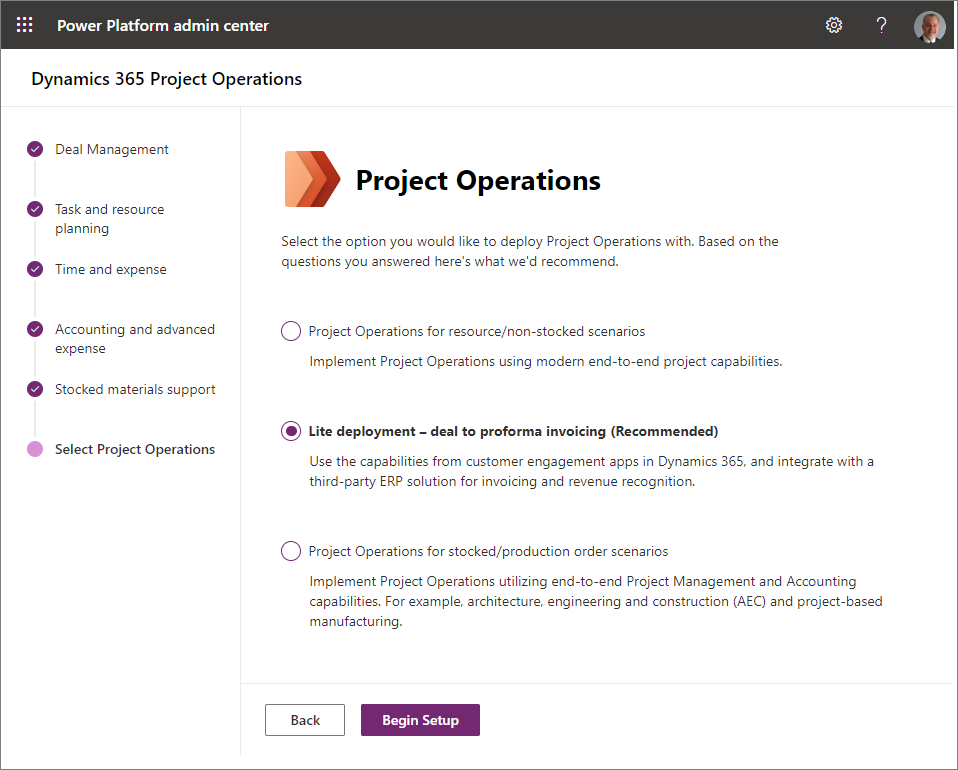
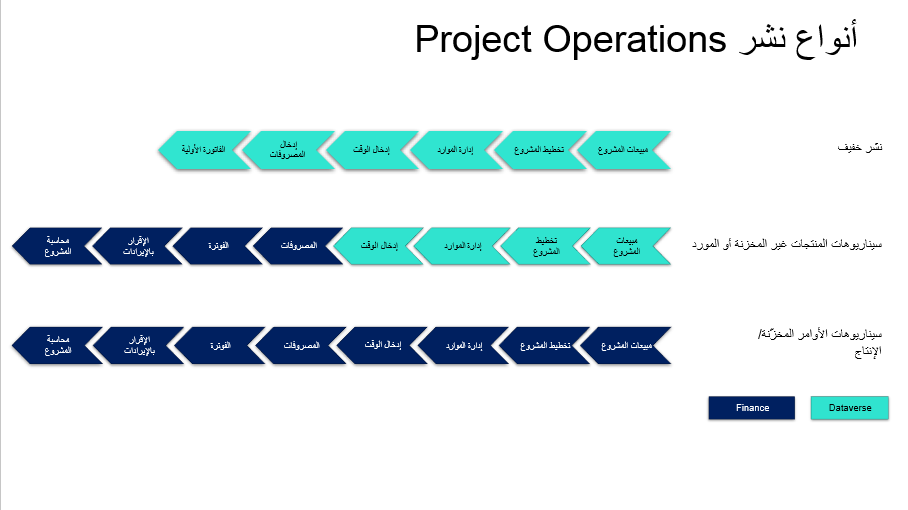

يدعم Project Operations خيارات توزيع متعددة لتتطابق مع متطلباتك. سواء كنت من عملاء Dynamics 365 الحاليين أو الجدد، بإمكان Project Operations دعم احتياجاتك.

سيساعدك استخدام استبيان توزيع Project Operations في تحديد التوزيع المناسب من خلال الإجابة عن عدد قليل من الأسئلة البسيطة.

سترشدك النتائج إلى نوع واحد من أنواع التوزيع التالية:

- النشر الخفيف – التعامل مع الفواتير الأولية
- Project Operations لسيناريوهات الموارد/المنتجات غير المخزنة
- Project Operations لسيناريوهات المنتجات المخزنة/أوامر الإنتاج

## النشر الخفيف - التعامل مع الفواتير الأولية
يتمتع نوع النشر الخفيف الخاص بـ Project Operations بالإمكانيات التالية للشركات القائمة على المشروع:

- تخطيط المشروع باستخدام Microsoft Project للويب
- تسعير وتكلفة متعددة الأبعاد لموارد العمالة
- التسعير على أساس الفئة لفئات المصروفات
- إدارة المبيعات القائمة على المشروع باستخدام قدرات Dynamics 365 Sales
- ميزة Universal Resource Scheduling التي تتكامل مع تطبيقات أخرى مثل Dynamics 365 Field Service وDynamics 365 Customer Service
- تقدم المشروع وتتبع الوقت
- تتبع المصروفات الأساسية للمصروفات المستندة إلى المشروع
- فواتير أولية يمكن مراجعتها وإرسالها إلى نظام مالي لمعالجتها
- القابلية للتوسعة من خلال Microsoft Power Platform

استخدم نوع التوزيع هذا إذا كنت تتوقع استخدام دورة حياة المشروع الكاملة، بما في ذلك المتطلبات التالية:

- القدرة على إدارة المبيعات القائمة على المشاريع مع أنواع أخرى من المبيعات باستخدام إمكانيات تطبيق Sales
- نظام متكامل يدير المشروعات الداخلية والقابلة للفوترة للجداول والماليات من مبيعات المشروع إلى الفوترة
- ERP/نظام محاسبة مالي من مصدر آخر للتكامل مع Project Operations
- نظام من مصدر آخر للعمل مع ضرائب المبيعات وأسعار الصرف وتسديدات المصروفات والمصروفات غير المتعلقة بالمشروع

## Project Operations لسيناريوهات الموارد/المنتجات غير المخزنة
يحتوي نوع توزيع Project Operations للسيناريوهات المستندة إلى الموارد/غير المخزنة على الإمكانات التالية للشركات القائمة على المشروعات:

- تخطيط المشروع باستخدام Microsoft Project للويب
- تسعير وتكلفة متعددة الأبعاد لموارد العمالة
- التسعير على أساس الفئة لفئات المصروفات
- إدارة المبيعات المستندة إلى المشروع باستخدام إمكانات تطبيق Sales
- ميزة Universal Resource Scheduling التي تتكامل مع تطبيقات أخرى مثل Field Service وCustomer Service
- تقدم المشروع وتتبع الوقت
- تجارب إدارة المصروفات الكاملة والأساسية للمصروفات الخاصة بالمشروع وغير الخاصة بالمشروع بما في ذلك التقاط الإيصال باستخدام إمكانات OCR
- الفوترة التي تمتد من الفواتير الأولية والفواتير الموجهة للعملاء والتي تدعمها ضريبة مبيعات المؤسسات ونظام أسعار الصرف السارية التاريخ
- تكلفة المشروع القابلة للتكوين وملفات تعريف الإيرادات وقواعد المحاسبة والاستحقاقات الخاصة بالأعمال قيد التنفيذ (WIP)
- الإقرار بإيرادات المشروع
- القابلية للتوسعة من خلال Power Platform

يوفر نوع التوزيع هذا ملحقاً بالوظيفة التي يتم توفيرها بواسطة تطبيقات Dynamics 365 Finance وDynamics 365 Supply Chain Management. يجب تحديد هذا التوزيع عندما تكون لديك المتطلبات التالية:

- القدرة على إدارة المبيعات القائمة على المشاريع مع أنواع أخرى من المبيعات باستخدام إمكانيات تطبيق Sales
- نظام إدارة مشروع متكامل يدير المشاريع الداخلية القابلة للفوترة للجداول الزمنية والبيانات المالية من مبيعات المشروع إلى المحاسبة
- نظام لإدارة المصروفات يتضمن إجراءات إنفاذ السياسة وتعويضات تعقب المصروفات الخاصة بالمشروع وغير الخاصة بالمشروع
- محرك منسق لضريبة المبيعات وسعر الصرف على مستوى المؤسسات لإنشاء للفواتير الموجهة للعميل للمشاريع
- نظام محاسبة المشاريع والتعرف على الإيرادات يتوافق مع معايير التقارير المالية الدولية (IFRS)
- تطبيقات Finance أو Supply Chain Management وتكامل الحركات القائمة على المشاريع

## Project Operations لسيناريوهات المنتجات المخزنة/أوامر الإنتاج
يحتوي نوع توزيع Project Operations لسيناريوهات المنتجات المخزنة/أوامر الإنتاج‬ على الإمكانات التالية للشركات القائمة على المشروع:

- تخطيط المشروع باستخدام هياكل تنظيم العمل
- توريد واستهلاك المخزون المخزّن للمشاريع
- إدارة المبيعات القائمة على المشروع باستخدام الوحدة النمطية للمبيعات والتسويق في تطبيقات التمويل والعمليات
- تسعير المشروع وتحديد تكاليفه باستخدام تكوينات معدل التكلفة ومعدل الفاتورة في تطبيقات التمويل والعمليات
- إدارة الموارد للمشاريع في تطبيقات التمويل والعمليات
- تقدم المشروع وتتبع الوقت في تطبيقات التمويل والعمليات
- تجارب إدارة المصروفات للمصروفات الخاصة بالمشروع وغير الخاصة بالمشروع مع التقاط الإيصال باستخدام إمكانات OCR
- الفوترة باستخدام ضريبة مبيعات المؤسسات ونظام أسعار الصرف السارية التاريخ
- مجموعات المشاريع القابلة للتكوين لمحاسبة واستحقاقات الأعمال قيد التنفيذ (WIP)
- الإقرار بإيرادات المشروع

يوفر نوع التوزيع هذا أيضاً امتداداً للوظيفة التي يوفرها تطبيقي Finance وSupply Chain Management. يجب تحديد هذا التوزيع عندما تكون لديك المتطلبات التالية:

- نظام شامل لإدارة المشاريع يدير الأصناف المسجلة في المخزون وتكلفة أمر وظيفة/إنتاج للمشاريع الداخلية والمفوترة للجداول والماليات
- لدى المؤسسة بالفعل تطبيقات Finance أو Supply Chain Management وسيؤدي دمج الحركات القائمة على المشروع إلى تبسيط الوصول إلى البيانات واحتياجات إعداد التقارير
- نظام لإدارة المصروفات يعمل بكامل طاقته يتضمن إجراءات إنفاذ السياسة وتعويضات تعقب المصروفات الخاصة بالمشروع وغير الخاصة بالمشروع
- محرك لضريبة المبيعات وسعر الصرف على مستوى المؤسسات لإنشاء فواتير موجهة للعميل للمشاريع
- نظام محاسبة المشاريع والتعرف على الإيرادات يتوافق مع معايير التقارير المالية الدولية (IFRS)

