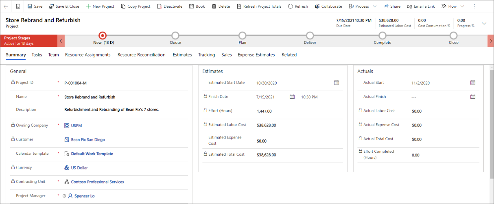
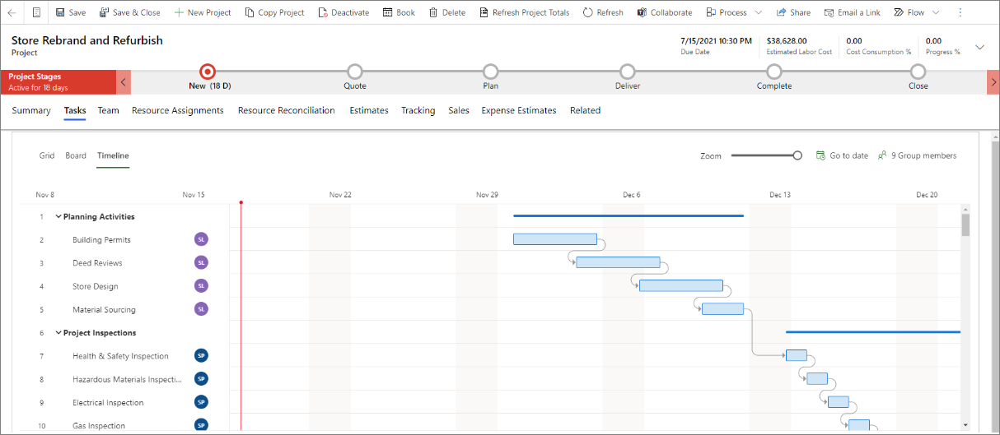
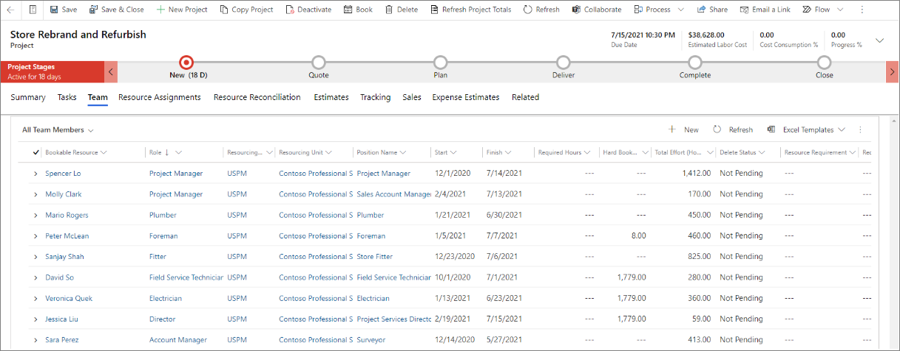
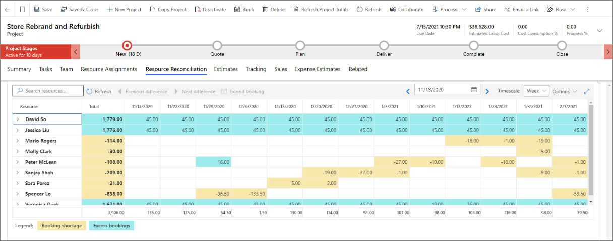
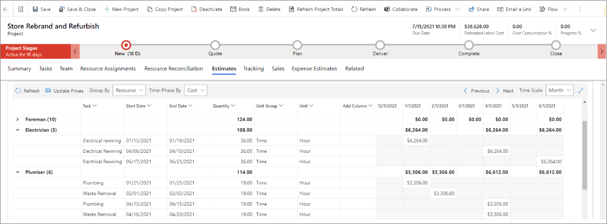
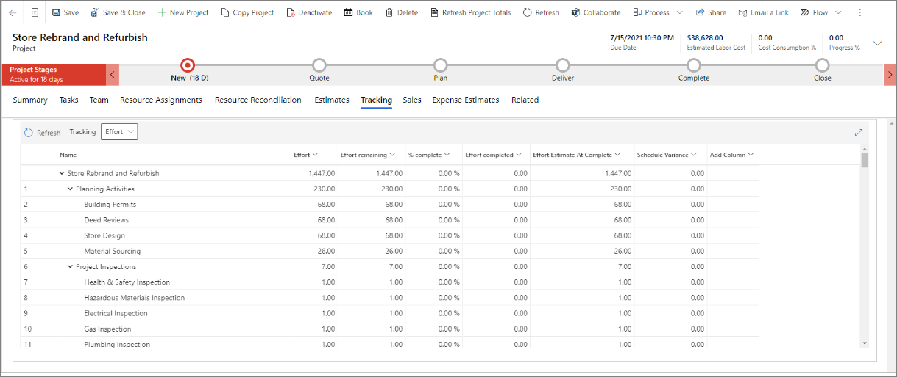
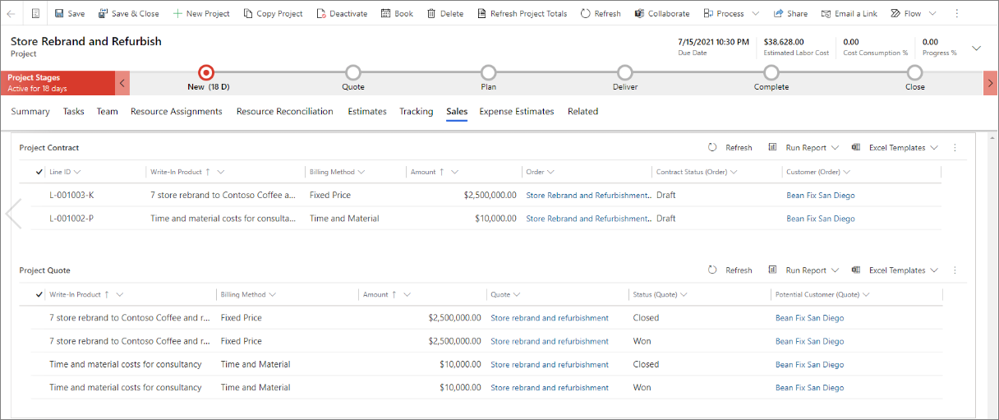
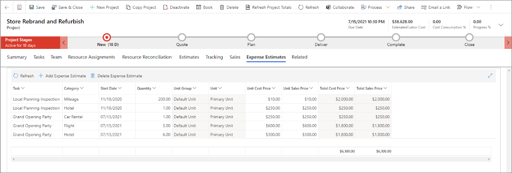

تساعدك أدوات إدارة المشاريع في Project Operations في تشغيل المشاريع. تساعد أدوات الجدولة مديري المشروعات والفرق في الحفاظ على إنتاجيتهم. تتضمن بعض المهام التي تساعد فيها الأدوات ما يلي:

- تخطيط المشروعات باستخدام جدول العمل والتقديرات.
- تقدير تكاليف المشروع والإيرادات وتعقبها.
- استخدم تقديرات المشروع أثناء عملية المبيعات.
- التنبؤ بمتطلبات الموارد للمشاريع الموجودة في البنية الأساسية لبرنامج ربط العمليات التجارية.
- تسليم المشاريع بنجاح من خلال تعقب التقدم المحرز واستهلاك التكلفة.

## مراحل المشروع

يتم تصميم مراحل المشروع لتعكس حالة المشروع أثناء تقدمه. يمكن استخدام التخصيصات لتحديث المراحل تلقائياً من خلال تدفقات عمليات الأعمال أو Microsoft Power Automate أو ملحقات المكونات الإضافية.

يتم تحديد المراحل التالية في سير إجراءات العمل الافتراضي:

- **جديد** - عند إنشاء مشروع، يتم تعيين مرحلة المشروع على **جديد**. إذا تم إنشاء المشروع من قالب، فقد يتضمن جدول زمني وتقدير وبيانات الفريق. وإلا، فسيكون مخطط تفصيلي للمشروع، ويتعين عليك إدخال المكونات المتبقية.

- **عرض الأسعار** – عند إقران مشروع بعرض أسعار أو عند إنشاء مشروع من عرض أسعار، يتم تعيين مرحلة المشروع على **عرض الأسعار**، ويتم تحديث تاريخي البدء والانتهاء المقدرين. أثناء وجود المشروع في مرحلة **عرض الأسعار**، ستعرض علامة التبويب **المبيعات** في الصفحة **كيان المشروع** تفاصيل عرض الأسعار.

- **التخطيط** – عندما تفوز بعرض أسعار مقترن بمشروع، سينتقل المشروع إلى مرحلة **العقد**، وسيتم تحديث مرحلة المشروع إلى **التخطيط**. أثناء وجود المشروع في مرحلة **تخطيط**، ستعرض الصفحة **‎كيان المشروع** تفاصيل العقد.

- **تسليم** – عند اكتمال خطة المشروع، وأنت جاهز لبدء المشروع، فيجب على مدير المشروع تحديث مرحلة المشروع إلى **تسليم** لإظهار أن المشروع قد بدأ.

- **اكتمال** – عند اكتمال العمل في المشروع، يمكن لمدير المشروع تحديث المرحلة إلى **اكتمال**. من خلال تحديث مرحلة المشروع إلى **اكتمال**، يشير مدير المشروع إلى أن العمل قد اكتمل بنسبة 100 في المائة ولكن يظل المشروع مفتوحاً بحيث يمكن تسجيل أي إدخالات للوقت أو المصروفات المعلقة.

- **إغلاق** – عند تسجيل كافة الحركات الخاصة بالمشروع، يمكن لمدير المشروع تحديث المرحلة إلى **إغلاق**. في هذه المرحلة، لا يمكن تسجيل أي حركات، ويتم تعيين المشروع للقراءة فقط.

> [!NOTE]
> لا يقوم سير إجراءات العمل الافتراضي في Project Operations بإجراء انتقالات تلقائية للحالة.

## التنقل في واجهة المستخدم

يتم فصل صفحة **المشروع** إلى عدة علامات تبويب. تمثل كل علامة تبويب مستوً مختلفاً من التفاصيل داخل المشروع.

- **ملخص** – يقدم وصفاً للمشروع ويجمع أداء المشروع المخطط والفعلي.

    

- **المهام** – يوفر تفاصيل حول هيكل تنظيم العمل الذي يمثله طريقة عرض الشبكة وعرض اللوحة وعرض المخطط الزمني، أو يُعرف أيضاً باسم مخطط Gantt.

    

- **الفريق** – يوفر تفاصيل حول المشاركين في المشروع. يتم أيضاً تلخيص الجهد المخصص لكل عضو في الفريق في طريقة العرض هذه.

    

- **تعيينات الموارد** – توفر طريقة عرض زمنية للجهد المبذول لكل مورد في المشروع.

    

- **تسوية الموارد** – توفر طريقة عرض على مراحل زمنية للاختلافات بين مهام كل مورد مسمى وعمليات الحجز الخاصة به.

    

- **التقديرات** – توفر طريقة عرض على مراحل زمنية لتقديرات تكلفة ومبيعات مشروع ما.

    

- **التعقب** – يوفر طريقة عرض تُظهر تقدم المهام في هيكل تنظيم العمل للجهد والتكلفة والمبيعات.

    

- **المبيعات** – توفر ارتباطات عميقة لعروض الأسعار والعقود المرتبطة بالمشروع.

    

- **تقديرات المصروفات** – توفر شبكة تحدد مصروفات المشروع بناءً على فئات النفقات التنظيمية.

    
    
 
معرفة المزيد حول إدارة المشروع في الوحدة النمطية [البدء في العمل باستخدام إدارة المشروع في Dynamics 365 Project Operations](https://docs.microsoft.com/learn/modules/get-started-project-management//?azure-portal=true).
