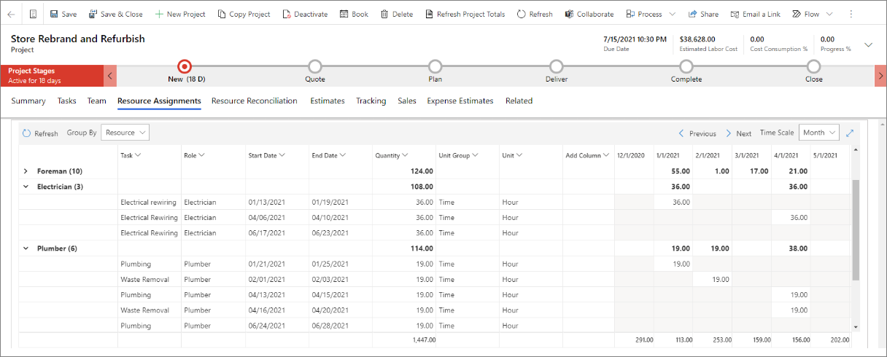

تساعدك أدوات إدارة المشاريع في Project Operations في تشغيل المشاريع.The project management tools in Project Operations help you to run projects. تساعد أدوات الجدولة مديري المشروعات والفرق في الحفاظ على إنتاجيتهم.The scheduling tools help project managers and teams stay productive. تتضمن بعض المهام التي تساعد فيها الأدوات ما يلي:Some of the tasks that the tools help with include:

- تخطيط المشروعات باستخدام جدول العمل والتقديرات.Plan projects by using a work schedule and estimates.
- تقدير تكاليف المشروع والإيرادات وتعقبها.Estimate and track project costs and revenue.
- استخدم تقديرات المشروع أثناء عملية المبيعات.Use project estimates during the sales process.
- التنبؤ بمتطلبات الموارد للمشاريع الموجودة في البنية الأساسية لبرنامج ربط العمليات التجارية.Forecast resource requirements for projects that are in the pipeline.
- تسليم المشاريع بنجاح من خلال تعقب التقدم المحرز واستهلاك التكلفة.Deliver projects successfully by tracking progress and cost consumption.

## مراحل المشروعProject stages

يتم تصميم مراحل المشروع لتعكس حالة المشروع أثناء تقدمه.Project stages are designed to reflect the state of the project as it progresses. يمكن استخدام التخصيصات لتحديث المراحل تلقائياً من خلال تدفقات عمليات الأعمال أو Microsoft Power Automate أو ملحقات المكونات الإضافية.Customizations can be used to automatically update the stages with business process flows, Microsoft Power Automate, or plug-in extensions.

يتم تحديد المراحل التالية في سير إجراءات العمل الافتراضي:The following stages are defined in the default business process flow:

- **جديد** - عند إنشاء مشروع، يتم تعيين مرحلة المشروع على **جديد**.**New** – When you create a project, the project stage is set to **New**. إذا تم إنشاء المشروع من قالب، فقد يتضمن جدول زمني وتقدير وبيانات الفريق.If the project was created from a template, it might have schedule, estimate, and team data. وإلا، فسيكون مخطط تفصيلي للمشروع، ويتعين عليك إدخال المكونات المتبقية.Otherwise, it is an outline of the project, and the remaining components must be entered.

- **عرض الأسعار** – عند إقران مشروع بعرض أسعار أو عند إنشاء مشروع من عرض أسعار، يتم تعيين مرحلة المشروع على **عرض الأسعار**، ويتم تحديث تاريخي البدء والانتهاء المقدرين.**Quote** – When you associate a project with a quote, or when you create a project from a quote, the project stage is set to **Quote** and the estimated start and end dates are updated. أثناء وجود المشروع في مرحلة **عرض الأسعار**، ستعرض علامة التبويب **المبيعات** في الصفحة **كيان المشروع** تفاصيل عرض الأسعار.While the project is in the **Quote** stage, the **Sales** tab on the **Project entity** page shows details of the quote.

- **التخطيط** – عندما تفوز بعرض أسعار مقترن بمشروع، سينتقل المشروع إلى مرحلة **العقد**، وسيتم تحديث مرحلة المشروع إلى **التخطيط**.**Plan** – When you win a quote that is associated with a project, and the project is moved to the **Contract** phase, the project stage is updated to **Plan**. أثناء وجود المشروع في مرحلة **تخطيط**، ستعرض الصفحة **‎كيان المشروع** تفاصيل العقد.While the project is in the **Plan** stage, the **Project entity** page shows details of the contract.

- **تسليم** – عند اكتمال خطة المشروع، وأنت جاهز لبدء المشروع، فيجب على مدير المشروع تحديث مرحلة المشروع إلى **تسليم** لإظهار أن المشروع قد بدأ.**Deliver** – When the project plan is completed, and you are ready to start the project, the project manager should update the project stage to **Deliver** to show that the project has started.

- **اكتمال** – عند اكتمال العمل في المشروع، يمكن لمدير المشروع تحديث المرحلة إلى **اكتمال**.**Complete** – When the work for the project is completed, the project manager can update the stage to **Complete**. من خلال تحديث مرحلة المشروع إلى **اكتمال**، يشير مدير المشروع إلى أن العمل قد اكتمل بنسبة 100 في المائة ولكن يظل المشروع مفتوحاً بحيث يمكن تسجيل أي إدخالات للوقت أو المصروفات المعلقة.By updating the project stage to **Complete**, the project manager indicates that the work is 100 percent completed but that the project is being kept open so that any pending time or expense entries can be recorded.

- **إغلاق** – عند تسجيل كافة الحركات الخاصة بالمشروع، يمكن لمدير المشروع تحديث المرحلة إلى **إغلاق**.**Close** – When all transactions are recorded for the project, the project manager can update the stage to **Close**. في هذه المرحلة، لا يمكن تسجيل أي حركات، ويتم تعيين المشروع للقراءة فقط.At that point, no transactions can be recorded, and the project is set to read-only.

> [!NOTE]
> لا يقوم سير إجراءات العمل الافتراضي في Project Operations بإجراء انتقالات تلقائية للحالة.The default business process flow in Project Operations does not perform automatic state transitions.

## التنقل في واجهة المستخدمNavigate the user interface

يتم فصل صفحة **المشروع** إلى عدة علامات تبويب.The **Project** page is separated into several tabs. تمثل كل علامة تبويب مستوً مختلفاً من التفاصيل داخل المشروع.Each tab represents a different level of detail within the project.

- **ملخص** – يقدم وصفاً للمشروع ويجمع أداء المشروع المخطط والفعلي.**Summary** – Provides a description of the project and aggregates the planned and actual project performance.

    

- **المهام** – يوفر تفاصيل حول هيكل تنظيم العمل الذي يمثله طريقة عرض الشبكة وعرض اللوحة وعرض المخطط الزمني، أو يُعرف أيضاً باسم مخطط Gantt.**Tasks** – Provides the details about the work breakdown structure represented by a grid view, board view, and a timeline view, or also known as a Gantt chart.

    

- **الفريق** – يوفر تفاصيل حول المشاركين في المشروع.**Team** – Provides details about the project participants. يتم أيضاً تلخيص الجهد المخصص لكل عضو في الفريق في طريقة العرض هذه.The assigned effort of each team member is also summarized in this view.

    

- **تعيينات الموارد** – توفر طريقة عرض زمنية للجهد المبذول لكل مورد في المشروع.**Resource Assignments** – Provides a time-phased view of the effort for each resource on a project.

    

- **تسوية الموارد** – توفر طريقة عرض على مراحل زمنية للاختلافات بين مهام كل مورد مسمى وعمليات الحجز الخاصة به.**Resource Reconciliation** – Provides a time-phased view of the differences between the assignments of each named resource and their bookings.

    

- **التقديرات** – توفر طريقة عرض على مراحل زمنية لتقديرات تكلفة ومبيعات مشروع ما.**Estimates** – Provides a time-phased view of the cost and sales estimates of a project.

    

- **التعقب** – يوفر طريقة عرض تُظهر تقدم المهام في هيكل تنظيم العمل للجهد والتكلفة والمبيعات.**Tracking** – Provides a view that shows the progress of tasks in the work breakdown structure for effort, cost, and sales.

    

- **المبيعات** – توفر ارتباطات عميقة لعروض الأسعار والعقود المرتبطة بالمشروع.**Sales** – Provides deep links to quotes and contracts that are associated with the project.

    

- **تقديرات المصروفات** – توفر شبكة تحدد مصروفات المشروع بناءً على فئات النفقات التنظيمية.**Expense Estimates** – Provides a grid that defines project expenses based on organizational expense categories.

    
    
 
معرفة المزيد حول إدارة المشروع في الوحدة النمطية [البدء في العمل باستخدام إدارة المشروع في Dynamics 365 Project Operations](https://docs.microsoft.com/learn/modules/get-started-project-management//?azure-portal=true).Learn more about project management in the [Get started with project management in Dynamics 365 Project Operations](https://docs.microsoft.com/learn/modules/get-started-project-management//?azure-portal=true) module.
