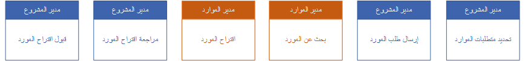

الموارد هي الأصل الأكثر أهميه في المؤسسة القائمة على الخدمات. إن إمكانية العثور على الموارد المناسبة في الوقت المناسب، وحجز تلك الموارد في المشروعات والاحتفاظ بها مستخدمة، تساعد المؤسسة على تحقيق أهداف الإيرادات وأهداف رضا العملاء. 

يمكنك استخدام وظيفة موارد المشروع في Project Operations لتنفيذ المهام التالية:

- تشكيل فرق المشروع من خلال حجز الموارد المتاحة والمؤهلة.
- المحافظة على مستودع للمهارات والكفاءة.
- إنشاء متطلبات الموارد لأعضاء الفريق العام من تعيينات المهام الخاصة بهم.
- مطابقة المهارات من خلال تحديد المهارات التي تم تحديدها في طلب الموارد مقابل مهارات الموارد المتاحة.
- استبدال الموارد.
- محاذاة تعيينات جدول المشروع وحجوزات الموارد.
- تسوية الاختلافات في الحجوزات والتعيينات.
- تغيير حجوزات الموارد كاستجابة لحاله خارج المكتب.
- التعاون بين مديري المشاريع ومديري الموارد.
- عرض محفوظات استخدام الموارد مقابل هدف، بما في ذلك التصنيف التفصيلي لكيفية استخدام وقت المورد.
- إنشاء سجلات عامة لأعضاء الفريق وتحديد الأدوار والوحدة التنظيمية للمورد.

## الحجوزات والتعيينات

الحجوزات هي التخصيص المحدد أو المبدئي للموارد لمشروع ما. تستهلك حجوزات العمالة المحددة القدرة الإنتاجية للمورد. تمثل الحجوزات المفاهيم التنظيمية للفرق بحيث يمكنها فهم كيفية مشاركة الموارد عبر المشاريع المختلفة. يعتبر Project Operations الحجوزات مفهوماً على مستوي المشروع.

على عكس الحجوزات، فإن التعيينات هي التزام الموارد بمهام المشروع في جدول المشروع. يمكن أن تكون الموارد مسماة أو عامة.

وعادةً ما يتساوى مجموع حجوزات المورد مع مجموع تعيينات المورد عبر مهمة واحدة أو عدة مهام. ومع ذلك، لا يطبق Project Operations هذه الاتفاقية. تُظهر طريقة عرض **التسوية** لمدير المشروع الأماكن التي لا تتفق فيها حجوزات الموارد والتعيينات.

## أوضاع إدارة الموارد

يدعم Project Operations وضعين لتقوم بتشغيل تدفق الحجز الإجمالي. يتم تحديد وضع الإدارة كمعلمة مشروع ويمكن تعديله إذا تطلب العمل تغييره.

الوضعان هما:

- الوضع مركزي
- الوضع مختلط

### الوضع مركزي
بالنسبة للمؤسسات التي تركز على تخصيص الموارد للمشاريع، يوفر الوضع **مركزي** طريقة لضمان أن مديري المشاريع يمكنهم تحديد متطلبات الموارد على مستوى المشروع. يتم تفويض استيفاء متطلبات الموارد إلى مدير موارد. ويستطيع مديرو المشاريع قبول الموارد التي يتم اقتراحها من جانب مدير الموارد أو رفضها.

**تحديد متطلبات الموارد**

تُحدَّد متطلبات الموارد من جانب مدير المشروع لتقرير الموارد اللازمة لتنفيذ العمل في المشروع. 

لتحديد متطلبات الموارد، اتبع الخطوات التالية:

1.  في **هيكل تنظيم العمل**، أنشئ مهمة واحدة أو أكثر.
2.  تعيين عضو فريق عام لكل مهمة. ستعمل التعيينات على تحديث الجهد الإجمالي لعضو فريق المشروع.
3.  في علامة التبويب **عضو الفريق**، حدد عضو الفريق ثم حدد **إنشاء متطلب**.

يعتمد متطلب الموارد الذي تم إنشاؤه على تفاصيل مثل:

- الخصائص
- الأدوار
- وحدات العمل
- تفضيلات الموارد
- المنطقة الزمنية

> [!NOTE]
> يستخدم مساعد الجدولة التفاصيل لتصفية الموارد.

**إرسال طلب موارد**

يمكنك إرسال متطلب الموارد التي تم إنشاؤها كطلب موارد. بعد ذلك، يتم إرسال الطلب إلى مدير الموارد لاستيفائه.

1.  في Project Operations، في صفحة **المشاريع**، حدد علامة التبويب **الفريق** لعرض قائمة الموارد القابلة للحجز.
2.  حدد المَورد العام الذي يحتوي على متطلب موارد من القائمة ثم حدد **إرسال الطلب**.

ستتغير حالة طلب عضو الفريق العام إلى **تم الإرسال**.

بعد استيفاء الطلب، يتم استبدال المَورد العام بمَورد مسمى إذا كانت إدارة الموارد تستوفي الطلب من خلال حجز مَورد مسمى. أو، إذا كان مدير الموارد يقترح مَورداً مسمى، فسيظل المَورد العام موجوداً في الفريق وستتغير حالة الطلب إلى **بحاجة إلى المراجعة**.

**البحث عن مَورد**

يتم استخدام **مساعد الجدولة** لحجز الموارد بناءً على المتطلبات التي يحددها مدير المشروع. يعتمد **مساعد الجدولة** على المعلمات التي يتم توفيرها في متطلبات المَورد للعثور على المَورد. يوصي **مساعد الجدولة** بالموارد التي تطابق المتطلبات ذات الصلة، مثل النوافذ الزمنية أو المهارات المطلوبة.

**اقتراح مَورد**

يمكن لمديري الموارد اقتراح مَورد لمدير المشروع عن طريق استخدام طلب المَورد.

1.  من شبكة **الطلب** أو الطلب، حدد **البحث عن الموارد**.
2.  في صفحة **مساعد الجدولة**، حدد المَورد ثم في الجزء **إنشاء حجز مَورد**، في الحقل **حالة الحجز**، حدد **حجز**

تحدث تحديثات الحالة الآتية:

- في الصفحة **مساعد الجدولة** يتم تحديث مؤشرات الحالة للإشارة إلى أن الحجز **مقترح**، وليس حجزاً محدداً.
- في طلب الموارد، تغيرت الحالة إلى **بحاجة إلى المراجعة**.
- في علامة التبويب **الفريق** الخاصة بالمشروع، تغيرت قيمة **حالة الطلب** الخاصة بعضو الفريق العام إلى **بحاجة إلى المراجعة**.

عندما يقوم مديرو الموارد بمعالجة طلبات الموارد، يمكنهم استخدام أي الطرق الآتية:

- اقترح موارد متعددة لاستيفاء الطلب في حالة عدم توفر مَورد واحد لاستيفاء الساعات المطلوبة. وبعد ذلك، تُقسَّم الساعات المقترحة بين الموارد المتعددة التي يمكنها استيفاء الساعات المطلوبة. في هذا السيناريو، لا يمكن أن تتداخل الساعات.
- اقتراح موارد أقل من الموارد المطلوبة. في هذا السيناريو، تكون القدرة الإنتاجية للموارد‬ المقترحة أقل من الساعات المطلوبة التي حددها مقدم الطلب. بناءً على ذلك، عندما يقبل مقدم الطلب الموارد المقترحة، يتم إنشاء متطلب موارد غير مكتمل لتسجيل الطلب المتبقي.
- حجز موارد متعددة لاستيفاء الطلب في حالة عدم توفر مَورد واحد لإتمام العمل.
- حجز موارد أقل من الموارد المطلوبة. في هذا السيناريو، تكون الساعات المحجوزة أقل من الساعات المطلوبة. يوجهك النظام إلى اقتراح الموارد بدلاً من الحجوزات بحيث يستطيع مقدم الطلب التحقق من الطلب المتبقي وتتبعه.

### الوضع مختلط

بالنسبة للمؤسسات التي تتطلب المرونة في تخصيص الموارد، يتيح **الوضع مختلط** لمديري المشاريع ومديري الموارد حجز الموارد.

 

يتضمن Project Operations لوحة معلومات **مدير الموارد** التي توفر نظرة عامة مرئية على طلب الموارد واستخدامها في جميع عبر المؤسسة. يمكنك أيضاً استخدام لوحة معلومات **مدير الموارد** لإدارة الموارد في المشاريع. 

على سبيل المثال، يمكن لمديري المشروع إضافة عضو فريق مباشرةً إلى مشروع وحجز عضو فريق للوفاء بمتطلبات الموارد التي تم التقاطها بواسطة مَورد عام.

**إضافة عضو فريق مباشرةً إلى المشروع**

لإضافة عضو فريق مباشرةً إلى مشروع، في الصفحة **المشاريع**، في علامة التبويب **الفريق**، حدد **جديد**. يظهر مربع الحوار **إنشاء سريع - عضو فريق المشروع**. 

**حجز عضو فريق لتلبية متطلبات الموارد لمورد عام**

يمكنك حجز مورد عام في فريق المشروع. كما يمكنك أيضاً تحديد الدور والقدرة المطلوبة وكيفية توزيع هذه القدرة. أما بالنسبة لمتطلبات المورد، فيمكنك تحديد السمات المقترنة بالمورد العام. تتضمن هذه السمات المهارات المطلوبة والوحدة التنظيمية المفضلة والموارد المفضلة.

**تعيين موارد عامة إلى مهام وإنشاء متطلبات الموارد**

يمكنك إنشاء المهام ثم تعيين موارد عامة لها. يمكن بعد ذلك تمثيل طلب الموارد بواسطة عناصر نائبة أثناء تقدير جدولك الزمني والأرقام المالية. كما يمكنك بعد ذلك إنشاء متطلبات الموارد للموارد العامة وتحقيقها.

تعرّف على المزيد حول إدارة الموارد في [البدء في العمل باستخدام إدارة الموارد في Dynamics 365 Project Operations](/training/modules/get-started-project-resource-management/?azure-portal=true).
