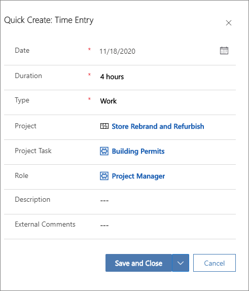

إدخال الوقت هو عملية تسجيل الوقت الفعلي الذي يستهلكه المورد. تسمح إدخالات الوقت في Project Operations بحساب التكلفة وأسعار المبيعات أثناء تقدم المهام. تساعد هذه الإدخالات مدير المشروع على متابعة المشاريع والمهام. تُعلم إدخالات الوقت أيضاً مديري الموارد بأي إجازة أو غيابات محتملة تظهر على لوحة الجدولة على أنها **خروج**. تسمح هذه الإعلامات لمديري الموارد بالتخطيط حول تلك الأحداث.

## نظرة عامة على الوقت
عند تسجيل الوقت في Project Operations، يمكن للمستخدمين تعقب أي مستوى في المشروع، بما في ذلك المهمة أو الملخص أو مستوى المشروع.

يقوم أعضاء فريق المشروع بإنشاء إدخالات الوقت وإرسالها للموافقة عليها، وسيقوم الموافقون على المشروع بالموافقة على الإدخالات. يمكن لعضو فريق المشروع استدعاء إدخال الوقت لإجراء التصحيحات.

## إنشاء إدخال وقت جديد

لإنشاء إدخال وقت جديد، اتبع الخطوات التالية:

1.  في شبكه إدخال الوقت، حدد **جديد**.
2.  في مربع الحوار **إنشاء سريع: إدخال الوقت**، حدّد تاريخ إدخال الوقت.
3.  أدخل بيانات أبعاد **المشروع**، و **مهمة المشروع**، و **الدور**، و **المدة**. يتعين إضافة هذه المعلومات بالدقائق أو الساعات أو الأيام عن طريق كتابة **h** أو **m** أو **d** مصاحباً للرقم.
4.  أدخل وصفاً للإدخال وأي تعليقات يمكن مشاركتها خارجياً بخصوص إدخال الوقت.
5.  احفظ الإدخال. تظهر القيم التي تم إدخالها في قسم **الأبعاد**. تظهر المعلومات التي تم إدخالها في حقل **المدة** في التاريخ الذي تم إنشاء إدخال الوقت له.

    

