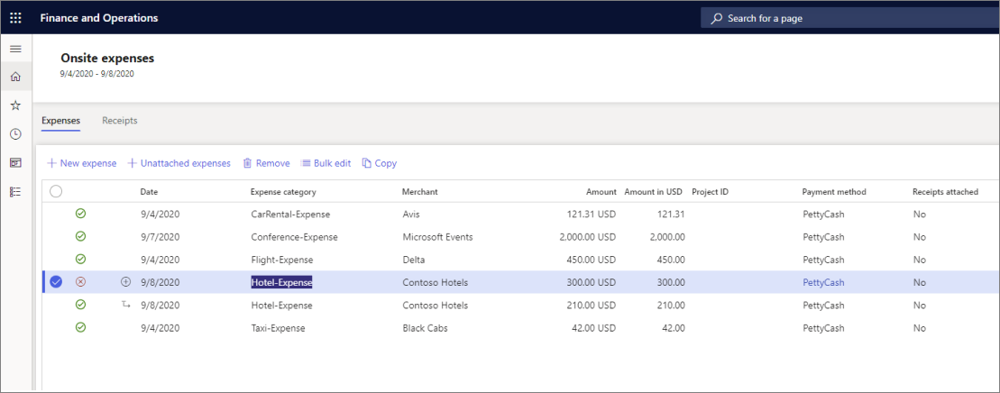

تدعم Project Operations القدرة على معالجة المصروفات. تحدث معالجة المصروفات مع المشروعات أو بدونها باستخدام سير عمل قابل للتخصيص من السياسات، وفئات الحركات، والموافقات.

تتضمن Project Operations نموذجي توزيع مدعومين لإدارة المصروفات:

- النشر الأساسي
- النشر الكامل

## النشر الأساسي

يكون **النشر الأساسي** متاحاً لسيناريوهات **Project Operations المستندة إلى الموارد/غير المخزنة** و **‏‫النشر الخفيف - التعامل مع الفواتير الأولية**.

يسمح هذا السيناريو فقط بتسجيل المصروفات البسيطة على المشروع. يمكنك تسجيل المصروفات على مشروع ما، ثم يقوم القائم بالموافقة على المشروع بمراجعتها والموافقة عليها.

## النشر الكامل 

يكون **النشر الكامل** متاحاً لسيناريوهات **Project Operations المستندة إلى الموارد/غير المخزنة** أو سيناريوهات **Project Operations المستندة إلى أمر الإنتاج**.

يوفر هذا النموذج تطبيقاً كاملاً للسياسة يتضمن القدرة على إنشاء سياسات، مثل:

- حدود فئة المصروفات
- السفر
- المصروف اليومي
- عمليات استيراد بطاقة الائتمان
- إيصال التعرّف البصري على الحروف

في هذا النموذج، ستحتاج إلى إعداد وتعريف سياسات المصروفات التي يتعين على العاملين اتباعها عند إدخال وتقديم تقارير المصروفات وطلبات السفر. وستحتاج أيضاً إلى إعداد وتحديد عملية سير عمل لمراجعة طلبات السفر والموافقة عليها ووثائق المصروفات وطلبات السلفة النقدية.

تعرف على المزيد حول تعقب الوقت وإدارة المصروفات في [‏‫بدء استخدام إدارة العمل في Dynamics 365 Project Operations](/learn/modules/get-started-project-work-management/?azure-portal=true).
