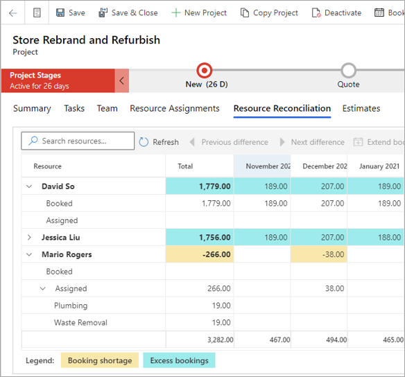

الحجوزات هي التخصيص المحدد أو المبدئي للموارد لمشروع ما. تستهلك حجوزات العمالة المحددة القدرة الإنتاجية للمورد. تمثل الحجوزات المفاهيم التنظيمية للفرق بحيث يمكنها فهم كيفية مشاركة الموارد عبر المشاريع المختلفة. يعتبر Project Operations الحجوزات كمفهوم على مستوى المشروع.

التعيينات هي تخصيص الموارد لمهام المشروع في جدول المشروع. يمكن أن تكون الموارد مسماة أو عامة.

وعادةً ما يتساوى مجموع حجوزات المورد مع مجموع تعيينات المورد عبر مهمة واحدة أو عدة مهام. 

ومع ذلك، لا يفرض Project Operations هذا الاتفاق. تُظهر طريقة العرض **تسوية الموارد** لمدير المشروع الأماكن التي لا تتوافق فيها حجوزات المورد مع تعيينات المورد.

## طريقة عرض "تسوية الموارد" 
بالنسبة لأعضاء الفريق، تكون الحجوزات والتعيينات غير محكمة الاقتران. بعبارة أخرى، يمكن أن يكون للموارد تعيينات وليس لها حجوزات، أو يمكن أن يكون لها حجوزات ولكن بدون تعيينات. من الناحية المثالية، يجب أن تتوافق الحجوزات مع التعيينات بحيث تكون للموارد قدرة إنتاجية مخصصة لتنفيذ تعيينات المهام. ومع ذلك، قد تستند الحجوزات إلى التوفر، وقد تتغير توقيتات المهام مع استمرار المشروع. لذلك، يوفر الاقتران غير المحكم للحجوزات والتعيينات المرونة.

علامة التبويب **‏‫تسوية الموارد** الموجودة في صفحة **المشروع** تتيح لمديري المشاريع تسوية حجوزات أعضاء الفريق وتعييناتهم لفرق المشروع.

كما تعرض علامة التبويب **تسوية الموارد** الحجوزات والتعيينات وصولاً إلى مستوى تعيين المهمة الفردية لكل عضو في الفريق. يتم عرض الساعات في الخلايا التي تمثل الفترات الزمنية من الأشهر إلى الأيام.

تعرض علامة التبويب صافي الإجمالي الكلي للمشروع، مع عمود **الإجمالي**.

بالنسبة لكل مورد، تقوم علامة التبويب بحساب الفرق بين حجوزات عضو الفريق والقيمة المحتسبة لتعيينات المهام الخاصة بعضو الفريق. وبشكل مثالي، يجب أن يكون هذا الفرق صفراً (0). وبعبارة أخرى، يجب ألا توجد فروق بين الحجوزات والتعيينات. 

يتم تلوين الفروق وتظليلها للفت الانتباه إلى حالتين:

- **نقص الحجز** – يحدث نقص الحجز عندما يكون للمورد تعيينات أكثر من الحجوزات. ونظراً لأنه لم يتم حجز هذه القدرة الإنتاجية، فقد يرغب مدير المشروع في تصحيح هذه الحالة عن طريق توسيع حجوزات المورد لتغطية العجز.

- **الحجوزات الزائدة** – تحدث الحجوزات الزائدة عند حجز مورد للمشروع ولكن لم يتم تعيينه للمهام. قد تكون هذه الحالة مقبولة في الحالات التي تم فيها حجز المورد للمشروع قبل حدوث تعيين المهمة. ولكن، في حالات أخرى، لم يتم التخطيط لتعيين المورد للمهام. وفي هذه الحالات، يجب على مدير المشروع الأخذ في الاعتبار إلغاء حجوزات المورد بحيث يمكن استخدام القدرة الإنتاجية لمشروع آخر.

