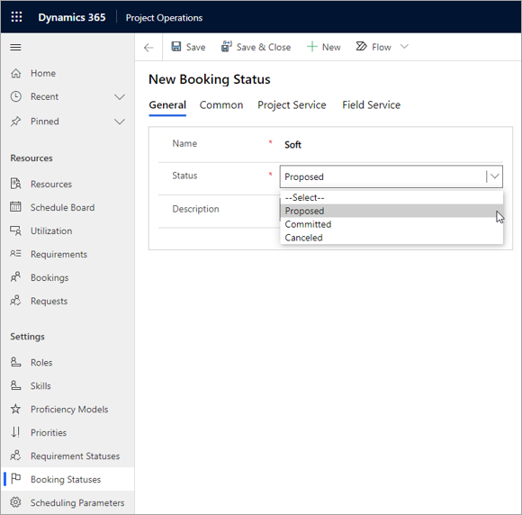

تسمح لك حالات الحجز بإنشاء العديد من الحالات الفرعية التي يتم تعيينها لكل حالة من حالات الحجز لتحديد العمليات التجارية الفريدة لشركتك بدقة أكبر.Booking statuses allow you to create multiple sub-statuses that are mapped to each of your booking statuses to define your company’s unique business processes more precisely.

1.  تحديد **الموارد > الإعدادات > حالات الحجز النشط > حالات الحجز النشطة**.Select **Resources > Settings > Booking Statuses > Active Booking Statuses**.

2.  حدد **+جديد** في صفحة **حالات الحجز النشطة**.Select **+New** on the **Active Booking Statuses** page.

3.  في علامة التبويب **عام**:On the **General** tab: 
    - اكتب اسم حالة الحجز.Enter the name of the booking status.
    - حدد **حالة** إما **مقترح** أو **ملتزم** أو **ملغى**.Select a **Status** of either **Proposed**, **Committed**, or **Canceled**.

    
    
4.  في علامة التبويب **شائع**:On the **Common** tab:
    - حدد قيمة مخصصة لـ **لون الحالة** لتحديد اللون الذي سيتم عرض خانة وقت جدولة المورد به في لوحة الجدولة.Select a custom **Status Color** value to specify in which color the resource schedule time slot will be displayed on the schedule board.
    - أدخل عنوان URL لـ **تحديد حالة** إما **مقترح**، أو **ملتزم**، أو **ملغى**.Enter the URL for **Select a Status** of either **Proposed**, **Committed**, or **Canceled**.
    - ستستهلك أي حالة حجوزات تم إنشاؤها بالحالة **ملتزم** القدرة الإنتاجية للموارد، ولن يتم إنشاء أي حالة حجز تم إنشاؤها بالحالة **مقترح**.Any bookings status created with status of **Committed** will consume resource capacity, and any booking status created with a status of **Proposed** will not.

5.  في علامة التبويب **خدمة المشروع**، حدد **إدخال التزام** لأي من الحالة **ملغى** أو **بلا** أو **حجز العمالة المحدد** أو **حجز العمالة المبدئي** أو **مقترح**.On the **Project Service** tab, select a **Commit Enter** of either **Canceled**, **None**, **Hard Book**, **Soft Book**, or **Proposed**.

