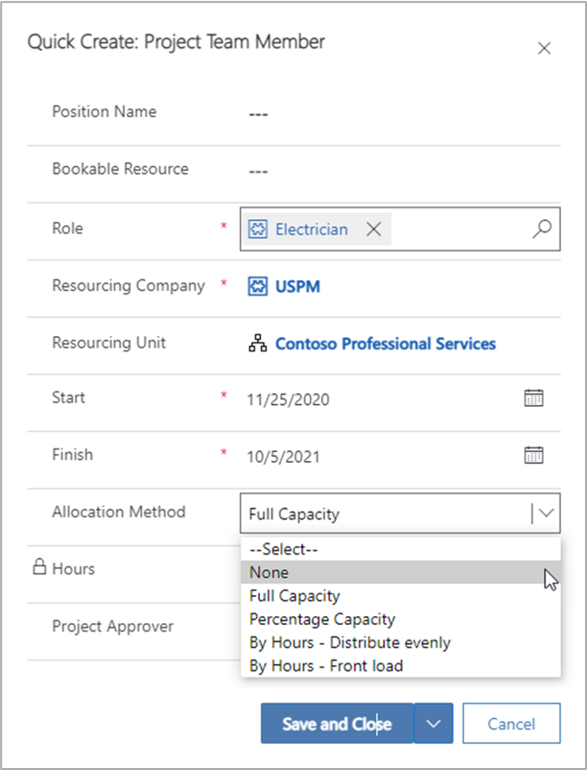

يدعم Project Operations وضعين لتقوم بتشغيل تدفق الحجز الإجمالي.Project Operations supports two modes for you to run the overall booking flow. يتم تحديد وضع الإدارة كمعلمة مشروع ويمكن تعديله إذا تطلب العمل تغييره.The mode of management is defined as a project parameter and can be modified if your business needs change.

والوضعان هما **مركزي** و **مختلط**.The two modes are **Central** and **Hybrid**.

## الوضع مركزيCentral mode
بالنسبة إلى المؤسسات التي تمركز تخصيص الموارد إلى المشاريع، يوفر الوضع "مركزي" طريقة لضمان أن مديري المشاريع يمكنهم تحديد متطلبات الموارد على مستوى المشروع.For organizations that centralize the allocation of resources to projects, the Central mode provides a way to ensure that project managers can define resource requirements at the project level. 

يتم تفويض استيفاء متطلبات الموارد إلى مدير موارد.Fulfillment of the resource requirements is delegated to a resource manager. 

ويستطيع مديرو المشاريع قبول الموارد التي يتم اقتراحها من جانب مدير الموارد أو رفضها.Project managers can accept or reject resources that are proposed by the resource manager.

### تحديد متطلبات المواردDefine the resource requirement
تُحدَّد متطلبات الموارد من جانب مدير المشروع لتقرير الموارد اللازمة لتنفيذ العمل في المشروع.Resource requirements are defined by the project manager to establish the resources that are needed to implement the work on the project. وتعمل الخطوات الآتية على تحديد متطلبات الموارد.The following steps define a resource requirement.

1.  في **هيكل تنظيم العمل**، أنشئ مهمة واحدة أو أكثر.In the **Work breakdown structure**, create one or more tasks.
2.  تعيين عضو فريق عام لكل مهمة.Assign a generic team member to each task. ستعمل التعيينات على تحديث الجهد الإجمالي لعضو فريق المشروع.The assignments will update the total effort of the project team member.
3.  في علامة التبويب **عضو الفريق**، حدد عضو الفريق ثم حدد **إنشاء متطلب**.On the **Team Member** tab, select the team member and then select **Generate Requirement**.

يعتمد متطلب الموارد الذي تم إنشاؤه على تفاصيل مثل:A generated resource requirement is based on details such as:

- الخصائصCharacteristics
- الأدوارRoles
- وحدات العملBusiness units
- تفضيلات المواردResource preferences
- المنطقة الزمنيةTime zone

> [!NOTE]
>يستخدم مساعد الجدولة التفاصيل لتصفية الموارد.The schedule assistant uses the details to filter resources.

### إرسال طلب مواردSubmit a resource request
يمكنك إرسال متطلب الموارد التي تم إنشاؤها كطلب موارد.You can submit a generated resource requirement as a resource request. بعد ذلك، يتم إرسال الطلب إلى مدير الموارد لاستيفائه.The request is then sent to a resource manager for fulfillment.

1.  في Project Operations، في صفحة **المشاريع**، حدد علامة التبويب **الفريق** لعرض قائمة الموارد القابلة للحجز.In Project Operations, on the **Projects** page, select the **Team** tab to view a list of bookable resources.
2.  حدد المَورد العام الذي يحتوي على متطلب موارد من القائمة ثم حدد **إرسال الطلب**.Select the generic resource that has a resource requirement from the list and then select **Submit Request**.
3.  ستتغير حالة طلب عضو الفريق العام إلى **تم الإرسال**.The request status of the generic team member will change to **Submitted**.

بعد استيفاء الطلب، يتم استبدال المَورد العام بمَورد مسمى إذا كانت إدارة الموارد تستوفي الطلب من خلال حجز مَورد مسمى.After the request is fulfilled, the generic resource is replaced by a named resource if the resource manager fulfills the request by booking a named resource. أو، إذا كان مدير الموارد يقترح مَورداً مسمى، فسيظل المَورد العام موجوداً في الفريق وستتغير حالة الطلب إلى **بحاجة إلى المراجعة**.Otherwise, if the resource manager proposes a named resource, the generic resource remains on the team and the request status will change to **Needs Review**.

### البحث عن مَوردFind a resource
يمكنك استخدام مساعد الجدولة لحجز الموارد استناداً إلى المتطلبات التي حددها مدير المشروع.You can use the schedule assistant to book resources based on requirements that are defined by the project manager. يعتمد مساعد الجدولة على المعلمات التي يتم توفيرها في متطلبات المَورد للعثور على المَورد.The schedule assistant relies on the parameters that are provided in the resource requirement to find the resource. إضافة إلى ذلك، يوصي مساعد الجدولة بالموارد التي تطابق المتطلبات ذات الصلة، مثل الإطارات الزمنية أو المهارات المطلوبة.Additionally, the schedule assistant will recommend resources that match relevant requirements, such as time windows or needed skills.

### اقتراح مَوردPropose a resource
يمكن لمديري الموارد اقتراح مَورد لمدير المشروع عن طريق استخدام طلب المَورد.Resource managers can propose a resource to the project manager by using a resource request.

1.  من شبكة الطلب أو الطلب، حدد **البحث عن الموارد**.From the request grid, or the request, select **Find Resources.**
2.  في صفحة **مساعد الجدولة**، حدد المَورد ثم في الجزء **إنشاء حجز مَورد**، في الحقل **حالة الحجز**، حدد **حجز**On the **Schedule Assistant** page, select the resource, and then in the **Create Resource Booking** pane, in the **Booking Status** field, select **Book**.

تحدث تحديثات الحالة الآتية:The following status updates occur:

- في الصفحة **مساعد الجدولة**، يتم تحديث مؤشرات الحالة للإشارة إلى أن الحجز مقترح، وليس حجزاً محدداً.On the **Schedule Assistant** page, the status indicators are updated to indicate that the booking is proposed, not hard-booked.
- في طلب الموارد، تغيرت الحالة إلى **بحاجة إلى المراجعة**.On the resource request, the status is changed to **Needs Review**.
- في علامة التبويب **الفريق** الخاصة بالمشروع، تغيرت قيمة **حالة الطلب** الخاصة بعضو الفريق العام إلى **بحاجة إلى المراجعة**.On the **Team** tab of the project, the generic team member's **Request Status** value is changed to **Needs Review**.

عندما يقوم مديرو الموارد بمعالجة طلبات الموارد، يمكنهم استخدام أي الطرق الآتية:When Resource managers process resource requests, they can use any of the following approaches:

- اقترح موارد متعددة لاستيفاء الطلب في حالة عدم توفر مَورد واحد لاستيفاء الساعات المطلوبة.Propose multiple resources to satisfy the demand if no single resource is available to fulfill the required hours. وبعد ذلك، تُقسَّم الساعات المقترحة بين الموارد المتعددة التي يمكنها استيفاء الساعات المطلوبة.Proposed hours are then split among multiple resources that can satisfy the required hours. في هذا السيناريو، لا يمكن أن تتداخل الساعات.In this scenario, the hours can’t overlap.
- اقتراح موارد أقل من الموارد المطلوبة.Propose fewer resources than are required. في هذا السيناريو، تكون القدرة الإنتاجية للموارد‬ المقترحة أقل من الساعات المطلوبة التي حددها مقدم الطلب.In this scenario, the proposed resource capacity is less than the required hours that the requestor specified. بناءً على ذلك، عندما يقبل مقدم الطلب الموارد المقترحة، يتم إنشاء متطلب موارد غير مكتمل لتسجيل الطلب المتبقي.Therefore, when the requestor accepts the proposed resources, an unfulfilled resource requirement is created to capture the remaining demand.
- حجز موارد متعددة لاستيفاء الطلب في حالة عدم توفر مَورد واحد لإتمام العمل.Book multiple resources to satisfy the demand if no single resource is available to complete the work.
- حجز موارد أقل من الموارد المطلوبة.Book fewer resources than are required. في هذا السيناريو، تكون الساعات المحجوزة أقل من الساعات المطلوبة.In this scenario, the booked hours are fewer than the required hours. يوجهك النظام إلى اقتراح الموارد بدلاً من الحجوزات بحيث يستطيع مقدم الطلب التحقق من الطلب المتبقي وتتبعه.The system guides you to propose resources instead of bookings so that the requestor can verify and keep track of remaining demand.

## الوضع مختلطHybrid mode
يستطيع مديرو المشاريع استخدام لوحة معلومات **مدير الموارد** لإدارة الموارد في المشاريع.Project managers can use the **Resource manager** dashboard to manage the resources on projects. 

على سبيل المثال، يمكنه إضافة عضو فريق مباشرةً إلى مشروع ثم حجز عضو فريق لتلبية متطلبات الموارد التي سجلها مَورد عام.For example, they can add a team member directly to a project and then book a team member to fulfill the resource requirements that were captured by a generic resource.

### إضافة عضو فريق مباشرةً إلى المشروعAdd a team member directly to a project
لإضافة عضو فريق مباشرةً إلى مشروع، في الصفحة **المشاريع**، في علامة التبويب **الفريق**، حدد **جديد**.To add a team member directly to a project, on the **Projects** page, on the **Team** tab, select **New**. يظهر مربع الحوار **الإنشاء السريع: عضو فريق المشروع**، حيث يمكنك تنفيذ المهام الآتية:The **Quick Create: Project Team Member** dialog box appears, where you can perform these tasks:

- **حجز مَورد مسمى** - في الحقل **مَورد قابل للحجز**، حدد اسم المَورد.**Book a named resource** - In the **Bookable Resource** field, select the name of the resource. ثم حدد الدور وقم بتعيين الفترة وحدد أسلوب التخصيص.Then select the role, set the period, and select an allocation method. تتم إضافة المَورد المسمى الذي قمت بتحديده إلى المشروع باستخدام أسلوب التخصيص المحدد وتقويم الموارد.The named resource that you selected is added to the project by using the selected allocation method and the resources calendar.
- **إضافة مَورد عام** - اترك الحقل **مَورد قابل للحجز** فارغاً، ثم حدد الدور وقم بتعيين الفترة، ثم حدد أسلوب التوزيع المفضل.**Add a generic resource** - Leave the **Bookable Resource** field blank and then select the role, set the period, and select the preferred allocation method. تتم إضافة مَورد عام للفريق كعنصر نائب.A generic resource is added to the team as a placeholder. يحتوي العنصر النائب على نمط الطلب الذي يتم استخدامه لحجز الموارد المسماة في الفريق.The placeholder holds the demand pattern that is used to book named resources on the team. يتم إجراء المتطلب وفقاً لتقويم المشروع.The requirement is made according to the project calendar.
- **إضافة مَورد مسمى إلى الفريق دون استهلاك القدرة الإنتاجية للمَورد**- في الحقل **مَورد قابل للحجز**، حدد مَورداً.**Add a named resource to the team without consuming resource capacity** - In the **Bookable Resource** field, select a resource. حدد الفترة ثم حدد "بلا" كأسلوب التخصيص.Select the period and then select None as the allocation method. تتم إضافة المَورد إلى الفريق، ولكن لا يتم استهلاك القدرة الإنتاجية للمَورد من خلال عملية حجز.The resource is added to the team, but the resource's capacity isn't consumed through a booking.

    

