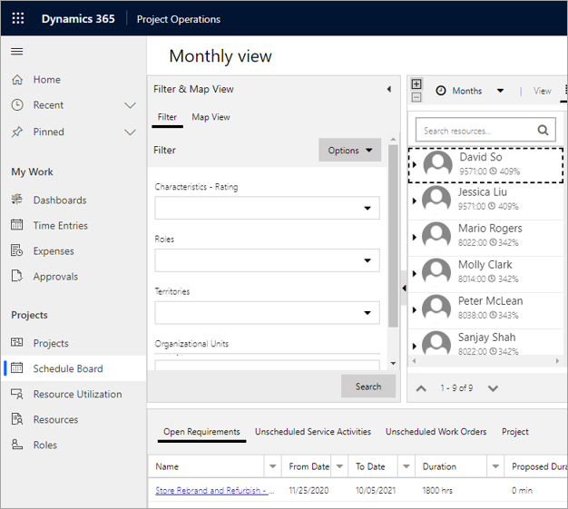

في بعض الأحيان، يجب أن يقوم مدير المشروع أو مدير الموارد بتخصيص مَورد لأحد المشاريع دون تحديد متطلبات معينة من عضو فريق عام. يمكن إنجاز هذه المهمة بإحدى الطرق الثلاث.

- الحجز من شبكة **عضو الفريق**
- الحجز من **لوحة الجدولة**
- الحجز من صفحة **المشروع**

## الحجز من شبكة عضو الفريق
إذا كانت مؤسستك تعمل في وضع توزيع الموارد المختلط، فبإمكان مدير المشروع حجز مَورد مباشرةً إلى المشروع عن طريق إكمال الخطوات الآتية:

1.  من المشروع، انتقل إلى شبكة **عضو الفريق** وحدد **جديد**.
2.  حدد اسم منصب المَورد ودوره.
3.  حدد المَورد القابل للحجز من البحث المتاح.
4.  بعد تحديد المَورد، حدد معلومات الحقول الآتية لحجز المَورد:
    - تاريخ البدء
    - تاريخ الانتهاء
    - أسلوب التوزيع
    - الساعات، إن أمكن
    - الموافق على المشروع
5.  حدد **حفظ وإغلاق**.

## الحجز من لوحة الجدولة
عندما يحتاج مدير الموارد إلى حجز مَورد مباشرة إلى مشروع، فإنه يمكنه استخدام لوحة الجدولة ومتطلبات المشروع. متطلب المشروع هو أحد متطلبات الموارد المتاحة دائماً للحجز وفقاً لها. للحجز مباشرة إلى مشروع من لوحة الجدولة، أكمل الخطوات الآتية:

1.  انتقل إلى **لوحة الجدولة**، وفي الصفحة اليسرى، قم بتصفية الموارد التي تقوم بوضعها في المتطلب.
2.  في الجزء السفلي، حدد علامة التبويب **المشروع** لعرض قائمة بمتطلبات المشروع.
3.  اسحب المتطلب إلى أحد الموارد ثم قم بتحديد المعلومات الآتية:
    - تاريخ البدء
    - تاريخ الانتهاء
    - حالة الحجز
    - أسلوب الحجز
    - المدة

## الحجز من صفحة المشروع
بصفتك مديراً للمشروع، قد تحتاج إلى حجز مَورد لمشروع ولكنك على دراية بالمعايير فقط بدلاً من معرفة اسم المَورد. أكمل الخطوات الآتية لاستخدام Schedule assistant للبحث عن مَورد استناداً إلى السمات المتاحة للمَورد.

1.  انتقل إلى المشروع وحدد **حجز** لفتح Schedule assistant.
2.  باستخدام عوامل التصفية الموجودة في الجانب الأيسر من Schedule assistant، قم بتضييق المعايير ثم حدد **بحث**.
3.  استناداً إلى الموارد التي يتم إرجاعها في النتائج، يمكنك حجز مَورد.

> [!NOTE]
> لا يؤدي هذا الأسلوب إلى إنشاء حجوزات للمَورد. بدلاً من ذلك، يقوم بإضافة المورد إلى الفريق. بعد إضافة عضو الفريق إلى المشروع، يمكن أن يستخدم مدير المشروع **الاحتفاظ بالحجوزات** أو **تمديد الحجوزات** لإضافة الحجوزات المطلوبة إلى المَورد.
