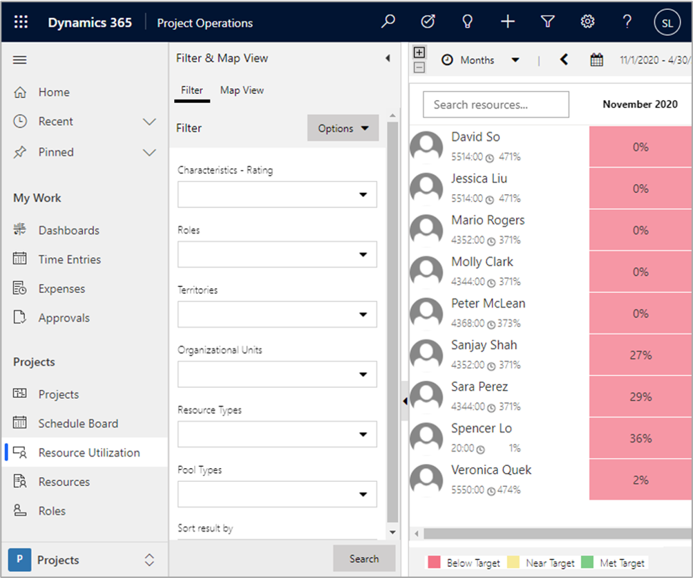

يمكن أن يكون للموارد استخدام قابل للفوترة مستهدف. ويتم تحديد استخدام الهدف هذا كسمة في الدور الافتراضي للمَورد أو يتم تعيينه في سجل المَورد القابل للحجز الفردي. وتعتمد العمليات الحسابية للاستخدام على الساعات الفعلية التي قامت الموارد بالإعلام عنها باستخدام قيود الوقت المعتمدة.

تستخدم المعادلات الآتية لحساب الاستخدام:

- **الاستخدام القابل للفوترة** - الساعات الفعلية الخاضعة للرسوم ÷ القدرة الإنتاجية للمورد
- **الاستخدام غير القابل للفوترة** - الوقت الفعلي مع معرف إدخال الفوترة = غير الخاضع للرسوم أو التكميلي أو غير المتاح ÷ القدرة الإنتاجية للمورد
- **داخلي** -الوقت الفعلي من دون عقد مبيعات ÷ القدرة الإنتاجية للمورد‬
- **القدرة الإنتاجية للمورد‬**- ساعات عمل المَورد – ساعات العمل – أيام غير العمل

يمكن العثور على طريقة عرض **استخدام المَورد** في جزء **الموارد**.

كل خليه في الشبكة تمثل النسبة المئوية للاستخدام القابل للفوترة للمَورد في فترة زمنية، مثل يوم أو أسبوع أو شهر. تستخدم المعادلات الآتية لتلوين الخلايا:

- **أخضر** - استخدام قابل للفوترة > = الاستخدام المستهدف للمَورد
- **أصفر** - الاستخدام المستهدف – 20 < = الاستخدام القابل للفوترة < الاستخدام المستهدف
- **أحمر** - استخدام قابل للفوترة > الاستخدام المستهدف – 20

  
