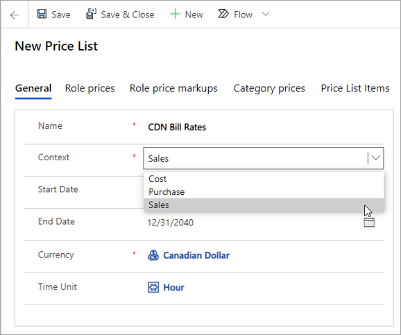
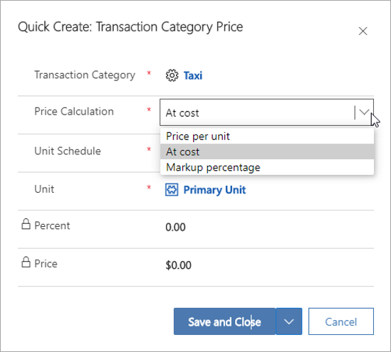

تمثل قوائم الأسعار في Project Operations كتالوج أسعار. وتشير الأسعار إلى أسعار التكلفة والمبيعات والفواتير. 
## إنشاء أسعار التكلفة وأسعار المبيعات
استناداً إلى ما إذا كانت قائمة الأسعار تشير إلى أسعار التكلفة أو أسعار المبيعات والفواتير، يكون سياق قائمة الأسعار هو **المبيعات** أو **التكلفة**.

-  **قوائم أسعار التكلفة** - تشير إلى نوع سعر التكلفة في سجلات القيم الفعلية والتقديرية.
-  **قوائم أسعار المبيعات** - تشير إلى السعر في السجلات المقدرة والفعلية لأنواع المبيعات غير المفوترة والمفوترة.

الملحقات التالية خاصة بـ Project Operations ويتم تطبيقها على قوائم الأسعار من Dynamics 365 Sales.

- **السياق** - يحتوي هذا الحقل على القيم المدعومة من **التكلفة** و **المبيعات**. قيمة **الشراء** غير مدعومة. عيّن السياق على **التكلفة** لإنشاء قائمة أسعار التكلفة أو على **المبيعات** لإنشاء قائمة أسعار المبيعات. تُشير قوائم أسعار التكلفة إلى نوع سعر التكلفة في سجلات القيم الفعلية والتقديرية. تُشير قوائم أسعار المبيعات إلى السعر في السجلات المقدرة والفعلية لأنواع المبيعات غير المفوترة والمفوترة. 
- **الوحدة الزمنية**- يعرض هذا الحقل الوحدة الزمنية الافتراضية التي تم إعداد السعر لها في جدول "سعر الدور" ذي الصلة لقائمة الأسعار هذه.
- **كيان قائمة الأسعار** - تم إنشاء هذا الحقل المخفي بواسطة Project Operations للتمييز بين قوائم الأسعار الخاصة بالعقد أو بعرض الأسعار عن تلك القياسية والقابلة للتطبيق بشكل عام.

## تحديد أسعار الأدوار
تحتوي كل قائمة أسعار على مجموعة من أسعار الأدوار، أو معدلات العمالة، التي تكون فعالة للسياق وتاريخ السريان المضمنين في رأس قائمة **السعر**. يمكن إعداد أسعار الفواتير للوقت في Project Operations بعملة واحدة فقط، وهي العملة الموجودة في رأس قائمة **السعر**.

## تحديد معدلات مصروفات التكلفة والمبيعات
عليك إعداد أسعار التكلفة والمبيعات لفئات الحركات في Project Operations. ونظراً لأن أسعار التكلفة والمبيعات مصممة للمصروفات، يجب أيضاً إعداد كل فئة حركة تتضمن هذه الأسعار كفئة مصروفات. يضمن هذا الإعداد الدقة في وظائف المراحل النهائية. لا يمكن إدراج أسعار التكلفة والمبيعات لفئات الحركات إلا بعملة واحدة، والتي يجب أن تكون العملة في رأس قائمة **السعر**.

### طرق التسعير للمصروفات
عند إعداد أسعار الفئات ذات الصلة فقط في سياق تسعير المصروفات، يمكنك استخدام إحدى طرق التسعير الثلاث التالية:

- **السعر لكل وحدة** - عند تحديد طريقة التسعير هذه في بند مرتبط بقائمة أسعار المبيعات، يتم ضبط الإعدادات الافتراضية للأسعار على الفئة ومجموعة الوحدات في كل من البنود التقديرية والفعلية. تشير البنود التقديرية إلى بنود المشروع التقديرية للمصروفات وتفاصيل بند عرض الأسعار وتفاصيل شروط التعاقد للمصروفات.

- **بتكلفة** - عند تحديد طريقة التسعير هذه في بند مرتبط بقائمة أسعار المبيعات، يتم ضبط الإعدادات الافتراضية للأسعار على الفئة ومجموعة الوحدات فقط للقيم الفعلية للمصروفات، مثل القيم الفعلية للمبيعات غير المفوترة لفئة حركة المصروفات. يتم تعيين سعر الوحدة على القيم الفعلية للمبيعات غير المفوترة من سعر الوحدة على القيم الفعلية للتكلفة لتلك المصروفات. لا يتمّ التعيين الافتراضي للسعر على أساس التكلفة في تقديرات المشروع للمصروفات أو بند عرض الأسعار وتفاصيل شروط التعاقد المُتعلّقة بالمصروفات.

- **‏‫النسبة المئوية للقيمة المضافة للتكلفة الحالية** - عند تحديد طريقة التسعير هذه في بند مرتبط بقائمة أسعار المبيعات، يتم ضبط الإعدادات الافتراضية للأسعار على الفئة ومجموعة الوحدات فقط للقيم الفعلية للمصروفات، مثل القيم الفعلية للمبيعات غير المفوترة لفئة حركة المصروفات. يتم تعيين سعر الوحدة هذا على القيم الفعلية للمبيعات غير المفوترة إلى قيمة محسوبة من سعر الوحدة على القيمة الفعلية للتكلفة لتلك المصروفات بعد تطبيق النسبة المئوية للقيمة المضافة للتكلفة الحالية المحددة. لا يتمّ التعيين الافتراضي للسعر على أساس التكلفة في تقديرات المشروع للمصروفات أو بند عرض الأسعار وتفاصيل شروط التعاقد المتعلقة بالمصروفات.

