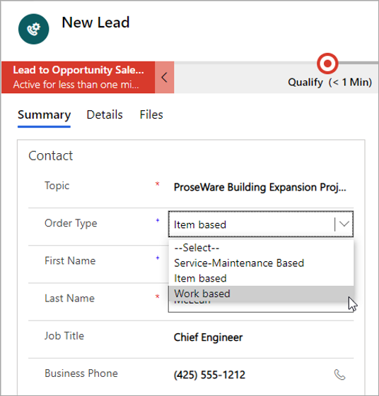

يمكن إدارة العملاء المتوقعين بالاستناد إلى المشروع وتأهيلهم في Project Operations. تتضمن عملية إدارة العملاء المتوقعين إنشاء عملاء متوقعين على أساس العمل ثم تأهيلهم.
## عملاء متوقعون لمبيعات المشروع
في قسم **المبيعات**، في جزء التنقل الأيمن، افتح صفحة قائمة **عملاء متوقعون** لعرض قائمة بكافة سجلات العملاء المتوقعين في النظام. قائمة العملاء المتوقعين التي يتم عرضها تستند إلى العمل وأنواع أخرى من العملاء المتوقعين التي يمكن إنشاؤها إذا كان لديك أيضاً تطبيقات Dynamics 365 Sales أو Dynamics 365 Field Service.

يمكنك إنشاء طريقة عرض تمت تصفيتها لرؤية العملاء المتوقعين بالاستناد إلى المشروع فقط عن طريق إنشاء عامل تصفية على قيمة **النوع**. على سبيل المثال، يمكنك تحديد إظهار العملاء المتوقعين استناداً إلى العمل فحسب.

## إنشاء عميل متوقع جديد لصفقة مستندة إلى مشروع
عند تأهيل العميل المتوقع المستند إلى المشروع، يتم إنشاء فرصة وحساب. الفرصة المستندة إلى المشروع هي نقطة البداية لأنشطة متابعة المبيعات في مرحلة "الفرصة". تتميز الفرص المستندة إلى المشروع بقدرات فريدة مطلوبة لبيع عمل المشروع. 

وتشتمل هذه القدرات على ما يلي:

- أسلوبا الفوترة الوقت والمواد والسعر الثابت.
- قوائم أسعار بتاريخ سريان متعددة للموارد البشرية والمواد والنفقات المستحقة على المشاريع

> [!IMPORTANT]
> بالنسبة لعميل متوقع مؤهَّل لإنشاء فرصة تلقائياً، قم بتعيين السمة **نوع الأمر** إلى **معتمد على العمل** عند إنشاء العميل المتوقع. وإذا اخترت نوعاً مختلفاً، فلن يُنشئ العميل المتوقع فرصة مستندة إلى المشروع عندما يكون مؤهلاً. إذا لم يتم إنشاء الفرصة المستندة إلى المشروع، فلن تتوفر القدرات الخاصة بالمشروع في عمليات المبيعات في المراحل النهائية.

