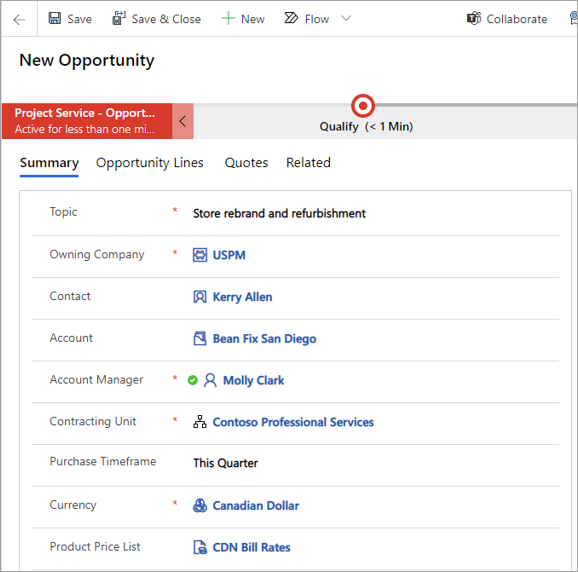
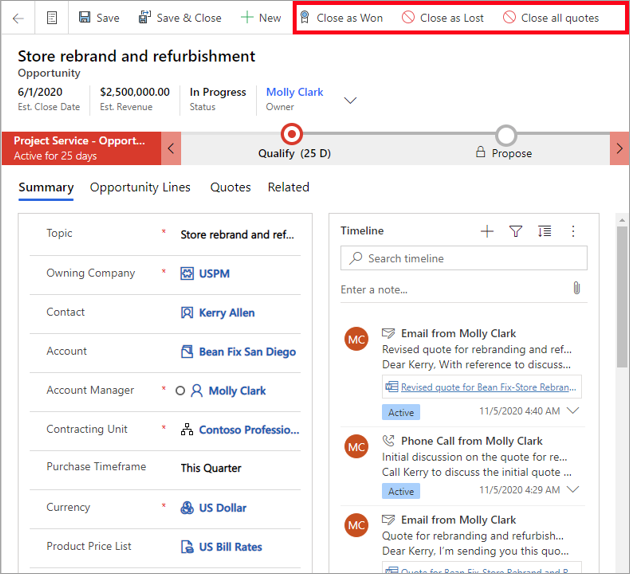

الفرص المستندة إلى المشروع في Project Operations هي ملحقات للفرص في Dynamics 365 Sales.Project-based opportunities in Project Operations are extensions of opportunities in Dynamics 365 Sales. توفر هذه الملحقات وظائف إضافية خاصة ومطلوبة للفرص المستندة إلى المشروع.These extensions provide additional functionality that is specific to and required for project-based opportunities. يمكن أن تتضمن هذه الملحقات الحقول الجديدة وإجراءات الشريط المتوفرة في الفرص القائمة على المشروع.These extensions can include new fields and ribbon actions that are available in project-based opportunities. قد تجد بعض الحقول والوظائف والمنطق الافتراضي المتوفرة في المبيعات غير متوفرة في Project Operations.You might find some fields, functionality, and defaulting logic that are available in Sales aren’t available in Project Operations.

يتم دعم عمليات سير إجراءات العمل التالية للصفقات المستندة إلى المشروع في Project Operations:The following business process flows are supported for project-based deals in Project Operations:

- عملية تجارية من عميل متوقع إلى فرصةLead to Opportunity business process
- عملية مبيعات الفرصةOpportunity sales process

## إغلاق فرصة مشروعClose a project opportunity
يمكن إغلاق فرص المشروع على أنها رابحة أو خاسرة.Project opportunities can be closed as won or lost. يتيح لك مربع الحوار **إغلاق الفرصة** إضافة سبب الحالة والتاريخ والتفاصيل الأخرى حول ربح الفرصة أو خسارتها.The **Close opportunity** dialog box allows you to add the status reason, date, and other details about win or loss of the opportunity.

> [!NOTE]
> لن يتم السماح لك بإغلاق الفرصة إذا كانت عروض الأسعار النشطة مرتبطة بها.You won't be allowed to close the opportunity if active quotes are associated with it. 

يمكنك إغلاق كافة عروض أسعار المسودة وعروض الأسعار النشطة المرتبطة بفرص في نفس الوقت.You can close all active and draft quotes that are associated with an opportunity at the same time. سيتم السماح لك بإغلاق الفرصة.Then, you'll be allowed to close the opportunity.

