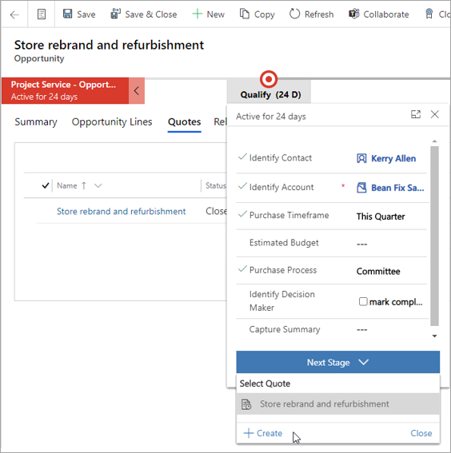

في Project Operations، صُممت أسعار المشروعات للمساعدة في بناء المقترحات لعمل المشروع.In Project Operations, project quotes are designed to help build proposals for project work. يتم بناء عرض أسعار المشروع في Project Operations لعروض المشروع باستخدام المكونات الآتية:A project quote in Project Operations is structured for project proposals with the following components:

- **بنود عرض الأسعار** - حدد المكونات المنفصلة للعمل التي سيتم تقديمها كمكونات عالية المستوى.**Quote lines** - Identify the discrete components of work that will be presented as high-level components.

- **تفاصيل بنود عرض الأسعار** - قم بتحديد وتقدير العمل اللازم لكل مكون عالي المستوى أو لكل بند في عرض أسعار.**Quote line details** - Identify and estimate the work for each high-level component or quote line. يرتبط الجدول أو تقديرات التاريخ والجوانب المالية للعمل بسطر عرض الأسعار هذا.Schedule or date estimates and the financial aspects for the work are tied to that quote line.

- يتم إعداد **نماذج التعاقد والمكونات الخاضعة للرسوم** لكل بند في عرض الأسعار.**Contracting models and chargeable components** -  Are set up for each quote line. يساعد هذا الإعداد على تقدير توزيع الإيرادات والإنفاق والربحية لكل سطر عرض أسعار وعرض الأسعار العام.This setup helps estimate the spread of revenue, spend, and profitability for each quote line and the overall quote.

