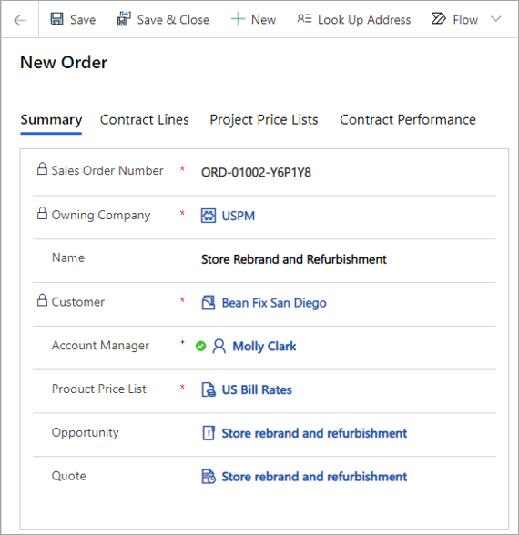
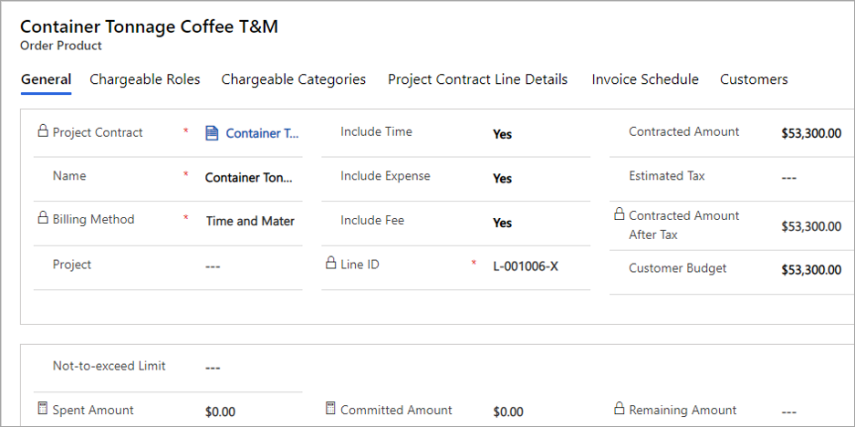
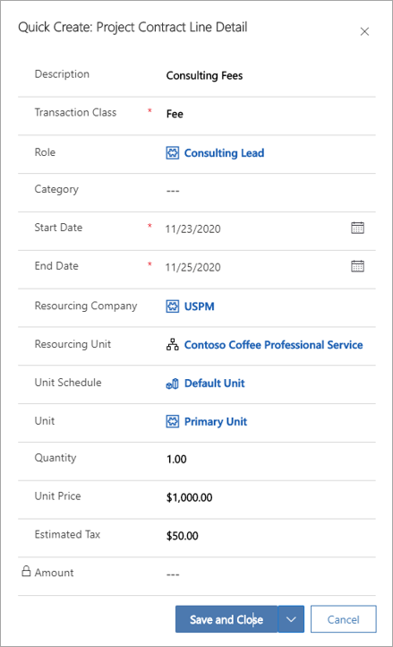

تلتقط عقود المشروع في Project Operations الالتزامات المتفق عليها تعاقدياً وتفاصيل الفوترة لأحد المشاريع، وتديرها. يتم تفصيل هيكل عقد مشروع في Project Operations للعمل المستند إلى المشروع باستخدام المكونات التالية:

- **شروط التعاقد** - حدد مكونات العمل المنفصلة التي سيتم تقديمها كمكونات عالية المستوى في فاتورة المشروع.

- **تفاصيل شروط التعاقد** - قم بتحديد وتقدير العمل اللازم لكل مكون عالي المستوى أو لكل شرط تعاقد. يشتمل التقدير على الجدول والأوجه المالية للعمل المرتبط بشروط التعاقد.

- **نماذج التعاقد والمكونات الخاضعة للرسوم** - يتم إعدادها لكل شرط تعاقد يتضمن ترتيبات فوترة لكل شرط تعاقد والعقد الكلي.

## شروط التعاقد المستندة إلى المشروع
تم تصميم ‏‫شروط التعاقد المستندة إلى المشروع‬ في Project Operations للاحتفاظ بالتقديرات وترتيبات الفوترة لمكونات محددة من عمل المشروع عند التفاوض. 

يتم تمديد البنية الخاصة بشروط التعاقد المستندة إلى المشروع لتقديرات المشاريع وسيناريوهات الفوترة ذات المفاهيم الآتية:

 - أسلوب الفوترة
 - تعيين المشاريع والمهام
 - فئات الحركات المضمنة
 - حد ما يجب ألا يتم تجاوزه‬
 - إعداد الخضوع للرسوم‬
 - التقديرات التي تستخدم تفاصيل شروط التعاقد.
 - عملاء شروط التعاقد

يتم تضمين الحقول الآتية في علامة التبويب **عام** الخاصة بشروط التعاقد المستندة إلى المشروع. وتساعد هذه الحقول على إعداد أساس لعمليات التقدير التفصيلية التصاعدية وترتيبات الفوترة الخاصة بالعمل المستند إلى المشروع.

- **الاسم** - اسم شرط التعاقد الذي يحدد المكون المنفصل للعقد الذي يتم تقديره. بالنسبة إلى عقد المشروع الذي تم إنشاؤه من عرض أسعار، يتم نسخ هذه القيمة من قيمة مقابلة لشروط عرض الأسعار المستند إلى المشروع.
- **أسلوب الفوترة** - في عقد المشروع الذي تم إنشاؤه من عرض أسعار، يتم نسخ هذه القيمة من حقل مقابل في شروط عرض الأسعار. تمثل مجموعة الخيارات هذه نموذجي تعاقد رئيسيين مدعوميْن من Project Operations:
    - **السعر الثابت**
    - **الوقت والمواد**
- **المشروع** - استخدم هذا الحقل لتحديد المشروع الذي سيتم استخدامه لتسليم العمل في هذا التكليف.
- تشير علامة **تضمين الوقت** إلى ما إذا كانت حركات الوقت أو تكاليف العمالة في المشروع المحدد مضمنة ضمن شرط التعاقد هذا. 
    - تشير القيمة **لا** إلى أنه لن يتم تضمين حركات الوقت أو تكاليف العمالة في شرط التعاقد هذا. 
     - وتشير القيمة **نعم** إلى أنه سيتم تضمينها.
- تشير علامة **تضمين المصروفات** إلى ما إذا كانت تكاليف المصروفات في المشروع المحدد مضمنة ضمن شرط التعاقد هذا. 
    - تشير القيمة **لا** إلى أنه لن يتم تضمين تكلفة المصروفات في شرط التعاقد هذا.
    - كما تشير القيمة **نعم** إلى أنه سيتم تضمينها.
- تشير علامة **تضمين الرسوم** إلى ما إذا كان سيتم تضمين الرسوم في المشروع المحدد ضمن شرط التعاقد هذا.
    - وتشير القيمة **لا** إلى أنه لن يتم تضمين الرسوم في شرط التعاقد هذا. 
    - وتشير القيمة **نعم** إلى أنه سيتم تضمينها.
- **‏‫المبلغ المتعاقد عليه‬** في شروط التعاقد ثابت السعر، يكون هذا المبلغ هو القيمة المتفق عليها والتي ستتم فوترتها إلى العميل لكافة مكونات العمل المرتبطة بشرط التعاقد هذا. ‏‫المبلغ المتعاقد عليه‬ في شرط التعاقد "الوقت والمواد"، يكون هذا المبلغ هو القيمة التقديرية لما ستتم فوترته إلى العميل لكافة مكونات العمل المرتبطة بشرط التعاقد هذا. في عقد المشروع الذي تم إنشاؤه من عرض أسعار، يتم نسخ هذه القيمة من حقل مقابل في شروط عرض الأسعار. 
- **الضريبة المقدَّرة** - يمكن للمستخدم تحرير هذا الحقل لإدخال مبلغ الضريبة المقدَّرة في شرط التعاقد. عندما تكون شروط التعاقد المستندة إلى المشروع مشتملة على تفاصيل الشروط، يتم إقفال هذا الحقل لمنع تحريره ويتم تلخيصه من مبلغ الضريبة في تفاصيل شروط التعاقد.
- **المبلغ المتعاقد عليه بعد الضريبة** - مبلغ شروط التعاقد بعد الضريبة. يكون هذا الحقل للقراءة فقط ويتم حسابه على أنه **مبلغ متعاقد عليه + ضريبة**.
- **‏‫حد ما يجب ألا يتم تجاوزه‬** - يستطيع المستخدم تحرير هذا الحقل ويكون متوفراً فقط في شروط التعاقد المستندة إلى المشروع والتي تتضمن أسلوب فوترة الوقت والمواد.
- **ميزانية العميل** - هذا الحقل قابل للتحرير ويتم نسخه من الحقل المقابل في شروط عرض الأسعار إذا كان العقد قد تم إنشاؤه من عرض أسعار.

 
## تقدير شروط التعاقد المستندة إلى المشروع
تحتوي شروط التعاقد المستندة إلى المشروع على تفاصيل تساعد على تقدير التكلفة والإيراد المحتمل للعمل المتضمن لتنفيذ شروط التعاقد.

لتقدير شروط التعاقد المستندة إلى المشروع، انتقل إلى علامة التبويب **تفاصيل شروط التعاقد** في **شروط التعاقد** المستندة إلى المشروع. 

إليك طريقتان لإنشاء تقدير في شروط تعاقد مستندة إلى المشروع:

- إنشاء تقدير مباشرة في شروط التعاقد عن طريق إضافة تفاصيل شروط التعاقد يدوياً.
- قم بإنشاء مشروع وخطة مشروع، ثم قم بربط المشروع والمهام بشروط تعاقد المشروع. ويؤدي هذا الأسلوب إلى تمكين العملية التي يمكن من خلالها استيراد تقدير خطة المشروع إلى شروط التعاقد وفقاً للمكونات المضمنة في شروط التعاقد.

## إنشاء جدول فواتير في شروط التعاقد المستندة إلى المشروع
يمكنك إنشاء جدول فواتير في شروط التعاقد المستندة إلى المشروع. يتم السماح بالفوترة فقط بعد اكتساب العقد وقيامك بإنشاء عقد مشروع. جدول الفواتير يسمح بإنشاء مسودات فواتير شروط التعاقد المستندة إلى المشروع بشكلٍ تلقائي. ومع ذلك، إذا كنت تقوم بإنشاء فواتير بشكلٍ يدوي، فيمكنك تخطي إنشاء جداول الفواتير في شروط التعاقد.

### إنشاء جدول فواتير الوقت والمواد لأحد شروط التعاقد

عندما يكون لشرط التعاقد المستند إلى المشروع أسلوب فوترة الوقت والمواد، يمكنك إنشاء جدول فواتير حسب التاريخ. لإنشاء جدول فواتير حسب التاريخ بشكلٍ تلقائي، قم بإكمال الخطوات الآتية:

1.  انتقل إلى **الإعدادات > ‏‫تكرارات الفاتورة‬** وقم بإعداد تكرار الفاتورة.
2.  انتقل إلى سجل عقد المشروع، في علامة التبويب **ملخص** في حقل **تاريخ التسليم المطلوب**، حدد تاريخاً.
3.  افتح شرط التعاقد **الوقت والمواد** الذي ستقوم بإنشاء جدول فواتير حسب التاريخ له.
4.  في علامة التبويب **جدول الفواتير**، حدد تاريخ بدء الفوترة وتكرار الفاتورة.
5.  في الشبكة الفرعية، حدد **إنشاء جدول فواتير**. يتم إنشاء جدول الفواتير باستخدام حقول **تاريخ تشغيل الفاتورة** و **تاريخ إيقاف الحركة** و **حالة التشغيل** تم تعيينها على النحو الآتي:
    - **تاريخ تشغيل الفاتورة** - يتم إملاء هذا التاريخ بتكرار الفاتورة.
    - **تاريخ إيقاف الحركة** - اليوم الذي يسبق تاريخ تشغيل الفاتورة.
    - **حالة التشغيل** - يتم تعيينها تلقائياً إلى **‏‫ليست قيد التشغيل‬**. عند تشغيل مهمة إنشاء الفاتورة التلقائية لتاريخ تشغيل فاتورة معين، يتم تحديث هذا الحقل إلى **تشغيل ناجح** أو **فشل التشغيل**.

لإنشاء جدول فواتير الوقت والمواد لشرط التعاقد المستند إلى المشروع الذي له أسلوب الفوترة الثابتة، اتبع الخطوات الآتية:

1.  انتقل إلى **الإعدادات > تكرارات الفاتورة**.
2.  انتقل إلى سجل عقد المشروع، في علامة التبويب **ملخص** في حقل **تاريخ التسليم المطلوب**، حدد تاريخاً.
3.  افتح شرط التعاقد **السعر الثابت** الذي تقوم بإنشاء جدول مراحل رئيسية له. في علامة التبويب **‏‫المراحل الرئيسية للفوترة‬**، حدد تاريخ بدء الفوترة وتكرار الفاتورة.
4.  في الشبكة الفرعية، حدد **إنشاء المراحل الرئيسية الدورية**. يتم إنشاء جدول الفواتير باستخدام حقول **اسم المرحلة الرئيسية** و **تاريخ المرحلة الرئيسية** و **مبلغ المرحلة الرئيسية**.
## تأكيد عقد مشروع
يمكن أن يكون عقد المشروع في Project Operations نشطاً مع السبب **تم التأكيد** أو مُقفلاً مع السبب **خسارة**. عند تأكيد عقد مشروع، سيتم تحديث الحالة من **مسودة** إلى **نشط** وسيكون سبب الحالة **تم التأكيد**. لا يمكن تحرير أو إعادة فتح العقد النشط أو المُقفل.

### الأثر المالي لتأكيد عقد مشروع
بعد تأكيد عقد المشروع، يعيد التطبيق حساب التكاليف عن طريق عكس القيم الفعلية القديمة للتكلفة وإنشاء قيم فعلية جديدة للتكلفة. وبعد ذلك، تتم معالجة القيم الفعلية الجديدة للتكلفة بناءً على أسلوب الفوترة لشروط تعاقد المشروع ذات الصلة. إذا كانت القيم الفعلية للتكلفة تشير إلى شرط التعاقد **الوقت والمواد**، فسيقوم التطبيق تلقائياً بإعادة إنشاء القيم الفعلية للمبيعات غير المفوترة المقابلة. إذا كانت القيم الفعلية للتكلفة تشير إلى شرط التعاقد **السعر الثابت**، فإن التطبيق يقوم بإيقاف إعادة معالجة القيم الفعلية للتكلفة.

يتم تقييم الحدود التي يجب ألا يتم تجاوزها والخضوع للرسوم والتسعير والتكلفة في القيم الفعلية ثم تحديثها كجزء من عملية التأكيد.

### إقفال عقد مشروع كخسارة
عند إقفال عقد مشروع كخسارة، يتم تحديث حالة العقد إلى **مُقفل** ويكون سبب الحالة **خسارة**. يصبح عقد المشروع للقراءة فقط. يظهر مربع الحوار **تأكيد** قبل إتمام التغييرات نظراً إلى أنه لا يمكنك إعادة فتح عقد مشروع مُقفل.

إذا كان عقد المشروع الذي تم إقفاله كخسارة يشير إلى مشروع في شروطه، فسيتم تمييز هذا المشروع أيضاً على أنه **مُقفل** أيضاً. يتم إلغاء أي حجوزات للموارد بداية من هذا اليوم. سيتم إلغاء أي قيم فعلية للمبيعات غير المفوترة في عقد المشروع غير الموجودة بالفعل في الفاتورة.

> [!NOTE]
>  لا يمكن تحرير أو إعادة فتح العقد النشط أو المُقفل.

