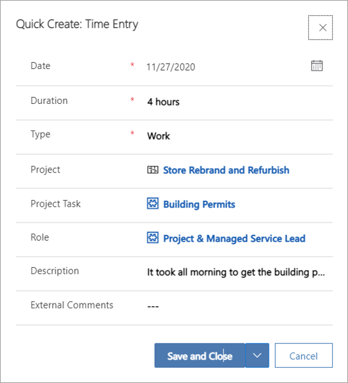

عند تسجيل الوقت في Project Operations، يمكن للمستخدمين تعقب أي مستوى في المشروع، بما في ذلك المهمة أو الملخص أو مستوى المشروع.When recording time in Project Operations, users can track against any level in the project, including the task, summary, or project level.

يقوم أعضاء فريق المشروع بإنشاء إدخالات الوقت وإرسالها للموافقة عليها، وسيقوم الموافقون على المشروع بالموافقة على الإدخالات.Project team members create and submit time entries for approval, and the project approvers will approve the entries. أحياناً، قد يستدعي أحد أعضاء فريق المشروع إدخال الوقت للتصحيحات.Occasionally, the project team member might recall a time entry for corrections.

## إنشاء إدخال وقت جديد وإرسالهCreate and submit a new time entry
لإنشاء إدخال وقت جديد، اتبع الخطوات التالية:To create a new time entry, follow these steps:

1.  في شبكه إدخال الوقت، حدد **جديد**.In the time entry grid, select **New**.
2.  في مربع الحوار **إنشاء سريع: إدخال الوقت**، حدّد تاريخ إدخال الوقت.In the **Quick Create: Time Entry** dialog box, select the time entry date.
3.  أدخل بيانات أبعاد **المشروع**، و **مهمة المشروع**، و **الدور**، و **المدة**.Enter data for the **Project**, **Project Task**, **Role**, and **Duration** dimensions. يجب إضافة هذه المعلومات بالدقائق أو الساعات أو الأيام بإدخال **س** أو **د** أو **ي** بالإضافة إلى الرقم.This information should be added in minutes, hours, or days by entering **h**, **m**, or **d**, together with the number.
4.  أدخل وصفاً للإدخال والتعليقات التي يمكن مشاركتها خارجياُ بخصوص إدخال الوقت.Enter a description for the entry and comments that can be shared externally regarding time entry.

عند حفظ الإدخال، ستظهر القيم التي تم إدخالها في قسم **الأبعاد**.When you save the entry, the entered values will appear in the **Dimensions** section. تظهر المعلومات التي تم إدخالها في حقل **المدة** في التاريخ الذي تم إنشاء إدخال الوقت له.The information that is entered in the **Duration** field appears on the date that the time entry was created for.

يتم إجراء نسخ احتياطي لحقول البحث بواسطة طرق عرض النظام.Lookup fields are backed by system views. على سبيل المثال، بعد أن يدخل المستخدم مشروعاً، يتم تعيين الحقل **مهمة المشروع** على طريقة عرض **نسخ** بشكل افتراضي.For example, after a user has entered a project, the **Project Task** field is set to the **Copy** view by default. لإنشاء إدخالات الوقت للمهام التي لم يتم تعيينها لمستخدم، حدد **تغيير طريقة العرض** في مربع حوار البحث، ثم حدد طريقة العرض **كل مهام المشاريع النشطة**.To create time entries for tasks that aren't assigned to a user, select **Change View** in the lookup dialog box, and then select the **All Active Project Tasks** view.

أنواع إدخالات الوقت المتاحة: **في وقت الراحة**، و **السفر**، و **الوقت الإضافي**، و **العمل**، و **الغياب**، و **الإجازة**.Time entry types that are available: **On Break**, **Travel**, **Overtime**, **Work**, **Absence**, and **Vacation**.

 

يمكنك إرسال الأنواع التالية من إدخالات الوقت:You can submit the following types of time entries: 

- إدخال لمرة واحدةA single time entry 
- مجموعة من إدخالات الوقت عن طريق تحديد مجموعة خلاياA group of time entries by selecting a block of cells 
- صف إدخال وقت كاملAn entire time entry row

وتظهر إدخالات الوقت المرسلة كإدخالات معلقة للموافقة.Submitted time entries appear as entries that are pending approval. 

> [!NOTE]
> بعد إرسال إدخالات الوقت بنجاح، لا يمكن تحريرها.After time entries are successfully submitted, they can't be edited.

## حالة إدخال الوقتTime entry status
يمكن أن يكون لإدخال الوقت الحالات التالية:A time entry can have the following statuses:

- **مسودة** - يتم تعيين إدخالات الوقت الجديدة تلقائياً على الحالة **مسودة**.**Draft** - New time entries are automatically assigned a status of **Draft**. يمكن فقط حذف إدخالات الوقت التي تكون حالتها **مسودة**.Only time entries that have a status of **Draft** can be deleted.
- **مُرسل** - عند إرسال إدخال وقت، يتم تحديث الحالة إلى **مُرسل**.**Submitted** - When a time entry is submitted, the status is updated to **Submitted**.
- **تمت الموافقة** - عند الموافقة على إدخال الوقت الذي تم إرساله، يتم تحديث الحالة إلى **تمت الموافقة**.**Approved** - When a submitted time entry is approved, the status is updated to **Approved**.
- **تم الإرجاع** - إذا تم رفض إدخال الوقت، يتم تحديث الحالة إلى **تم الإرجاع** وسيصبح الإدخال متاحاً للتصحيح وإعادة الإرسال.**Returned** - If a time entry is rejected, the status is updated to **Returned** and the entry will become available for correction and resubmission.

## استدعاء إدخال الوقتRecall a time entry
يمكنك استدعاء إدخالات الوقت التي قمت بإرسالها.You can recall time entries that you've submitted. يمكنك استدعاء إدخال وقت فردي أو مجموعة من إدخالات الوقت أو صف كامل من إدخالات الوقت.You can recall a single time entry, a block of time entries, or a whole row of time entries. يمكن تحرير إدخالات الوقت المستدعي.Recalled time entries can be edited.

