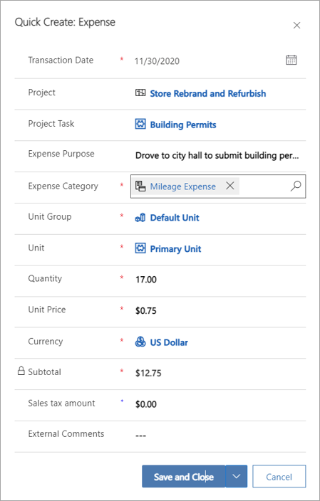
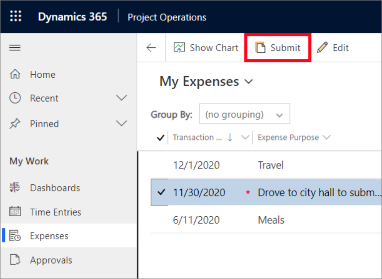
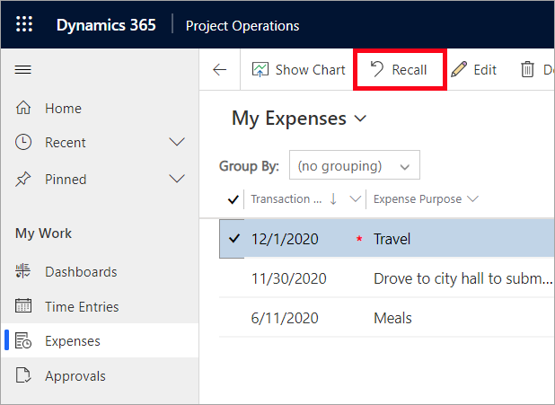
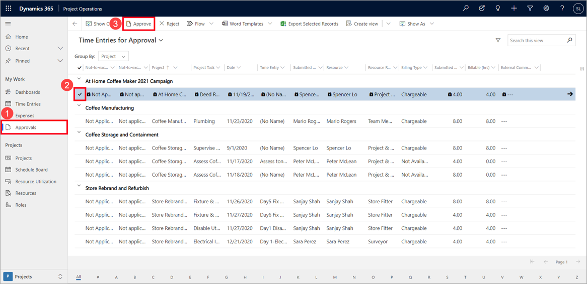

يمكنك التقاط المصروفات حتى تتمكن من إرسالها إلى المعتمد:

1. انتقل إلى **المصروفات** ثم حدد **جديد**.
2. في صفحة **المصروفات الجديدة**، أدخل معلومات المصروفات المطلوبة ثم حدد **حفظ**.
 

## إرسال مصروفات أساسية
بعد الانتهاء من التقاط المصروفات، وعندما تكون مستعداً لاعتمادها، يتعين عليك إرسالها.

1. انتقل إلى **المصروفات** وحدد مصروفات، أو يمكنك تحديد كافة المصروفات باستخدام خانة الاختيار الموجودة في الرأس.
2. حدد **إرسال**. يعالج النظام الإدخالات المحددة ثم يقوم بإنشاء طلبات اعتماد المصروفات.
 

## إضافة مرفق
قد يتعين عليك توفير المعتمد مع الوثائق الإضافية الخاصة بالمصروفات. يمكنك إرفاق إيصال في المخطط الزمني لإدخال المصروفات. حدد **تحرير** في القسم **المخطط الزمني** ثم حدد أيقونة مشبك الورق لإرفاق الإيصال.

## استدعاء مصروفات
عند إرسال مصروفات بالخطأ، يمكنك استدعاؤها. يعتمد الوقت المطلوب لاستدعاء إدخال المصروفات على مرحلة الموافقة الخاصة به. وإذا لم يوافق المعتمد على الإدخال بعد، يمكن أن يحدث الاستدعاء على الفور. ومع ذلك، إذا تمت الموافقة على الإدخال بالفعل، فإنه يُطلب من المعتمد الموافقة على الاستدعاء وعكس المعاملات.

1. انتقل إلى **المصروفات**، ثم في قائمة المصروفات، حدد المصروفات المراد استدعاؤها.
2. حدد **استرجاع**. إذا لم تتم الموافقة على إدخال المصاريف بعد، فسيقوم النظام باستدعائها على الفور. إذا تمت الموافقة على إدخال المصاريف بالفعل، فسيتم إنشاء طلب استدعاء لإعلام المعتمد برغبتك في عكس المصروفات. سيؤكد المعتمد بعد ذلك أنه يمكن إجراء العكس، وسيتم إرجاع الإدخال.

## حذف مصروفات أساسية
يمكن حذف المصروفات التي لم يتم إرسالها بعد. لحذف مصروفات تم إرسالها بالفعل، يتعين عليك أولاً استدعاؤها.

## الموافقة
اعتماداً على سياسات الموافقة على المصروفات الخاصة بمؤسستك، قد يُطلب من أكثر من شخص الموافقة على تقرير المصروفات المقدم. عندما تقوم بإعداد عملية سير العمل للموافقة على تقرير المصروفات، يمكنك إضافة عناصر سير العمل التي تتضمن المهام أو الخطوات لواحد أو أكثر من جهات الموافقة على تقرير المصروفات. 

على سبيل المثال، قد تطلب الموافقة على جميع تقارير المصروفات من قِبل شخصين منفصلين: مدير الموظف الذي أرسل التقرير ومنسق الحسابات الدائنة.

إذا قررت طلب العديد من جهات اعتماد تقرير المصروفات، يمكنك إضافة عناصر سير العمل بأي من الطرق التالي.

- أضف عنصر موافقة واحداً يتكون من خطوة واحدة. على سبيل المثال، قد تتطلب الخطوة أن يتم تعيين تقرير مصروفات لمجموعة مستخدمين وأن تتم الموافقة عليه من قِبل 50 في المائة من أعضاء مجموعة المستخدمين.

- أضف عنصر موافقة واحداً يتكون من خطوات متعددة. على سبيل المثال، قد يحتوي عنصر الموافقة على الخطوات التالية:

  1. يوافق مدير الموظف الذي قدم تقرير المصروفات عليه.

  2. يتحقق كاتب الحسابات الدائنة من الإيصالات وبنود تقرير المصروفات.

  3. يوافق مالك الموازنة على تقرير المصروفات.

- أضف عدة عناصر موافقة، لكل منها خطوة واحدة. على سبيل المثال، يمكنك إضافة عنصر موافقة منفصل لكل خطوة من الخطوات التالية:

  1. يوافق مدير الموظف على تقرير المصروفات.

  2. يوافق مالك الموازنة على تقرير المصروفات.

