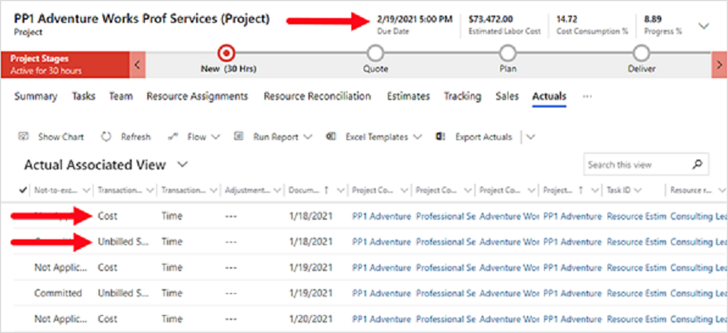

في هذا التمرين، ستقوم بإجراء سلسلة من مهام الوقت والمصروفات التي تستند إلى سيناريوهات واقعية متعددة من خلال مستخدمين مختلفين.

يستخدم هذا التمرين بيانات العرض التوضيحي القياسية المتوفرة في Project Operations. يمكنك الوصول إلى بيئة تجريبية لـ Project Operations من خلال تحديد **الشروع في العمل** في الزاوية اليمنى العلوية من الصفحة [Dynamics 365 Project Operations‏‎](https://dynamics.microsoft.com/project-operations/overview/?azure-portal=true).

## المهمة 1: تعيين الموافقين على المشروع
في هذه المهمة، ستقوم بتعيين **حساب مسؤول** و **سبنسر لو** بصفتهما الموافقين على المشروع، والذين سيوافقون على إدخالات الوقت أو المصروفات التي تم إرسالها.

1.  افتح علامة التبويب **مستعرض الويب (المشروع)** وحدد علامة التبويب **الفريق**، ثم حدد **حساب مسؤول**. حدد أيقونة **المزيد من الأوامر**، ثم حدد **تحرير**.
2.  في الصفحة **عضو فريق المشروع**، في المربع **الموافق على المشروع**، حدد **نعم**، ثم حدد **حفظ وإغلاق**.
3.  كرر الخطوات 1-2 لتعيين **سبنسر لو**.
 
## المهمة 2: إدخالات الوقت
في هذه المهمة، تقوم بتشغيل دور **جاكوب هانكوك**، الرئيس الاستشاري، والذي سيقوم بإنشاء إدخالات الوقت وإرسالها. 

### إنشاء إدخال الوقت
لإنشاء إدخال الوقت، اتبع هذه الخطوات:

1.  في مستعرض الويب، حدد أيقونة الإعدادات ثم حدد **نافذة جديدة في وضع التصفح المتخفي** ‏(Google Chrome) أو حدد **نافذة جديدة في وضع التصفح الخاص** ( Microsoft Edge).
2.  في مستعرض الويب الجديد، في المربع "عنوان الويب"، أدخِل **office.com** ثم اضغط على مفتاح **Enter**.
3.  في صفحة الويب **مرحباً بك في Office**، حدد **تسجيل الدخول**، ثم سجِّل الدخول باسم **jacobh@<yourdomainname\>**.
4.  في صفحة **Office 365**، حدد أيقونة الوافل ثم حدد **Dynamics 365**.
5.  في الصفحة الرئيسية **Dynamics 365**، حدد **Project Operations**.
6.  أسفل القسم **العمل الخاص بي**، حدد **إدخالات الوقت**، في الصفحة **إدخالات الوقت الأسبوعية الخاصة بي**، وحدد **جديد**. يحتاج جاكوب إلى إنشاء خمسة إدخالات وقت تغطي الأسبوع بالكامل.
7.  في الجزء **الإنشاء السريع: إدخال الوقت**، أكمل الإعدادات الآتية وحدد السهم لأسفل، ثم حدد **حفظ وإنشاء جديد**.

    | **الإعداد** | **إجراء الخطوات الآتية** |
     | ------------- | ------------- |
     | **التاريخ‬** | حدد أيقونة التقويم وحدد **يوم الاثنين من هذا الأسبوع**|
     | **المدة** | حدد **8 ساعات** |
    | **النوع** | حدد **العمل** |
     | **المشروع** | حدد أيقونة البحث وحدد **خدمات PP1 Adventure Works الاحترافية**|
    | **مهمة المشروع** | حدد أيقونة البحث وحدد **تقدير المورد** |

8.  كرر الخطوة 7 أربع مرات أخرى، مع زيادة التاريخ بيوم واحد.
9.  في الصفحة **إدخالات الوقت الأسبوعية الخاصة بي**، اضغط على المفتاح **F5** لتحديث الصفحة وحدد الصف، ثم حدد **إرسال**.

بعد انتهاء المعالجة، لاحظ أن **حالة الإدخال** قد تم تغييرها إلى **مرسلة**.

### الموافقة على إدخال الوقت
في هذه المهمة، تؤدي دور حساب المسؤول (مدير المشروع) وستقوم بمراجعة إدخالات الوقت والموافقة عليها. 

1.  في علامة التبويب **مستعرض الويب (المشروع)** التي يتم تسجيل الدخول إليها باسم **حساب المسؤول**، وضمن القسم **العمل الخاص بي**، حدد **الموافقات**.
2.  في الصفحة **إدخالات الوقت للموافقة**، حدد كافة الإدخالات، ثم حدد **موافقة**. في مربع الحوار، حدد **موافق**.
3.  بعد انتهاء المعالجة، في قائمة التنقل، حدد **المشاريع**، ثم حدد مشروع **PP1 Adventure Works**.
4.  في الصفحة **المشروع**، حدد علامة التبويب **ذات الصلة**، ثم حدد **القيم الفعلية**.
5.  قم بمراجعة الصفحة **طريقة العرض المقترنة الفعلية**.

  
 
> [!NOTE]
> تحدث حركتان كل يوم: حركة للتكاليف وأخرى للمبيعات.

### استدعاء إدخال الوقت
في هذه المهمة، تؤدي دور **جاكوب هانكوك**، الرئيس الاستشاري، والذي سيقوم باستدعاء إدخالات الوقت التي تمت الموافقة عليها وتغيير إدخال يوم الجمعة بوصفه يوم عطلة بسبب الطوارئ العائلية.

1.  افتح مستعرض الويب الذي قام **جاكوب هانكوك** بتسجيل الدخول إليه.
2.  في الصفحة **إدخالات الوقت الأسبوعية الخاصة بي**، حدد الصف، ثم حدد **استدعاء**.
3.  في مربع الحوار **استدعاء الإدخالات التي تمت الموافقة عليها**، في المربع **سبب الاستدعاء**، أدخِل **الطوارئ العائلية في يوم الجمعة - سأقوم بتغيير الإدخال إلى يوم عطلة**، ثم حدد **نعم**.
4.  افتح مستعرض الويب الخاص بالمسؤول.
5.  في قائمة التنقل، حدد **الموافقات** وقم بتغيير طريقة العرض إلى **استدعاء طلبات للموافقة**.
6.  في الصفحة **استدعاء طلبات للموافقة**، حدد جميع الإدخالات وحدد **موافقة**، ثم حدد **موافق** في مربع الحوار.
7.  افتح مستعرض الويب لدى جاكوب هانكوك.
8.  في الصفحة **إدخالات الوقت الأسبوعية الخاصة بي**، اضغط على المفتاح **F5** لتحديث الصفحة. عندما تقوم **حالة الإدخال** بعرض **تم الإرجاع**، يمكنك تحرير الإدخال. ولأنه لا يمكنك تعديل إدخال واحد فقط، ستضطر إلى حذف الصف وإعادة إنشاء الإدخالات. 
9.  في الصفحة **إدخالات الوقت الأسبوعية الخاصة بي**، حدد الصف وحدد **حذف**، ثم حدد **موافق** في مربع الحوار **تأكيد الحذف**.
10. في الصفحة **إدخالات الوقت الأسبوعية الخاصة بي**، في شريط القوائم، حدد **إضافة جديد**.
11. في الجزء **الإنشاء السريع: إدخال الوقت**، أكمل الإعدادات الآتية وحدد السهم لأسفل، ثم حدد **حفظ وإنشاء جديد**.

    | **الإعداد** | **إجراء الخطوات الآتية** |
     | ------------- | ------------- |
     | **التاريخ‬** | حدد أيقونة التقويم وحدد **يوم الاثنين من هذا الأسبوع**|
     | **المدة** | حدد **8 ساعات** |
    | **النوع** | حدد **العمل** |
     | **المشروع** | حدد أيقونة البحث وحدد **خدمات PP1 Adventure Works الاحترافية**|
    | **مهمة المشروع** | حدد أيقونة البحث وحدد **تقدير المورد** |
 

12. كرر الخطوة 9 للأيام من الثلاثاء إلى الخميس.
13. بالنسبة إلى يوم الجمعة، أكمل الإعدادات الآتية، ثم حدد **حفظ وإغلاق**.

    | **الإعداد** | **إجراء الخطوات الآتية** |
     | ------------- | ------------- |
    | **التاريخ‬** | حدد **يوم الجمعة** |
     | **المدة** | حدد **8 ساعات** |
    | **النوع** | حدد **عطلة** |
     | **الوصف** | أدخِل **طوارئ عائلية** |

14. عند الانتهاء، اضغط على المفتاح **F5** لتحديث الصفحة، ثم حدد كلا الصفين، ثم حدد **إرسال**، ثم حدد **موافق** في مربع الحوار.
15. قم بالتبديل إلى "مستعرض ويب المسؤول".
16. قم بالتغيير إلى طريقة العرض **إدخالات الوقت للموافقة**، ثم حدد جميع الإدخالات، ثم حدد **موافقة**، ثم حدد **موافق** في مربع الحوار.
17. قم بالتغيير إلى طريقة العرض **حالات الغياب/العطلات للموافقة**، ثم حدد إدخال العطلة، ثم حدد **موافقة**، ثم حدد **موافق** في مربع الحوار.

### إلغاء الموافقة على الوقت - وقت غير خاضع للرسوم
في هذه المهمة، تؤدي دور حساب المسؤول (مدير المشروع) وستقوم بتغيير أحد إدخالات الوقت التي تمت الموافقة عليها لـ **جاكوب هانكوك** إلى إدخالات وقت غير خاضعة للرسوم. 

1.  قم بتغيير طريقة العرض إلى **‏‫الموافقات السابقة الخاصة بي**‬ وحدد آخر إدخال خاضع للرسوم/تمت الموافقة عليه. حدد **إلغاء الموافقة**، ثم حدد **موافق** في مربع الحوار **إلغاء الموافقة**.
2.  قم بتغيير طريقة العرض **إدخالات الوقت للموافقة** وحدد المربع **نوع الفوترة**، ثم حدد **غير خاضعة للرسوم**، ثم حدد **موافقة**.
3.  عند اكتمال المعالجة، حدد **تحديث** وتأكد من اسم **الشخص الموافق**، وسيظهر **حساب المسؤول**.
4.  قم بتغيير طريقة العرض إلى **الموافقات السابقة الخاصة بي** ولاحظ أنه تم تغيير نوع الفوترة إلى **غير خاضعة للرسوم**.

> [!NOTE]
>  يمكنك أيضاً مراجعة **طريقة العرض المقترنة الفعلية** من الصفحة **المشاريع > المشاريع**، للاطلاع على الإدخالات غير الخاضعة للرسوم.

## المهمة 3: إدخالات المصروفات
في هذه المهمة، تؤدي دور **جاكوب هانكوك**، الرئيس الاستشاري، الذي سيقوم بإنشاء مصروفات السفر لمشروع Adventure Works وإرسالها. يدرس جاكوب في ورشة عمل لمدة أسبوعين وقام بحجز تذكرة طيران لهذه المناسبة. 

### إنشاء إدخال المصروفات
لإنشاء إدخال المصروفات، اتبع هذه الخطوات:

1.  افتح مستعرض الويب لدى جاكوب هانكوك.
2.  في القسم **العمل الخاص بي**، حدد **المصروفات**، وفي الصفحة **المصروفات الخاصة بي**، حدد **إضافة جديد**. 
3.  في الجزء **إنشاء سريع: المصروفات**، أكمل الإعدادات الآتية ثم حدد **حفظ وإغلاق**.

    | **الإعداد** | **إجراء الخطوات الآتية** |
     | ------------- | ------------- |
     | **تاريخ الحركة** | حدد أيقونة التقويم وحدد تاريخ اليوم|
     | **المشروع** | حدد أيقونة البحث وحدد **خدمات PP1 Adventure Works الاحترافية (المشروع)**|
    | **مهمة المشروع** | حدد أيقونة البحث وحدد **تقديم ورش العمل** |
     | **الغرض من المصروفات** | أدخِل **مصروفات السفر** |
    | **فئة المصروفات** | حدد **رحلة الطيران** |
    | **مبلغ ضريبة المبيعات** | أدخِل **39.00**|

4. في الصفحة **المصروفات الخاصة بي**، حدد الصف، ثم حدد **إرسال**. بعد انتهاء المعالجة، لاحظ أن **حالة المصروفات** قد تم تغييرها إلى **مرسلة**.

### الموافقة على إدخال المصروفات
في هذه المهمة، تؤدي دور حساب المسؤول (مدير المشروع) وستقوم بمراجعة إدخالات الوقت والموافقة عليها. 

1.  افتح مستعرض الويب لـ "حساب المسؤول".
2.  ضمن القسم **العمل الخاص بي**، حدد **موافقة**، ثم قم بتغيير طريقة العرض إلى **إدخالات المصروفات للموافقة**.
3.  في الصفحة **إدخالات المصروفات للموافقة**، حدد الإدخال وحدد **موافقة**، ثم حدد **موافق** في مربع الحوار.
4.  بعد انتهاء المعالجة، في قائمة التنقل، ضمن القسم **المشاريع**، حدد **المشاريع**، ثم حدد المشروع **PP1 Adventure Works**.
5.  في الصفحة **المشروع**، حدد علامة التبويب **ذات الصلة**، ثم حدد **القيم الفعلية**.
6.  في الصفحة **طريقة العرض المقترنة الفعلية**، ابحث عن فئة الحركة **المصروفات** لعرض إدخالي المصروفات اللذين تمت الموافقة عليهما: إدخال للتكلفة وآخر للمبيعات غير المفوترة. يمكنك النقر نقراً مزدوجاً فوق الإدخال لعرض تفاصيل المصروفات.
 
### استدعاء إدخال المصروفات
في هذه المهمة، تؤدي دور **جاكوب هانكوك**، الرئيس الاستشاري، والذي سيقوم باستدعاء إدخال المصروفات الذي تمت الموافقة عليه وتغيير **مبلغ ضريبة المبيعات** إلى 89.00 دولاراً أمريكياً.

1.  افتح مستعرض الويب الذي قام جاكوب هانكوك بتسجيل الدخول إليه.
2.  في الصفحة **المصروفات الخاصة بي**، حدد الصف، ثم حدد **استدعاء**.
3.  في مربع الحوار **استدعاء الإدخالات التي تمت الموافقة عليها**، في المربع **سبب الاستدعاء**، أدخِل **مبلغ ضريبة المبيعات غير صحيح. ويجب أن يكون 89.00 دولاراً**، ثم حدد **نعم**.
4.  افتح مستعرض الويب الخاص بالمسؤول.
5.  في قائمة التنقل، ضمن القسم **العمل الخاص بي**، حدد **الموافقات** وقم بتغيير طريقة العرض إلى **استدعاء طلبات للموافقة**.
6.  في الصفحة **استدعاء طلبات للموافقة**، حدد الصف وحدد **موافقة**، ثم حدد **موافق** في مربع الحوار.
7.  افتح مستعرض الويب لدى جاكوب هانكوك.
8.  في الصفحة **المصروفات الخاصة بي**، اضغط على المفتاح **F5** لتحديث الصفحة وحدد الصف، ثم حدد **تحرير**. 
9.  في الصفحة **مصروفات السفر**، قم بتغيير **مبلغ ضريبة المبيعات** إلى **89.00**، ثم حدد **إرسال**.
10. افتح مستعرض الويب الخاص بالمسؤول.
11. قم بتغيير طريقة العرض إلى **إدخالات المصروفات للموافقة** وحدد الإدخال، ثم حدد **موافقة**، ثم حدد **موافق** في مربع الحوار.

### إلغاء الموافقة على المصروفات - مصروفات غير خاضعة للرسوم
لقد أخبرك مولي كلارك، مدير الحسابات، أن الشركة لن تقوم برد مصروفات السفر إلى Adventure Works. 

في هذه المهمة، تؤدي دور حساب المسؤول (مدير المشروع) وستقوم بتغيير أحد إدخالات الوقت التي تمت الموافقة عليها لجاكوب هانكوك إلى إدخالات وقت غير خاضعة للرسوم. 

1.  قم بتغيير طريقة العرض إلى ‏‫**الموافقات السابقة الخاصة بي**‬، وحدد إدخال **مصروفات السفر** وحدد **إلغاء الموافقة** وحدد **موافق** في مربع الحوار **إلغاء الموافقة**.
2.  قم بتغيير طريقة العرض **إدخالات المصروفات للموافقة** وحدد المربع **نوع الفوترة**، ثم حدد **غير خاضعة للرسوم**، ثم حدد **موافقة**، ثم حدد **موافق** في مربع الحوار.
3.  قم بتغيير طريقة العرض إلى **الموافقات السابقة الخاصة بي**. لاحظ أنه تم تغيير نوع الفوترة لـ **مصروفات السفر** إلى **غير خاضعة للرسوم**.
4.  يمكنك أيضاً مراجعة **طريقة العرض المقترنة الفعلية** من الصفحة **المشاريع > المشاريع**، للاطلاع على الإدخالات غير الخاضعة للرسوم.

