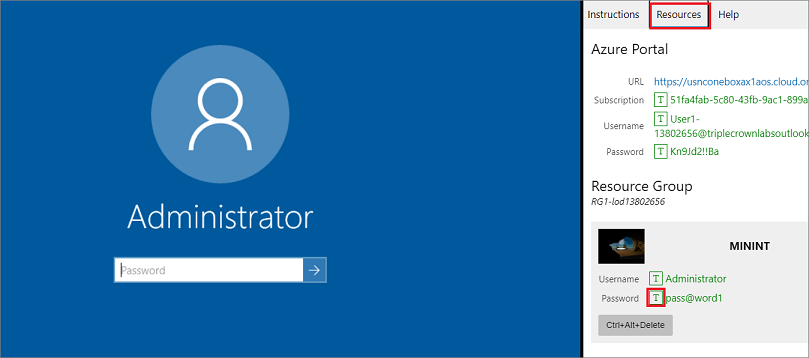
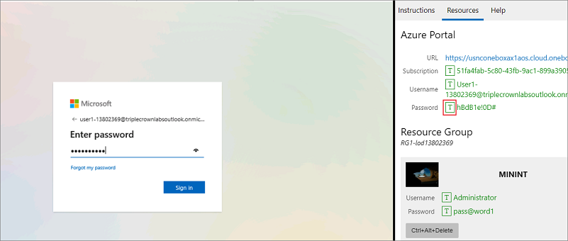

## اقرأ هذا أولاً - قبل أن تبدء المعمل!Read this first - before you start the lab! 

> [!IMPORTANT]
> بالنسبة لهذا المعمل، لا يمكنك تسجيل الدخول باستخدام بيانات الاعتماد الخاصة بك.For this lab, you CANNOT sign in with your own credentials. استخدم الخطوات التالية لتسجيل الدخول إلى بيئة المعمل باستخدام بيانات الاعتماد الصحيحة.Use the following steps to sign in to your lab environment with the correct credentials. 

1. حدد **تشغيل وضع VM** أو **تسجيل الدخول لتشغيل وضع VM** في هذه الوحدة.Select **Launch VM mode** or **Sign in to launch VM mode** in this unit. 
2. في علامة التبويب **الموارد** على الشريط الجانبي للمعمل، حدد الرمز **T** بجوار **كلمة المرور** في الصندوق **MININT**، للحصول على كلمة مرور المسؤول للجهاز الظاهري الخاص بك.In the **Resources** tab on the lab side bar, select the **T** icon next to **Password** in the **MININT** box, to have the administrator password for the Virtual Machine entered for you.

    

3. اضغط على **إدخال**.Press **Enter**. 
4. في نافذة **الشبكات** التي تفتح، حدد **لا** لعدم السماح باكتشاف جهاز الكمبيوتر الخاص بك.In the **Networks** window that opens, select **No** to not allow your PC to be discoverable.
5. سترى نافذة PowerShell وستظهر نافذة أوامر Windows.You'll see a PowerShell window and a Windows Command window appear. بعد مرور دقيقتين إلى ثلاث دقائق، سيتم إغلاقها وسيفتح Internet Explorer تلقائياً.After about two to three minutes, they'll close and Internet Explorer will open automatically. انتظر حتى ينتقل إلى صفحة **تسجيل الدخول** لـ Finance and Operations.Wait for it to navigate to the **Sign in** page for Finance and Operations. 
6. في صفحة **تسجيل الدخول** إلى Microsoft في Finance and Operations، أدخل مؤشر الماوس في حقل **اسم المستخدم**.On the Microsoft **Sign in** page in Finance and Operations, insert your mouse cursor into the **Username** field. 
7. في علامة التبويب **الموارد** للشريط الجانبي للمعمل، أسفل عنوان **مدخل Azure**، حدد رمز **T** بجوار **اسم المستخدم**، ثم اضغط على **إدخال**.On the **Resources** tab of the lab side bar, below the **Azure portal** heading, select the **T** icon next to **Username**, then press **Enter**. 

    

8. سيكون مؤشر الماوس الآن في صفحة **كلمه المرور**.Your mouse cursor will now be in the **Password** page.
9. في علامة التبويب **الموارد** للشريط الجانبي للمعمل، أسفل عنوان **مدخل Azure**، حدد رمز **T** لتحديد **كلمة المرور**، ثم اضغط على **إدخال**.On the **Resources** tab of the lab side bar, below the **Azure portal** heading, select the **T** icon next to select **Password**, then press **Enter**. 

    

10. لا تظل مسجلاً للدخول، أو تخزن كلمة المرور على الجهاز الظاهري.Don't stay signed in, or store the password on the virtual machine. 

11. للاطلاع على تعليمات المعمل، حدد علامة التبويب **التعليمات** على الشريط الجانبي للمعمل.To see the lab instructions, select the **Instructions** tab on the lab side bar.

يمكنك الآن أن تبدء عملك في هذا المعمل.You can now begin your work on this lab. 
