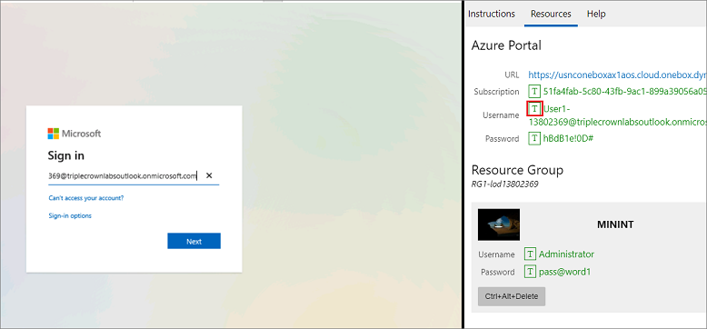

## اقرأ هذا أولاً - قبل أن تبدء المعمل! 

> [!IMPORTANT]
> بالنسبة لهذا المعمل، لا يمكنك تسجيل الدخول باستخدام بيانات الاعتماد الخاصة بك. استخدم الخطوات التالية لتسجيل الدخول إلى بيئة المعمل باستخدام بيانات الاعتماد الصحيحة. 

1. حدد **تشغيل وضع VM** أو **تسجيل الدخول لتشغيل وضع VM** في هذه الوحدة. 
2. في علامة التبويب **الموارد** على الشريط الجانبي للمعمل، حدد الرمز **T** بجوار **كلمة المرور** في الصندوق **MININT**، للحصول على كلمة مرور المسؤول للجهاز الظاهري الخاص بك.

    

3. اضغط على **إدخال**. 
4. في نافذة **الشبكات** التي تفتح، حدد **لا** لعدم السماح باكتشاف جهاز الكمبيوتر الخاص بك.
5. سترى نافذة PowerShell وستظهر نافذة أوامر Windows. بعد مرور دقيقتين إلى ثلاث دقائق، سيتم إغلاقها وسيفتح Internet Explorer تلقائياً. انتظر حتى ينتقل إلى صفحة **تسجيل الدخول** لـ Finance and Operations. 
6. في صفحة **تسجيل الدخول** إلى Microsoft في Finance and Operations، أدخل مؤشر الماوس في حقل **اسم المستخدم**. 
7. في علامة التبويب **الموارد** للشريط الجانبي للمعمل، أسفل عنوان **مدخل Azure**، حدد رمز **T** بجوار **اسم المستخدم**، ثم اضغط على **إدخال**. 

    

8. سيكون مؤشر الماوس الآن في صفحة **كلمه المرور**.
9. في علامة التبويب **الموارد** للشريط الجانبي للمعمل، أسفل عنوان **مدخل Azure**، حدد رمز **T** لتحديد **كلمة المرور**، ثم اضغط على **إدخال**. 

    

10. لا تظل مسجلاً للدخول، أو تخزن كلمة المرور على الجهاز الظاهري. 

11. للاطلاع على تعليمات المعمل، حدد علامة التبويب **التعليمات** على الشريط الجانبي للمعمل.

يمكنك الآن أن تبدء عملك في هذا المعمل. 
