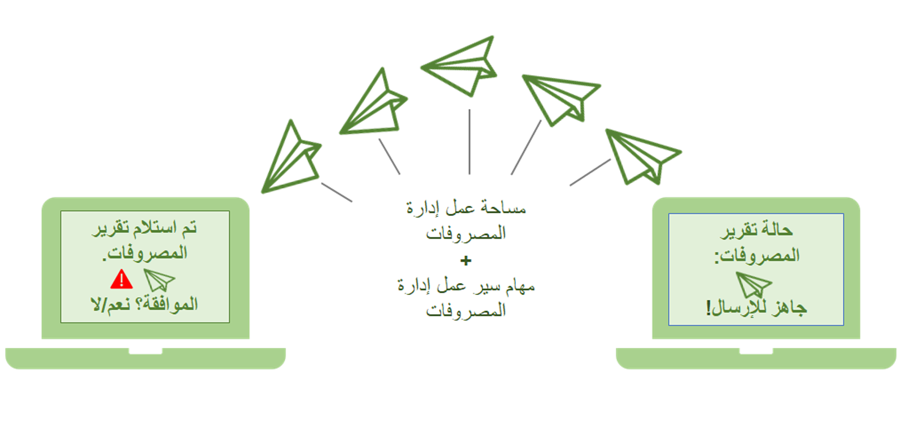

تم تصميم إدخال تقرير المصروفات لتبسيط عملية إكمال تقارير المصروفات. تعد مساحة عمل **إدارة المصروفات** الموقع الرئيسي للمستخدمين لتقديم المصروفات إلى مؤسساتهم. تعد مساحة عمل إدارة المصروفات موضعاً شاملاً واحداً لتقديم تقارير المصروفات. يمكن تمكين مساحة العمل هذه والعديد من الميزات الأخرى من خلال الوحدة النمطية **إدارة الميزات** في Dynamics 365 Project Operations.

باستخدام Project Operations، يمكنك الوصول إلى العديد من الميزات التي تسمح لمؤسستك بتصميم نظام إدخال مصروفات سريع وبسيط، ويتبع قواعد الامتثال لحماية جميع الأطراف المعنية. 

تشتمل الميزات التي تجعل النظام سهل الاستخدام على ما يلي:

- القدرة على الوصول إلى نفقات المفوضين من خلال مساحة عمل **إدارة المصروفات**
- جزء مبسط لتحرير المصروفات وإدخالها
- نظام إدارة تحذير، وخطأ ونهج متقدم يساعد في التأكد من أن الشخص الذي يُدخل المصروفات يتفهم المشكلات التي تنشأ، ويستخدم أسرع السبل لحلها، ويسمح بإدخال مصروفات ناجح 

## تمكين ميزة "تقارير مصروفات معاد تصورها"

في أي إصدار جديد من Project Operations، يتم تقديم الميزات وتعديلها. مساحة العمل حيث يمكنك الوصول إلى مجموعة من التحسينات التي تم تقديمها مع كل إصدار هي مساحة العمل **إدارة الميزات**. تم إيقاف الميزات الجديدة بواسطة التصميم. يمكنك استخدام مساحة عمل **إدارة الميزات** لتمكين الميزات الجديدة والمحدثة وعرض الوثائق الخاصة بها. 

وهناك ميزة مفيدة واحدة تتمثل في **تقارير مصروفات معاد تصورها**. يكشف العرض التوضيحي للفيديو التالي عن مساحة عمل **إدارة الميزات**، ويمكِّن ميزة **تقارير مصروفات معاد تصورها**. 

وعادةً ما يتم تنفيذ هذه المهمة من قِبل مسؤول النظام. 

 > [!VIDEO https://www.microsoft.com/videoplayer/embed/RE4J3Yt]

