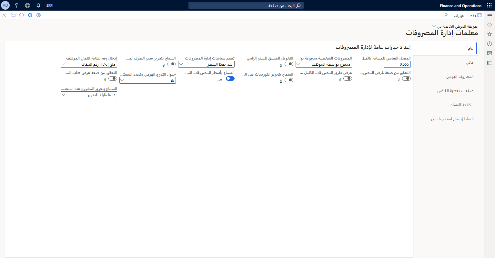
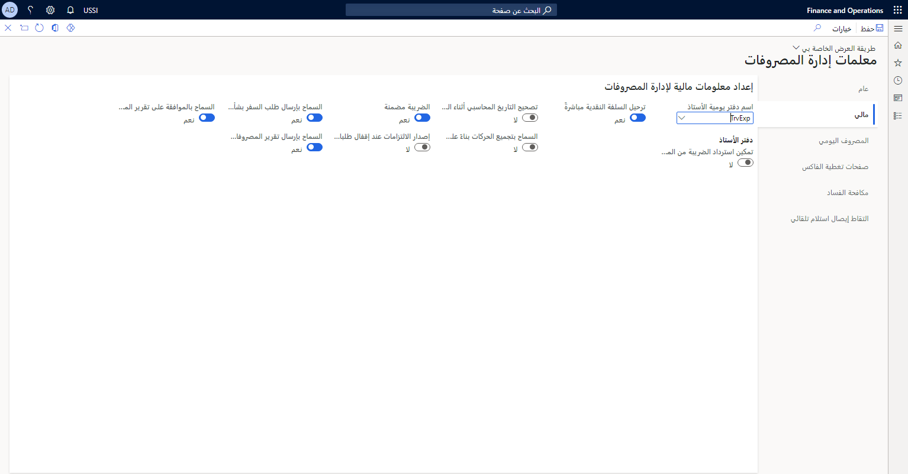
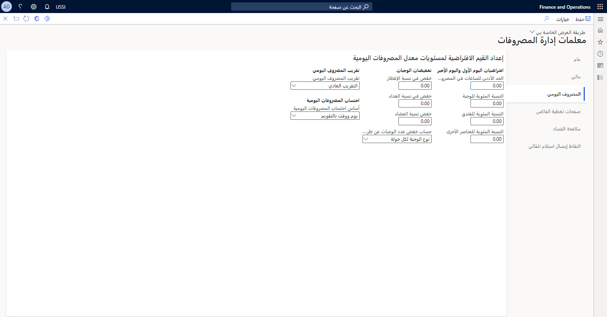
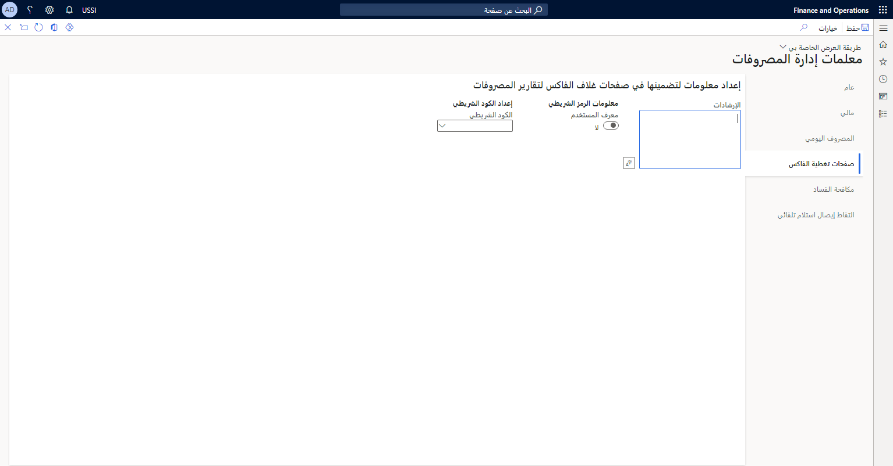
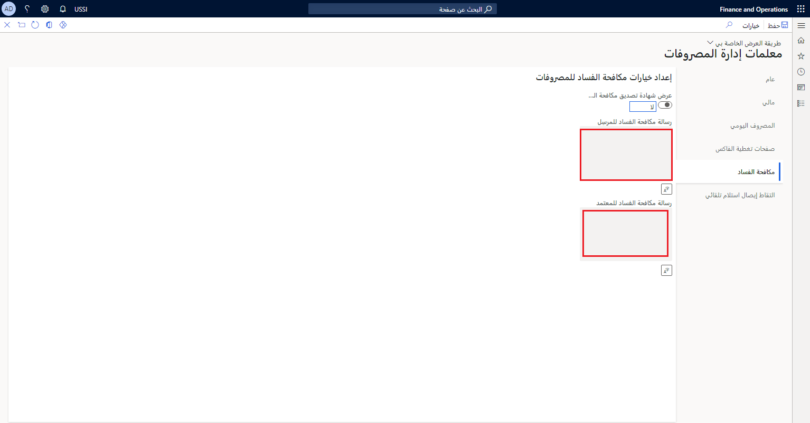

تُعد صفحة **معلمات إدارة المصروفات** هي صفحة الإعدادات الرئيسية لقدرات إدارة المصروفات.The **Expense management parameters** page is the main settings page for expense management capabilities. تُعد معلمات إدارة المصروفات مهمة، وغالباً ما تشير العديد من الميزات أو الخدمات الأخرى إلى هذه المعلمات.The expense management parameters are important, and many other features or services often refer to these parameters. عندما تكون مؤسستك في مرحلة التخطيط الأولي لإدارة المصروفات، تأكد من توجيه عناية خاصة لهذه الإعدادات والتخطيط للإعدادات التي ستتبناها مؤسستك.When your organization is in its initial expense management planning phase, make sure that you pay close attention to these settings and plan the settings that your organization will adopt.

تحتوي صفحة **معلمات إدارة المصروفات** على خمس علامات تبويب تتحكم في مواضيع متنوعة:The **Expense management parameters** page has five tabs that control a variety of topics:

- عام General
- الأمور الماليةFinancial
- المصروف اليوميPer diem
- صفحات تغطية الفاكسFax cover pages
- مكافحة الفسادAnti-corruption

## عامGeneral 
تحتوي علامة التبويب **عام** على خيارات وإعدادات متنوعة يمكن لمؤسستك تمكينها أو تعطيلها.The **General** tab contains various options and settings that your organization can enable or disable. تتوفر لك الحقول لإدخال المعدلات التي سيتم الخصم منها، مثل **المعدل القياسي للمسافة بالميل**.Fields are available for you to enter rates to charge against, such as the **Standard rate of mileage**.

 

## الأمور الماليةFinancial
تتيح لك علامة تبويب **الأمور المالية** تعيين الخيارات المالية الأساسية حول كيفية تأثير المصروفات على دفتر الأستاذ الخاص بالمؤسسة، والضريبة التي يتم تحصيلها خلال عمليات شراء الموظفين، وماذا سيكون اسم دفتر يومية دفتر الأستاذ.The **Financial** tab allows you to set base financial options about how expenses affect the organization's ledger, the tax that is collected during employee purchases, and what the ledger journal name will be. 

## المصروف اليوميPer diem
تتضمن علامة التبويب **المصروف اليومي** سلسلة من حقول الإدخال التي تتطلب منك إدخال البيانات الرقمية المتعلقة بالمعدلات والنسب المئوية.The **Per diem** tab includes a series of input fields that require you to enter numerical data regarding rates and percentages. إذا كنت قادماً من نظام آخر لإدارة المصروفات، فقد يتم نقل القيم نفسها حتى تتمكن من مواصلة استخدامها.If you are coming from another expense management system, you might carry over the same values so that you can continue using them. يجد العديد من المستخدمين أن معلمات **المصروف اليومي** قوية وتوفر المرونة والتحكم للمؤسسة التي تقوم بإعداد نظام التشغيل.Many users find that the **Per diem** parameters are robust and give flexibility and control to the organization that is setting up the operating system.

## صفحات تغطية الفاكسFax cover pages
بالنسبة للمؤسسات التي ترسل المعلومات المتعلقة بالمصروفات عبر الفاكس، تسمح صفحة **معلمات إدارة المصروفات** بإنشاء صفحات غلاف الفاكس.For organizations that fax expense-related information, the **Expense management parameters** page allows for the generation of fax cover pages. وتتضمن هذه الصفحات الأكواد الشريطية التي تم ترميزها باستخدام المعرف الفريد للموظف مثل رقم الموظف أو الاسم المستعار.These pages include bar codes that are encoded with the employee's unique identifier such as an employee number or alias. تتضمن علامة التبويب **صفحات غلاف الفاكس** أيضاً مربع نص حيث يمكنك إدخال الإرشادات التي يتم ملؤها تلقائياً للمساعدة في توجيه الموظف الذي يرسل مستند مصروفات الفاكس.The **Fax cover pages** tab also includes a text box where you can enter instructions that auto-populate to help guide the employee who is submitting the fax expense document. 

## مكافحة الفسادAnti-corruption
تُعد علامة التبويب **مكافحة الفساد** واضحة ولكنها مهمة في تذكير جميع الموظفين بالحفاظ على المبادئ القانونية والأخلاقية في العمل عند إرسال تقارير المصروفات.The **Anti-corruption** tab is straightforward, yet critical, in reminding all employees about maintaining an ethical and legal business when submitting their expense reports. في علامة التبويب هذه، يمكنك كتابة شهادة تصديق مكافحة الفساد الخاصة بمؤسستك.In this tab, you can write your organization's anti-corruption attestation. يمكنك اختيار أن تكون لديك رسالة واحدة للمرسل ورسالة منفصلة للمعتمد.You can choose to have one message for the submitter and a separate message for the approver. 

تتضمن الصفحة ميزة الترجمة المبتكرة، والتي تضمن أن جميع الموظفين، بغض النظر عن لغتهم الأم، يمكنهم قراءة شهادة تصديق مكافحة الفساد الخاصة بالمؤسسة وفهمها قبل أن يتمكنوا من إرسال المصروفات.Embedded within the page is the innovative translation feature, which ensures that all employees, regardless of their native language, can read and understand the organization's anti-corruption attestation before they can submit an expense.

شاهد الفيديو التالي للحصول على عرض توضيحي لصفحة **معلمات إدارة المصروفات**.Watch the following video for a demonstration of the **Expense management parameters** page.

 > [!VIDEO https://www.microsoft.com/videoplayer/embed/RE4IWng]

