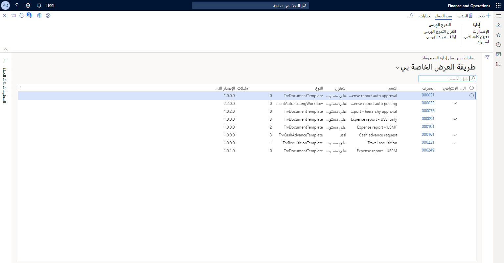
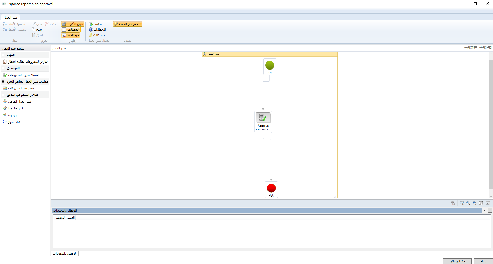

لإعداد عملية مراجعة لتقارير المصروفات في إدارة المصروفات، يمكنك استخدام نظام سير العمل. باستخدام مهام سير عمل إدارة المصروفات، سوف تقلل الوقت المستغرق بدءاً من تقديم المصروفات إلى وقت اعتمادها. 

تتيح واجهة سير العمل إمكانية أتمتة معايير محددة للاعتماد. على سبيل المثال، إذا لم يحتو تقرير المصروفات على إيصال مرفق، فقد يتم رفضه تلقائياً. يؤدي تمكين مهام سير العمل إلى توفير الوقت والجهد للأشخاص المسؤولين عن اعتماد المصروفات. 

لتحديد القائم باعتماد تقارير المصروفات، يمكنك إعداد سير عمل يستخدم المعايير التالية: 

- التدرج الهرمي لتقارير الموظفين والحدود المعرفة مسبقاً للاعتماد 
- اعتماد متعدد المستويات يدعم المعتمدين المؤقتين والنهائيين
- الأبعاد المالية والالتزام تجاه المشاريع 

يمكن إنشاء اعتمادات سير العمل لتقارير المصروفات، وطلبات السفر، والسلف النقدية، واسترداد ضريبة القيمة المضافة.

شاهد الفيديو التالي للاطلاع على أمثلة واقعية عن كيفية مساعدة مهام سير عمل إدارة المصروفات في معالجة المصروفات. 
 > [!VIDEO https://www.microsoft.com/videoplayer/embed/RE4J0Rk]

للحصول على مزيد من المعلومات، راجع [التعامل مع مهام سير العمل في تطبيقات Finance and Operations]( /learn/modules/create-use-workflows-finance-operations/?azure-portal=true).
