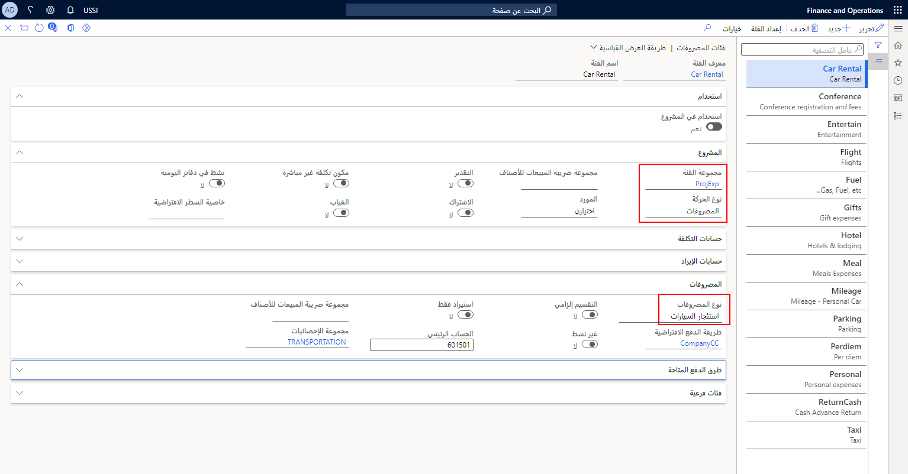
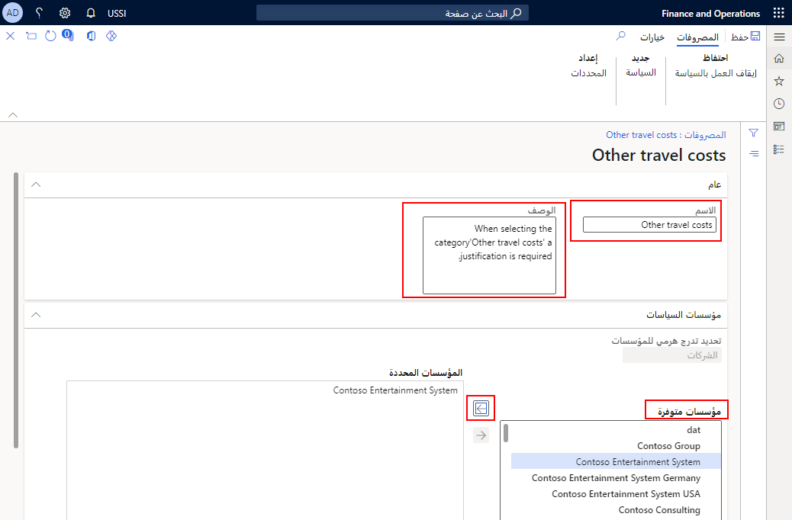
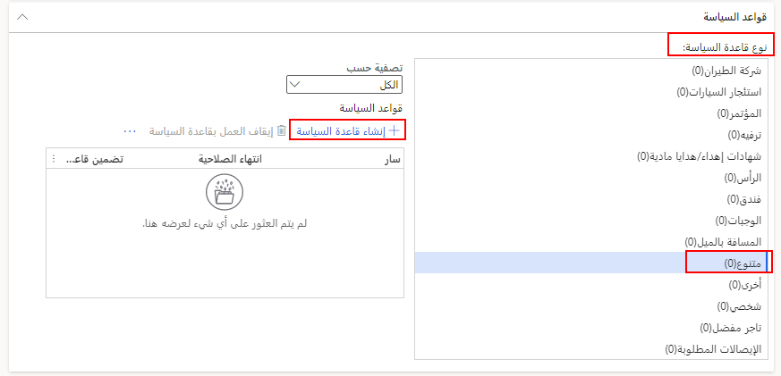
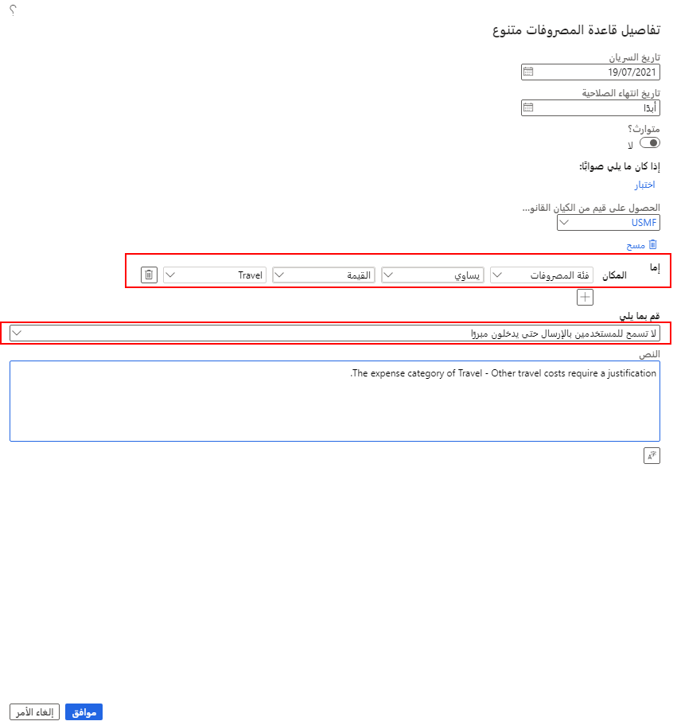
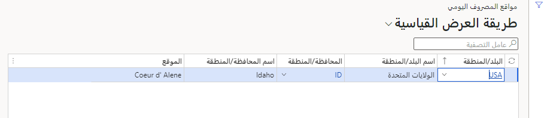

يمكنك إنشاء سياسات تقرير المصروفات وتحديد قواعد المصروفات اليومية لضمان فرض سياسات الشركة بشكلٍ منظم. تساعد السياسات الموظفين على عدم تجاوز حدود الميزانية وتوفير كافة المعلومات المطلوبة وإنفاق الأموال حسب احتياجهم إليها فحسب. يتم إنشاء قواعد المصروفات اليومية لتعويض الموظفين استناداً إلى معدل يومي ثابت قد يختلف حسب الموقع الجغرافي. 

## سياسات تقرير المصروفات
يتم إنشاء سياسات تقرير المصروفات مقابل فئات المصروفات وأنواعها. يوضح المثال الآتي الحقول التي يمكن إنشاء سياسات المصروفات من خلالها وهي **مجموعة الفئات** و **نوع المصروفات** ويتم إعدادها في **إدارة المصروفات > الإعداد > عام > فئات المصروفات**.

 

اتبع الخطوات الآتية لإنشاء سياسة تقرير المصروفات:

1.  انتقل إلى **إدارة المصروفات > السياسات > الإعداد > تقرير المصروفات**.
2.  حدد **جديد** في جزء الإجراءات.
3.  في الحقل **الاسم**، أدخِل اسماً للسياسة.
4.  في الحقل **الوصف**، أدخل وصفاً قصيراً للسياسة.
5.  قم بتوسيع علامة التبويب السريعة **مؤسسات السياسات**.
6.  في القسم **المؤسسات المتوفرة**، حدد الكيان أو الكيانات القانونية للسياسة. 
7.  حدد ‏‏السهم إلى اليمين لنقل الكيان القانوني إلى قسم **المؤسسات المحددة**.

    

8.  قم بتوسيع علامة التبويب السريعة **قواعد السياسة**.
9.  حدد **نوع قاعد السياسة** في الصفحة **فئات المصروفات**.
10. حدد **إنشاء قاعدة سياسة**.

    

11. أدخل **تاريخ سريان** السياسة.
12. إذا انتهت صلاحية السياسة في تاريخ معين، فحدد **تاريخ انتهاء الصلاحية** أو اتركه كـ **مطلقاً** إذا لم يكن لديك تاريخ انتهاء صلاحية معين.
13. في الحقل **أين**، حدد الشروط والمعايير الخاصة بالسياسة.
في المثال الآتي، فئة المصروفات تساوي القيمة **السفر**.
14. في القائمة المنسدلة **نفِّذ الآتي**، حدِّد ما سيحدث عندما يضيف المستخدم الفئة إلى التقرير.
في المثال الآتي، تمت إضافة **لا تسمح للمستخدمين بالإرسال حتى يتم إدخال التبرير**.
15. في الحقل **النص**، أدخل الرسالة التي تود عرضها عندما يقوم المستخدم بانتهاك السياسة.
في المثال الآتي، تمت إضافة **فئة المصروفات الخاصة بالسفر - تكاليف السفر الأخرى تتطلب تبريراً**.

    

عند قيام أحد الموظفين بإدخال بند مصروفات أو محاولات إرسال تقرير مصروفات يخالف السياسة التي تم تكوينها، فسوف يتلقى رسالة خطأ تم تحديدها عند إنشاء السياسة.

يمكنك تحديد الأنواع الثلاثة للسياسات:

- **تحذير** – يتيح للموظف إرسال تقرير مصروفات أو طلب سفر. سيتم تمييز المصروفات لجميع الموافقين ولإعداد التقارير لاحقاً.
- **خطأ** - يتطلب من الموظف مراجعة المصروفات للامتثال للسياسة قبل إرسال تقرير المصروفات أو طلب السفر.
- **التبرير** - يتطلب من الموظف أو المدير إدخال تبرير لتجاوز مبلغ السياسة قبل إرسال تقرير المصروفات أو طلب السفر.

صفحة **معلمات إدارة المصروفات** توفر لك خياراً لتقييم سياسات إدارة المصروفات إما عند حفظ البند أو عند إرسال تقرير مصروفات. إذا اخترت التقييم عند حفظ البند، فإن الخيار يضمن أن يكون لدى المستخدمين الرؤية المبكرة لما يحتاجون إليه لإكمال تقرير المصروفات بالكامل مرة واحدة. 

وبخلاف ذلك، يمكن تأخير تقييم السياسة لتوفير وقت للموظف في أثناء عملية إدخال المصروفات، وذلك في حالة التحقق من الصحة الذي يحدث في النهاية، خلال الإرسال إلى سير العمل. إذا تم تصحيح الأخطاء في كل مرة يتم فيها حفظ بند، فإن إنشاء تقرير المصروفات يمكن أن يبدو مرهقاً للموظف. وإذا تم تصحيح الأخطاء عند إرسال التقرير، فيمكن للموظف تصحيح كافة الأخطاء مرة واحدة. يعد قرار العملية هذا هو ما يجب على شركتك اتخاذه.

## تكوين المصروفات اليومية وإعدادها
عند إنشاء قاعدة مصروفات يومية، يمكنك تنفيذ الآتي:

- حدد أنه سيتم اقتطاع النسبة المئوية لمعدل المصروفات اليومية في حالة حصول أحد العمال على وجبات أو خدمات مجانية. 
- عيِّن الحدين الأدنى والأقصى لعدد الساعات التي يمكن أن يطبق فيها معدل المصروفات اليومية على سفر العامل. 

على سبيل المثال، بدلاً من مطالبة الموظف بإرسال كل إيصال وجبات، فقد تقرر الشركة إعطاء الموظفين معدلاً قياسياً يومياً للوجبات. في الغالب، ستختلف هذه المعدلات لمناطق مختلفة نظراً إلى أن تكلفة الوجبة في قرية ريفية يمكن أن تختلف عن تكلفة الوجبة في مدينة كبيرة. على سبيل المثال، إذا سافر أحد الموظفين إلى سياتل في جولة العمل، فقد تسمح شركته بالمعدل الأساسي البالغ 75.00 دولاراً أمريكياً لجميع الوجبات كل يوم.
 
وقبل إدخال العمليات الحسابية للمصروفات اليومية، يجب إعداد مواقع المصروفات اليومية في **إدارة المصروفات > الإعداد > العمليات الحسابية والأكواد > مواقع المصروفات اليومية**. أدخل كافة المواقع التي سيتم فيها استخدام المصروفات اليومية.
 

ويعتمد المبلغ الإجمالي لحساب المصروفات اليومية على تواريخ البدء والانتهاء التي تم تعيينها في الصفحة **مبالغ المصروفات اليومية**. 

1.  لإعداد معدلات المصروفات اليومية، انتقل إلى **إدارة المصروفات > الإعداد > العمليات الحسابية والأكواد > المصروفات اليومية**.
2.  حدد **جديد‎**.
3.  في القائمة المنسدلة **الموقع**، حدد موقعاً للبدل.
4.  في القائمة المنسدلة **العملة**، حدد العملة القابلة للتطبيق.
5.  قُم بتوسيع علامة التبويب السريعة **عام**.
6.  حدد معلومات **تاريخ البدء** و **تاريخ الانتهاء** المرتبطة بوقت سريان البدل.
7.  في حقل **الفندق**، أدخل بدل المصروفات اليومية حسب الحاجة.
8.  في حقل **الوجبات**، أدخل بدل المصروفات اليومية حسب الحاجة.
9.  في حقل **أخرى**، أدخل بدل المصروفات اليومية حسب الحاجة.
10.  **حفظ** الصفحة.
 

