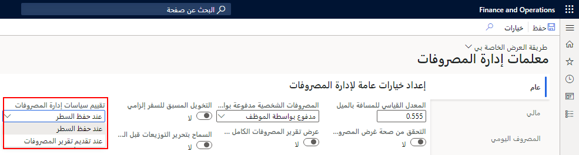
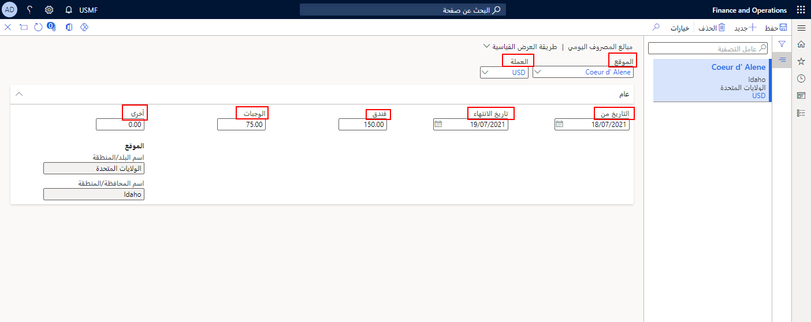

يمكنك إنشاء السياسات تقرير المصروفات وتحديد قواعد المصروفات اليومية لضمان فرض السياسات الشركة بشكلٍ منظم. تساعد السياسات الموظفين على عدم تجاوز حدود الميزانية وتوفير كافة المعلومات المطلوبة وإنفاق الأموال حسب احتياجهم إليها فحسب. يتم إنشاء قواعد المصروفات اليومية لتعويض الموظفين استناداً إلى معدل يومي ثابت قد يختلف حسب الموقع الجغرافي. 

## سياسات تقرير المصروفات
لدى الشركات سياسات تقرير المصروفات التي يقوم المديرون بفحصها غالباً قبل الموافقة على تقارير المصروفات. يمكنك تكوين Project Operations لمراجعة السياسات المرتبطة بتقرير المصاريف تلقائياً قبل السماح للموظف بإرسال تقرير المصاريف. 

على سبيل المثال، يمكن للسياسات أن تضع قيوداً على أسعار تذاكر الطيران أو سداد تكاليف الوجبات. قد تحدد عدد الليالي التي يمكن للموظف أن يقضيها في فندق لرحلة.

يتم إنشاء سياسات تقرير المصروفات مقابل فئات المصروفات وأنواعها. يوضح المثال الآتي الحقول التي يمكن إنشاء سياسات المصروفات من خلالها وهي **مجموعة الفئات** و **نوع المصروفات** ويتم إعدادها في **إدارة المصروفات > الإعداد > عام > فئات المصروفات**.

> [!div class="mx-imgBorder"]
> 
 

اتبع الخطوات الآتية لإنشاء سياسة تقرير المصروفات:

1.  انتقل إلى **إدارة المصروفات > السياسات > الإعداد > تقرير المصروفات**.
2.  حدد **جديد** في جزء الإجراءات.
3.  في الحقل **الاسم**، أدخِل اسماً للسياسة.
4.  في الحقل **الوصف**، أدخل وصفاً قصيراً للسياسة.
5.  قم بتوسيع علامة التبويب السريعة **مؤسسات السياسات**.
6.  في القسم **المؤسسات المتوفرة**، حدد الكيان أو الكيانات القانونية للسياسة. 
7.  حدد ‏‏السهم إلى اليمين لنقل الكيان القانوني إلى قسم **المؤسسات المحددة**.

    

8.  قم بتوسيع علامة التبويب السريعة **قواعد السياسة**.
9.  حدد **نوع قاعد السياسة** في الصفحة **فئات المصروفات**.
10. حدد **إنشاء قاعدة سياسة**.

    

11. أدخل **تاريخ سريان** السياسة.
12. إذا انتهت صلاحية السياسة في تاريخ معين، فحدد **تاريخ انتهاء الصلاحية** أو اتركه كـ **مطلقاً** إذا لم يكن لديك تاريخ انتهاء صلاحية معين.
13. في الحقل **أين**، حدد الشروط والمعايير الخاصة بالسياسة.
في المثال الآتي، فئة المصروفات تساوي القيمة **السفر**.
14. في القائمة المنسدلة **نفِّذ الآتي**، حدِّد ما سيحدث عندما يضيف المستخدم الفئة إلى التقرير.
في المثال الآتي، تمت إضافة **لا تسمح للمستخدمين بالإرسال حتى يتم إدخال التبرير**.
15. في الحقل **النص**، أدخل الرسالة التي تود عرضها عندما يقوم المستخدم بانتهاك السياسة.
في المثال الآتي، تمت إضافة **فئة المصروفات الخاصة بالسفر - تكاليف السفر الأخرى تتطلب تبريراً**.

    

عند قيام أحد الموظفين بإدخال بند مصروفات أو محاولات إرسال تقرير مصروفات يخالف السياسة التي تم تكوينها، فسوف يتلقى رسالة خطأ تم تحديدها عند إنشاء السياسة.

يمكنك تحديد الأنواع الثلاثة للسياسات:

- **تحذير** – يتيح للموظف إرسال تقرير مصروفات أو طلب سفر. سيتم تمييز المصروفات لجميع الموافقين ولإعداد التقارير لاحقاً.
- **خطأ** - يتطلب من الموظف مراجعة المصروفات للامتثال للسياسة قبل إرسال تقرير المصروفات أو طلب السفر.
- **التبرير** - يتطلب من الموظف أو المدير إدخال تبرير لتجاوز مبلغ السياسة قبل إرسال تقرير المصروفات أو طلب السفر.

صفحة **معلمات إدارة المصروفات** توفر لك خياراً لتقييم سياسات إدارة المصروفات إما عند حفظ البند أو عند إرسال تقرير مصروفات. إذا اخترت التقييم عند حفظ البند، فإن الخيار يضمن أن يكون لدى المستخدمين الرؤية المبكرة لما يحتاجون إليه لإكمال تقرير المصروفات بالكامل مرة واحدة. 

وبخلاف ذلك، يمكن تأخير تقييم السياسة لتوفير وقت للموظف في أثناء عملية إدخال المصروفات، وذلك في حالة التحقق من الصحة الذي يحدث في النهاية، خلال الإرسال إلى سير العمل. إذا تم تصحيح الأخطاء في كل مرة يتم فيها حفظ بند، فإن إنشاء تقرير المصروفات يمكن أن يبدو مرهقاً للموظف. وإذا تم تصحيح الأخطاء عند إرسال التقرير، فيمكن للموظف تصحيح كافة الأخطاء مرة واحدة. يعد قرار العملية هذا هو ما يجب على شركتك اتخاذه.

لإكمال السياسة، ستحتاج إلى تحديد:

- المؤسسات التي تنطبق عليها القاعدة 
- قواعد السياسات

لإكمال الإعداد لسياسة معينة، تحتاج إلى فهم أنواع المؤسسات وترتيب الأسبقية وأنواع قواعد السياسة لأن هذه ستؤثر على كيفية تطبيق الأنظمة.

### أنواع المؤسسات وترتيب الأسبقية
تعتمد أنواع المؤسسات التي يمكن استخدامها لسياسة ما على أنواع وحدات التشغيل المسموح بها في جميع التدرجات الهرمية للمؤسسات التي لديها **عنصر التحكم الداخلي في النفقات**. على سبيل المثال، في حالة عدم وجود تسلسلات هرمية لهذا الغرض، تتوفر فقط الشركات/الكيانات القانونية لتطبيق السياسات. إذا تمت إضافة **غرض الرقابة الداخلية للنفقات** إلى التسلسل الهرمي للإدارة الذي يتكون من وحدات تشغيل القسم، فيمكن أيضاً تعيين سياسات المصروفات على مستوى القسم.

لتعيين ترتيب التفضيل الافتراضي لإدارة سياسات النفقات، انتقل إلى **الإعداد** > **المعلمات** في علامة التبويب **معلمات قاعدة السياسة** في صفحة **معلمات السياسة**. في المثال أدناه، يمكن استخدام كلٍّ من **الأقسام** و **الشركات** لسياسات المصروفات ولكن تم تحديد **الشركات** فقط. 

> [!div class="mx-imgBorder"]
> 

إذا كنت تريد أن تكون قادراً على استخدام سياسات مختلفة لأقسام مختلفة، فأضف قسماً إلى قائمة ترتيب الأسبقية وحدد ما إذا كان يجب أن يكون للقسم أو الشركة التي ينتمي إليها العامل الأسبقية في حالة تطبيق قواعد متعددة.

### أنواع قواعد السياسات 
هناك مجموعة محددة مسبقاً من أنواع قواعد السياسات. سيستخدم كل نوع قاعدة الترتيب الافتراضي للأولوية المحدد في علامة التبويب **معلمات قاعدة السياسة** في صفحة **معلمات قاعدة السياسة** ما لم تتجاوز هذا الإعداد الافتراضي لنوع قاعدة سياسة معينة. ستحتاج إلى نوعين من المؤسسات على الأقل متاحين لسياسات المصروفات قبل أن تتمكن من تجاوز الترتيب الافتراضي للأولوية. 

في الأمثلة التالية، تستخدم الخطوط الحوية سياسة **الشركات** أولاً، ثم سياسة **القسم**. تستخدم مصروفات الفندق نهج **القسم** أولاً، ثم سياسة **الشركات**.

> [!div class="mx-imgBorder"]
> 

> [!div class="mx-imgBorder"]
> 

### استكمال تعريف السياسة
لإكمال تعريف السياسة، حدد مجموعة المؤسسات التي يجب أن تنطبق عليها السياسة. يمكن أن تكون المؤسسة كياناً قانونياً أو وحدة تشغيل. حدد التسلسل الهرمي للمؤسسة ثم عقدة داخل التدرج الهرمي. إذا حددت عقدة بها فروع، فسيتم تطبيق السياسة على جميع العناصر الفرعية بالإضافة إلى العقدة الأصلية المحددة. 

تذكر، لكي يكون التدرج الهرمي للمؤسسة متاحاً للتحديد، يجب تعيين **غرض الرقابة الداخلية للإنفاق** له. إذا كان الخيار الوحيد المتاح لك هو **الشركات**، فأنت لم تقم بتعيين **إنفاق غرض الرقابة الداخلية** على أي من التدرجات الهرمية التنظيمية الخاصة بك.

في المثال أدناه، غالباً ما تلتقي خدمات العملاء مع العملاء وسيكون لها سياسة مختلفة عن الأقسام الأخرى داخل الشركة. يتم استخدام التدرج الهرمي للمؤسسات **القسم**، ويتم تحديد قسم **خدمات العملاء**. بعد ذلك، يجب عليك تحديد نوع قاعدة السياسة - في هذه الحالة تكون سياسة **الوجبات**.

> [!div class="mx-imgBorder"]
> 

لاحظ أنه لكي تأخذ هذه السياسة الأسبقية على أي سياسة على مستوى الشركة، يجب على نوع قاعدة سياسة **الوجبات** وضع الأولوية لـ **القسم** على **الشركات** في ترتيب الأسبقية.

الخطوة التالية هي إنشاء قاعدة السياسة. حدد عنصر **قائمة إنشاء قاعدة السياسة** الموجود إلى يمين قائمة **قاعدة السياسة**.

تنظر القاعدة في القيم المحددة في سطر تقرير المصاريف وتقارنها بالقيم المحددة في القاعدة لتحديد ما إذا كانت المصروفات ضمن السياسة أو لا. في هذه الحالة، نرغب في السماح بمبلغ أكبر على نفقات الوجبات لخدمات العملاء، لذا تم تحديد حقل **المبلغ**.

> [!div class="mx-imgBorder"]
> 

قم بتعيين شروط قاعدة السياسة. في هذه الحالة، سنسمح بمبلغ يصل إلى 200 دولار أمريكي. تم تعيين قاعدة الشركة على 150 دولاراً أمريكياً ولكن نظراً لتقييم هذه القاعدة أولاً، سيتم السماح لموظفي خدمة العملاء بتجاوز هذا المبلغ، ولكن سيتم عرض تحذير. 

> [!NOTE]
> **تاريخ السريان** الذي تستخدمه مهم. لا يتم تقييم أي سطور تقرير مصروفات بتاريخ ما قبل **تاريخ السريان** وفقاً لسياسة.

يجب تحديد أحد الخيارات التالية. بشكل عام، يمكن تلخيص هذه الإجراءات على أنها تحذير أو خطأ أو تتطلب تبريراً.

- **السماح للمستخدمين بالتقديم والموافقة ولكن مع عرض رسائل التحذير**.
- **عدم السماح للمستخدمين بإرسال رسائل الخطأ أو الموافقة عليها وعرضها**.
- **عدم السماح للمستخدمين بالموافقة حتى يدخلون مبرراً**.
- **عدم السماح للمستخدمين بالإرسال حتى يدخلون مبرراً**.
- **عدم السماح للمستخدمين بالإرسال أو الموافقة حتى يدخلون مبرراً**.

يمكنك إضافة العديد من الشروط للقاعدة كما تريد. أضف شروطاً إضافية عن طريق تحديد + (علامة الجمع) واختيار عامل التشغيل. يمكنك استخدام العوامل التالية: 

- **And**
- **Or**
- **And either** - يتيح لك هذا الخيار تحديد شرطين. يحتاج واحد فقط للتطبيق. 

يمكن أن يكون لديك العديد من قواعد السياسة لسياسة واحدة. كل قاعدة سياسة لها تواريخ سريان وانتهاء صلاحية خاصة بها.

### اختبار قاعدة السياسة
أثناء تحديد قاعدة السياسة، يمكنك اختبارها مقابل تقارير المصروفات التي تم إرسالها بالفعل. 

1. حدد ارتباط **اختبار** للحصول على قائمة بتقارير المصروفات للشركة المحددة.

    > [!div class="mx-imgBorder"]
    > 

1. حدد تقرير المصروفات ثم سطراً داخل التقرير. 
2. حدد **تقييم**. يظهر إشعار أعلى الصفحة للإشارة إلى ما إذا كانت الحالة تم تقييمها إلى **صواب** أو **خطأ**.
 

### راجع السياسة قيد التنفيذ عند إرسال تقرير المصروفات
بالنسبة لتقرير المصروفات التالي، تم إدخال سطر يتجاوز سياسة وجبات الطعام لشخص غير موجود في قسم **خدمات العملاء**. لاحظ رمز الخطأ.

> [!div class="mx-imgBorder"]
> 
 
 
عندما يحاول الموظف إرسال تقرير المصروفات هذا للموافقة عليه، يتم عرض الرسالة التالية.

> [!div class="mx-imgBorder"]
> 

### استبعاد سياسة
يمكنك استبعاد سياسة عن طريق تحديد مجموعة قائمة **الاحتفاظ**، ثم تحديد عنصر قائمة  **استبعاد السياسة** في صفحة **قاعدة السياسة**. 

> [!div class="mx-imgBorder"]
> 
 
يمكنك أيضاً إنهاء العمل بقاعدة سياسة فردية ضمن سياسة ما عن طريق تحديد عنصر قائمة **استبعاد قاعدة سياسة** أعلى شبكة **قواعد السياسة**. 

> [!div class="mx-imgBorder"]
> 

## تكوين المصروفات اليومية وإعدادها
عند إنشاء قاعدة مصروفات يومية، يمكنك تنفيذ الآتي:

- حدد أنه سيتم اقتطاع النسبة المئوية لمعدل المصروفات اليومية في حالة حصول أحد العمال على وجبات أو خدمات مجانية. 
- عيِّن الحدين الأدنى والأقصى لعدد الساعات التي يمكن أن يطبق فيها معدل المصروفات اليومية على سفر العامل. 

على سبيل المثال، بدلاً من مطالبة الموظف بإرسال كل إيصال وجبات، فقد تقرر الشركة إعطاء الموظفين معدلاً قياسياً يومياً للوجبات. في الغالب، ستختلف هذه المعدلات لمناطق مختلفة نظراً إلى أن تكلفة الوجبة في قرية ريفية يمكن أن تختلف عن تكلفة الوجبة في مدينة كبيرة. على سبيل المثال، إذا سافر أحد الموظفين إلى سياتل في جولة العمل، فقد تسمح شركته بالمعدل الأساسي البالغ 75.00 دولاراً أمريكياً لجميع الوجبات كل يوم.
 
وقبل إدخال العمليات الحسابية للمصروفات اليومية، يجب إعداد مواقع المصروفات اليومية في **إدارة المصروفات > الإعداد > العمليات الحسابية والأكواد > مواقع المصروفات اليومية**. أدخل كافة المواقع التي سيتم فيها استخدام المصروفات اليومية.
 

ويعتمد المبلغ الإجمالي لحساب المصروفات اليومية على تواريخ البدء والانتهاء التي تم تعيينها في الصفحة **مبالغ المصروفات اليومية**. 

1.  لإعداد معدلات المصروفات اليومية، انتقل إلى **إدارة المصروفات > الإعداد > العمليات الحسابية والأكواد > المصروفات اليومية**.
2.  حدد **جديد‎**.
3.  في القائمة المنسدلة **الموقع**، حدد موقعاً للبدل.
4.  في القائمة المنسدلة **العملة**، حدد العملة القابلة للتطبيق.
5.  قُم بتوسيع علامة التبويب السريعة **عام**.
6.  حدد معلومات **تاريخ البدء** و **تاريخ الانتهاء** المرتبطة بوقت سريان البدل.
7.  في حقل **الفندق**، أدخل بدل المصروفات اليومية حسب الحاجة.
8.  في حقل **الوجبات**، أدخل بدل المصروفات اليومية حسب الحاجة.
9.  في حقل **أخرى**، أدخل بدل المصروفات اليومية حسب الحاجة.
10.  **حفظ** الصفحة.
 

