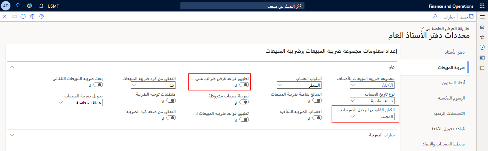

قد يقوم العامل الذي يتم توظيفه من قِبل أحد الكيانات القانونية في إحدى المؤسسات بأداء عمل لكيان قانوني آخر في المؤسسة نفسها.A worker who is employed by one legal entity in an organization might perform work for another legal entity in the same organization. وفي هذه الحالة، يمكنك استخدام ميزة المصروفات بين شركات شقيقة لتعيين مصروفات العامل إلى الكيان القانوني الذي تم إجراء العمل لصالحه.In this situation, you can use the intercompany expense feature to assign the worker’s expenses to the legal entity for which the work was performed. يُشار إلى الكيان القانوني الذي يوظف العامل باسم الكيان القانوني المُقرض.The legal entity that employs the worker is referred to as the "loaning legal entity." ويشار إلى الكيان القانوني الذي يتكبد العامل المصروفات لصالحه باسم "الكيان القانوني المقترض".The legal entity for which the worker incurs expenses is referred to as the "borrowing legal entity."

## إعداد ترحيل الضريبة للمصروفات بين شركات شقيقةSet up tax posting for intercompany expenses

إذا كنت ترغب في استخدام مجموعات ضرائب انتفاع مرتبطة بالكيان القانوني المُقرض بدلاً من الكيان القانوني المقترض في تقرير المصروفات، فيجب عليك تكوينها في الصفحة **معلمات دفتر الأستاذ العام**، في علامة التبويب السريعة **ضريبة المبيعات**.If you want to use tax groups that are associated with the loaning legal entity instead of the borrowing legal entity in your expense report, you must configure it on the **General ledger parameters** page, on the **Sales tax** FastTab. عند تعيين الحقل **الكيان القانوني لترحيل الضريبة بين شركات شقيقة** على **المصدر** وتعيين الحقل **تطبيق قواعد فرض ضريبة المبيعات** على **لا**، سيتم استخدام مجموعة الضريبة للكيان القانوني المُقرض.When the **Legal entity for intercompany tax posting** field is set to **Source** and the **Apply sales tax taxation rules** field is set to **No**, the tax combination for the loaning legal entity will be used.

إذا تم تعيين الحقل **الكيان القانوني لترحيل الضريبة بين شركات شقيقة** على **الوجهة**، فإنه يتم استخدام مجموعة الضريبة للكيان القانوني المقترض.If the **Legal entity for intercompany tax posting** field is set to **Destination**, the tax combination for the borrowing legal entity is used. قد يكون لدى المقاطعات والمناطق قواعد مختلفة.Counties and regions might have different rules. 

على سبيل المثال، في الولايات المتحدة، عند تعيين هذه المعلمة على **المصدر**، يجب أيضاً تكوين الحقل **ضريبة المبيعات مستحقة القبض** في الصفحة الجديدة **مجموعات ترحيل دفتر الأستاذ**.For example, in the United States, when this parameter is set to **Source**, the **Sales tax receivable** field must also be configured on the new **Ledger posting groups** page. 

ويستخدم مشغل المحاسبة المعلومات من هذا الحقل لإدخال المحاسبة المرتبط بالضريبة.The accounting engine uses the information from this field for tax-related accounting entry. ويكون السلوك متسقاً لبنود المصروفات التي يتم ترحيلها مع مشروع أو من دونه.The behavior is consistent for expense lines that are posted with or without a project.

