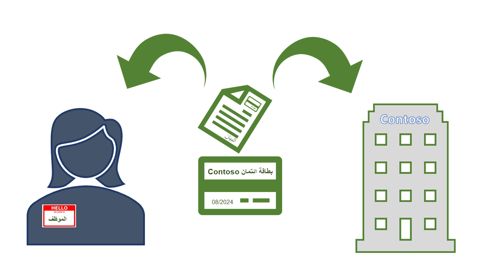

في بعض الأحيان، قد يقوم الموظفون بإيداع رصيد في البطاقات المدينة الخاصة بالشركة لاستخدامها في المصروفات الشخصية في أثناء رحلة عمل.Occasionally, workers might charge their corporate credit cards for personal expenses during business travel. وإذا لم تقم بتحديد عملية لمعالجة المصروفات الشخصية عندما يقوم الموظفون بإرسال تقارير المصروفات التفصيلية، فيمكن أن تتعطل عملية اعتماد تقارير المصروفات.If you do not define a process for handling personal expenses when employees submit their itemized expense reports, the approval process for expense reports could be disrupted.

لدى مؤسستك طريقتين لمعالجة المواقف التي يقوم خلالها موظف بإنفاق مصاريف شخصية على حساب الشركة:Your organization has two ways to handle situations when an employee makes personal charges on the corporate account:

- **الدفع بواسطة الموظف** - لا تتحمل الشركة التكاليف الشخصية التي تظهر في فاتورة البطاقة المدينة الخاصة بالشركة.**Paid by the employee** - Your company does not bear personal costs that appear on the corporate credit card bill. وبدلاً من ذلك، تقوم المؤسسة بإعداد تقرير يعرض المصروفات الشخصية ومصروفات الشركة التي تتم إضافتها إلى البطاقة المدينة الخاصة بالشركة.Instead, the organization produces a report that shows personal expenses and the corporate expenses that are charged to the corporate credit card. يقوم الموظف مباشرة بالدفع لمُورِّد البطاقة المدينة مقابل مصروفات الشخصية المستحقة على البطاقة المدينة الخاصة بالشركة.The employee directly pays the credit card vendor for the incurred personal expenses on the company credit card. 

- **الدفع بواسطة المؤسسة** - تدفع المؤسسة فاتورة البطاقة المدينة الخاصة بالشركة بالكامل.**Paid by the organization**- The organization pays the entire corporate credit card bill. وبعد ذلك، في حركة منفصلة، تقوم المؤسسة بالخصم أو الاقتطاع من راتب الموظف مقابل المصروفات الشخصية التي تم إنفاقها.Then, in a separate motion, the organization debits or deducts the employee's paycheck for the incurred personal expenses. 

بعد اختيار مؤسستك لكيفية فرض هذه السياسات، يمكنك تنفيذ طريقة الاختيار الخاصة بك في صفحة **معلمات إدارة المصروفات**.After your organization has chosen how to enforce these policies, you can implement your method of choice on the **Expense management parameters** page.

