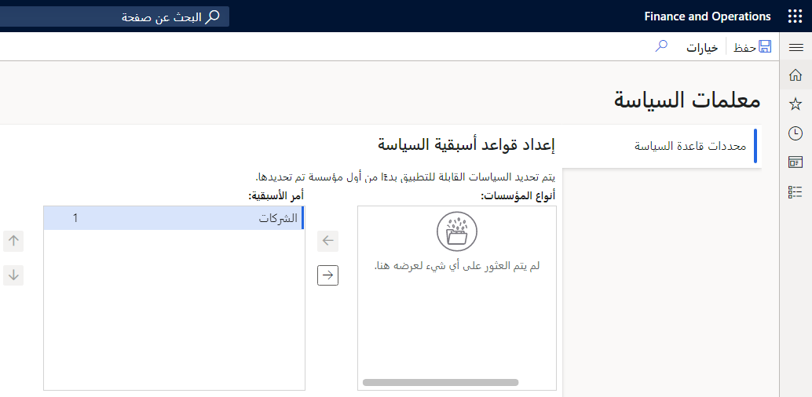

تحظر نُهُج المصروفات تقديم تقارير المصروفات و/أو اعتمادها. تنظر نُهُج التدقيق إلى التقارير المكتملة بالفعل وتحدد ما إذا كانت تفي بمعايير أو حالات معينة ترغب الشركة في مراقبتها. 

## إعداد نُهُج التدقيق
يمكنك إعداد نُهُج التدقيق للمصروفات بنفس الطريقة التي يتم بها إعداد نُهُج إدارة المصروفات. يكون الاختلاف الرئيسي بين هذين النوعين من النُهُج عند تقييمهما. 

سيقوم النظام بتقييم نُهُج إدارة المصروفات قبل أن تتمكن من السماح بتقديم تقرير المصروفات أو الموافقة عليه. على العكس من ذلك ، يقوم النظام بتقييم نُهُج التدقيق لتقارير المصروفات التي تم إكمالها بالفعل. يمكن لنُهُج التدقيق أيضاً وضع علامة على المخالفات التي تنطبق على مجموعات تقارير المصروفات استناداً إلى نطاقات التواريخ أو الموظفين أو المعايير الأخرى.
 
لإعداد نُهُج التدقيق، انتقل إلى **‎‏‫منضدة عمل التدقيق > إعداد‏‎ > النُهُج‏‎ > ‎تقرير المصروفات**. 

عند إنشاء نهج جديد، تأكد من تحديد المؤسسات التي يتم تطبيق القاعدة عليها وقواعد النهج. يمكنك تحديد تفاصيل نهج التدقيق عن طريق تحديد اسم النهج.
 
تعرض صفحة **التفاصيل** لتحديد نهج التدقيق **الاسم** و **الوصف**، عبارة عن مجموعة من المؤسسات المحددة التي سيتم تشغيل نهج التدقيق مقابلها، وقاعدة واحدة أو أكثر من قواعد النهج.

> [!div class="mx-imgBorder"]
> 

## أنواع قواعد نهج التدقيق 
يستخدم كل نوع قاعدة ترتيب الأسبقية التي تحددها في علامة التبويب **معلمات قاعدة النهج** في صفحة **المعلمات**. لإعداد ترتيب الأسبقية لقواعد التدقيق، انتقل إلى **‏‫منضدة عمل التدقيق‬ > نُهُج التدقيق > المعلمات** في صفحة **نُهُج التدقيق**.

> [!div class="mx-imgBorder"]
> 
 
لم يتم تحديد أنواع قواعد النهج مسبقاً. يمكنك إنشاء أنواع القواعد بناءً على الاستعلامات والمعايير المحددة مسبقاً للاستعلام. لإنشاء أنواع قواعد النهج لقواعد التدقيق، انتقل إلى **منضدة عمل التدقيق > الإعداد > نوع قاعدة النهج**.
 
يصف الجدول التالي كيف يمكنك استخدام كل عمود من أعمدة نوع قاعدة النهج لتحديد نوع القاعدة.

|     عمود الشبكة                |     القيم المسموح بها                                                                                                            |     ماذا تفعل القيمة؟                                                                                                                                                                       |
|--------------------------------|---------------------------------------------------------------------------------------------------------------------------------|---------------------------------------------------------------------------------------------------------------------------------------------------------------------------------------------------|
|     **اسم القاعدة**                  |     اسم النهج؛ يمكن أن يصل إلى 100 حرف                                                                  |     يمكنك تسمية قواعد النهج كيفما تشاء.                                                                                                                                             |
|     **الوصف‏‎**                |     ما يصل إلى 500 حرف من النص الوصفي                                                                         |     يمكنك تضمين وصف لقاعدة النهج بعبارات سهلة الاستخدام.                                                                                                               |
|     **اسم الاستعلام**                 |     أي استعلام معرَّف مسبقاً يبدأ اسمه بـ AuditPolicy                                                                   |     يحدد الاستعلام البيانات التي تتم مراجعتها كجزء من التدقيق. يجب إنشاء الاستعلام وتخزينه كجزء من قاعدة التعليمات البرمجية. لا يمكنك إنشاء استعلامات جديدة من واجهة المستخدم.    |
|     **نوع المستند**             |     للقراءة فقط - الجدول الأساسي المستخدم بواسطة الاستعلام الذي تحدده                                                                    |     هذا النوع من المستندات هو الذي يقوم بتدقيق النهج. وهو الاسم المألوف للجدول المستخدم في الاستعلام.                                                                                 |
|     **نوع الاستعلام**                 |     أحد الأنواع التالية:     شرطي، تجميعي، أخذ عينات، مكرر، بحث عن قائمة، بحث بالكلمة الأساسية           |     يصف الدرس التالي كيفية عمل كل نوع من أنواع الاستعلام بالتفصيل عند تقييم تقارير المصروفات مقابل قاعدة النهج هذه.                                                                   |
|     **الكيان القانوني**         |     عمود الجدول المحدد في نوع المستند الذي يشير إلى الشركة التي يرتبط بها تقرير المصروفات    |     تستخدم بعض الجداول عموداً يمثل معرف الشركة (سلسلة أحرف) بينما يستخدم البعض الآخر عموداً يمثل كياناً قانونياً (بشكل عام معرف سجل رقمي).                            |
|     **تاريخ المستند**    |     العمود الموجود في الجدول الأساسي الذي يحتوي على قيمة التاريخ أو قيمة التاريخ/الوقت                                                       |     يتم استخدام القيم الموجودة في هذا العمود بواسطة معايير نطاق التاريخ المحددة عند إنشاء دُفعة لتقييم مجموعة من تقارير المصروفات أو عند اختبار نوع قاعدة نهج التدقيق.              |

## أنواع الاستعلام
تصف الأقسام التالية أنواع الاستعلام التي يمكنك استخدامها لأنواع قواعد نهج التدقيق. 

### شرطي
لا يضيف نوع الاستعلام **الشرطي** معايير إلى الاستعلام علاوة على ما حددته كعامل تصفية لقاعدة نهج التدقيق. 

### تجميعي
يتضمن نوع الاستعلام **التجميعي** العبارتين **Group by** وكذلك **Having** في الاستعلام. على سبيل المثال، إذا كنت ترغب في تشجيع الموظفين على متابعة حياتهم المهنية واجتياز اختبارات الشهادات الاحترافية. مع ذلك، تريد تحديد المبلغ الذي ستدفعه للموظف خلال عام.

لا تؤدي القاعدة المحددة في لقطة الشاشة التالية إلى حدوث انتهاك ما لم ينفق الموظف الخاضع للتدقيق أكثر من 1,000 دولار أمريكي في السنة لامتحانات الشهادات الاحترافية.

> [!div class="mx-imgBorder"]
> 

> [!div class="mx-imgBorder"]
> 

### أخذ عينات
تكون استعلامات **أخذ العينات** مفيدة عندما ترغب في فحص مجموعة عشوائية من المستندات بناءً على عدد المستندات التي تتطابق مع معايير نوع قاعدة التدقيق وقيمة النسبة المئوية لأخذ العينات التي تحددها. 

يمكنك تطبيق معيار على أي عمود من سطر المصروفات ليؤدي هذا إلى تحديد السطر لإجراء التدقيق. في المثال التالي، سيتم تحديد 50 بالمائة من سطور المصروفات التي يكون مبلغ الحركة بها **> 1,000** للمراجعة.

> [!div class="mx-imgBorder"]
> 

### مكرر
تقوم الاستعلامات **المكررة** بالبحث عن سطور المصروفات المتكررة التي تحدث خلال عدد محدد من الأيام. يمكنك تحديد عدد الأيام السابقة لتاريخ البدء المطلوب تضمينه في التدقيق عند البحث عن التكرارات. يؤدي تحديد (0) صفر لأيام إضافية إلى أن يبحث التدقيق فقط في سطور المصروفات ضمن نطاق تاريخ الدُفعة.

> [!div class="mx-imgBorder"]
> 

 
### بحث عن قائمة
استخدم **البحث عن قائمة** عندما تريد تدقيق الموظفين الذين تقوم بتحديدهم في قائمة.
 
### بحث بالكلمة الأساسية
البحث بالكلمة الأساسية مرن. يمكنك البحث في أي عدد من أعمدة البيانات المتاحة وتضمين عدد غير محدود من كلمات البحث. 
 
عند إضافة نوع قاعدة نهج تدقيق إلى نهج تدقيق، يجب عليك تحديد المعايير التالية بغض النظر عن نوع الاستعلام:

- **تاريخ السريان** و **تاريخ انتهاء الصلاحية** – يمكن أن تحد هذه التواريخ من السجلات التي تم البحث عنها في الدُفعة. على سبيل المثال، قد تحدد القاعدة فترة محظورة للسفر لشهر معين. يجب عليك إدخال تاريخي البدء والانتهاء للشهر المحظور في هذا الحقل.
- **عامل التصفية** – حدد قيم التصفية مسموح بها للمستند (تقرير المصروفات أو سطر المصروفات) الذي يتم تدقيقه.

## اختبار قاعدة نهج التدقيق
يمكنك اختبار قاعدة مقابل مجموعة من تقارير المصروفات أو سطور المصروفات خلال تواريخ البدء والانتهاء المحددة. 

1. عند إدخال المعايير، حدد الزر **اختبار**.

    > [!div class="mx-imgBorder"]
    > 

1. أدخل نطاق التاريخ وحدد **تشغيل الاختبار**. 

 
## تقييم قاعدة النهج
لتقييم قاعدة النهج، قم بإنشاء دفعة تحدد نطاق التاريخ للمستندات لمراجعتها. أرسل الدُفعة باستخدام عنصر القائمة **خيارات إضافية** في صفحة **نهج التدقيق** أو **تفاصيل نهج التدقيق**.
 
عند إنشاء دُفعة، يتوقع النظام عدم ترك فجوات بين الدُفعات التي تم إنشاؤها بالفعل والدفعة الجديدة. في حالة ترك إحدى الفجوات، لن يتم تقييم تقارير مصروفات متعددة. 

يجب ألا تتداخل التواريخ مع دفعة أخرى لأن هذا سيؤدي إلى مضاعفة حساب تقارير المصروفات التي تحدث ضمن تداخل نطاقات التواريخ. سيعرض النظام تحذيراً عند تغيير تواريخ الدفعة، ولكن لا يحاول النظام تصحيح التواريخ التي تحددها.

لتحسين الأداء، يمكنك تشغيل المهام لتقييم تقارير المصروفات على أنها مجموعات. حجم المجموعة الافتراضي هو 1,000. في حالة مواجهة مشكلات في الأداء، قم بتغيير حجم المجموعة. تستخدم المجموعات الأصغر سلاسل معالجة متزامنة أكثر من المجموعات الأكبر وستتسبب في إكمال تقييم المجموعات بشكل أسرع.

> [!div class="mx-imgBorder"]
> 
    
عند إرسال إحدى الدُفعات، يتم تقييم كافة تقارير المصروفات التي تفي بنطاق التاريخ المحدد مقابل كافة أنواع القواعد المحددة في قاعدة نهج التدقيق. تعمل النتائج الخاصة بكل نوع من أنواع قواعد النهج ضمن نهج التدقيق على إنشاء حالة تدقيق.

## حالات التدقيق
تقوم حالة التدقيق بتخزين نتائج تقييمات تقارير المصروفات. يرتبط كل تقرير مصروفات يتطابق مع معايير نوع قاعدة نهج التدقيق بالحالة باستخدام الاقتران. ويتم تعيين الحالة إلى الموظف الذي يقوم بإنشاء دفعة الحالة. يقوم هذا الموظف بالتحقيق في كل تقرير من تقارير المصروفات المرتبطة بالحالة للتحقيق في انتهاكات النهج. 

تقوم الحالة بتجميع تقارير أو سطور المصروفات التي بها مخالفة إذا كانت الحالة نشطة. على سبيل المثال، يمكن عرض تقرير المصروفات الذي ينتهك تعويض 1,000 دولار أمريكي لكل سنة من الأميال. سيتم عقد اقتران مع العامل ومع تقرير المصروفات الفعلية. 

## حالات المجموعة
لتقليل عدد الحالات التي يقوم النظام بإنشائها، يمكنك تجميع الحالات معاً بناءً على قاعدة نهج التدقيق أو مجموعة السمات. على سبيل المثال، قد ترغب في إنشاء حالة لكل موظف مع كافة تقارير المصروفات المطابقة للموظف.

> [!div class="mx-imgBorder"]
> 

> [!NOTE]
> تعتمد المعايير المتاحة للمطابقة على نوع المستند الذي يقوم نوع قاعدة النهج بتقييمه.

