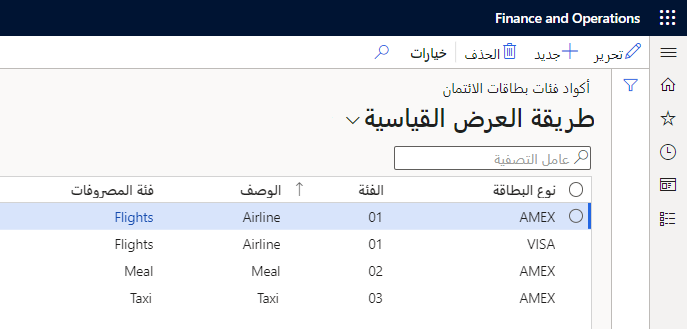
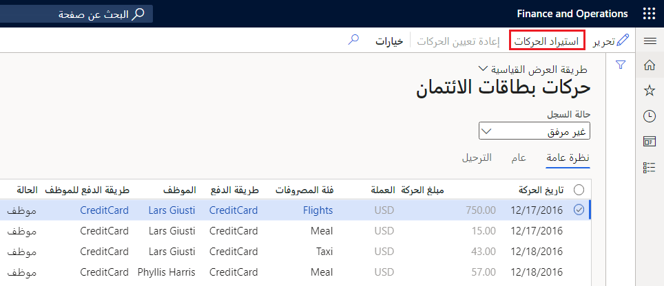
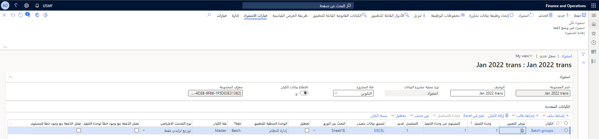
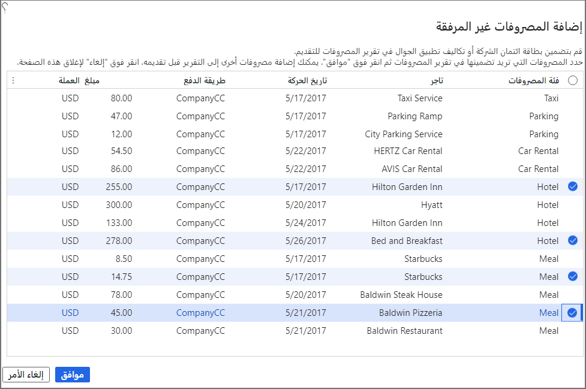
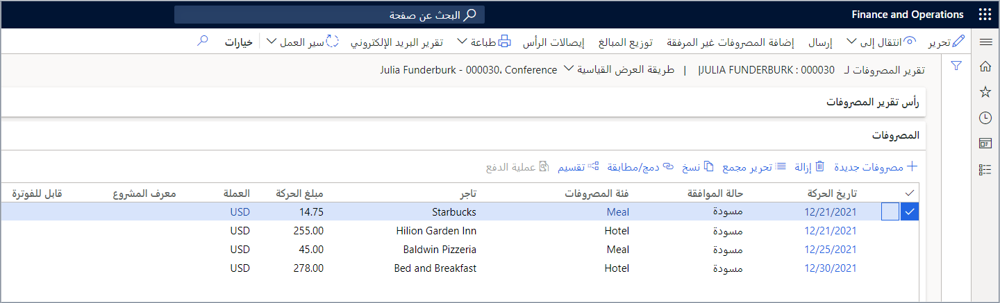
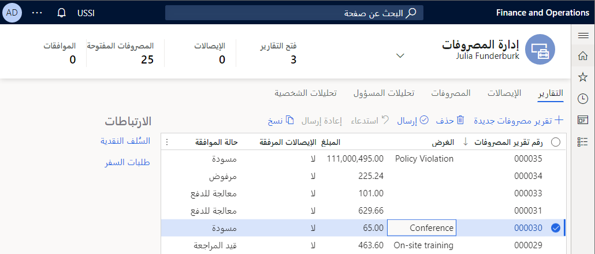
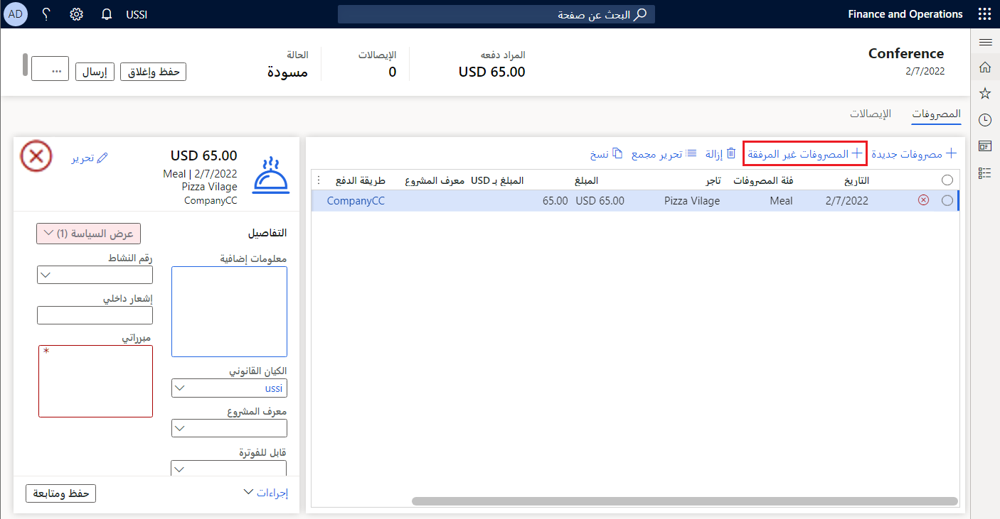
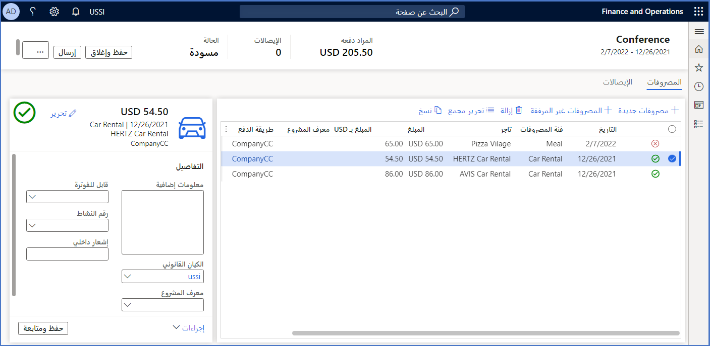

غالباً ما يستخدم الموظفون بطاقات مدينة خاصة بالشركة لدفع المصروفات عندما يكونون في رحلات العمل. يقوم الموظفون بتسجيل هذه المصروفات في تقرير المصروفات. تأكد أنك تقوم باستيراد حركات البطاقة المدينة إلى Project Operations بحيث يُمكن مطابقتها مع الإدخالات في تقارير المصروفات. 

## إعداد ‏‏حركات البطاقات المدينة

قم بإجراء الخطوات التالية لضمان إمكانية استيراد حركات البطاقات المدينة إلى Project Operations:

1. **أنواع البطاقات المدينة** - حدد أنواع البطاقات المقبولة بما في ذلك Visa وMasterCard وAmerican Express.
2. **أكواد فئات البطاقات المدينة** - لكل نوع من أنواع بطاقات الائتمان، يجب تعيين الفئات المحددة في ملف البطاقة المدينة إلى فئات المصروفات لإدخالات تقرير المصروفات. الانتقال إلى الوحدة النمطية **إدارة المصروفات > الإعداد > العمليات الحسابية والأكواد > أكواد فئات البطاقات المدينة**. تظهر اللقطة التالية تعيينات كود الفئة. 

    > [!div class="mx-imgBorder"]
    > 
 
3. **تعيين أرقام البطاقات المدينة للموظفين** - عند استيراد حركات البطاقات المدينة، يتم استخدام رقم البطاقة المدينة لمطابقة المصروفات مقابل بنود المصروفات. أضف أرقام البطاقة المدينة من قائمة **المصروفات** الخاصة بسجل الموظفين، ثم حدد **البطاقات المدينة**. يُمكنك إضافة أي عدد تريده من البطاقات المدينة لكل موظف.

    > [!div class="mx-imgBorder"]
    > 

 
## استيراد ‏‏حركات البطاقات المدينة
يُمكنك استيراد حركات البطاقة المدينة يدوياً أو استخدام جدول متكرر. 

لاستيراد الحركات يدوياً، انتقل إلى **إدارة المصروفات > المهام الدورية > حركات البطاقة المدينة**. حدد عنصر القائمة **حركات الاستيراد** لتحديد ملف لاستيراده.

> [!div class="mx-imgBorder"]
> 
 
عند تحديد **استيراد حركات**، سيتم عرض صَفحة **تعريف حزمة الاستيراد**. هذه الصَفحة إصدار محسّن من صَفحة **استيراد إدارة البَيانات**. إذا ظهرت صَفحة مختلفة، فلديك طريقة العرض القياسية ويُمكنك تحديد طريقة العرض المحسنة للتغيير إلى طريقة العرض التالية.

> [!div class="mx-imgBorder"]
> 
 
## ملف ‏‏حركات البطاقات المدينة
يجب أن يتضمن الملف الذي تقوم باستيراده الحقول التالية للاستيراد بنجاح:

- مبلغ الحركة
- رقم البطاقة
- نوع البطاقة (يجب أن يتطابق ذلك مع أحد أنواع البطاقات المحددة في الإعداد الخاص بك).
- العملة

يُمكنك تضمين المزيد من الحقول في الملف لتوفير معلومات إضافية. تساعد الأعمدة المضافة في تسهيل مطابقة المعاملات مع إدخالات حساب المصروفات.

يعتمد التنسيق الصحيح لملفات حركات البطاقات المدينة على موفري بطاقات الائتمان الفردية. تتضمن التنسيقات الشائعة Microsoft Excel وملفات القيم المفصولة بفواصل (CSV) وملفات الحقول الثابتة وXML.

## جدولة حركات الاستيراد

يُمكنك إعداد مهمة متكررة لاستيراد حركة البطاقة المدينة. لمزيد من المعلومات، راجع [إعداد مشروع البَيانات ووظيفة البَيانات المتكررة](/learn/modules/data-integrations-finance-operations/2-data-project/?azure-portal=true).

عندما تقوم باستيراد معاملة البطاقة المدينة، يُمكنك إرفاق حركات لبنود حساب المصروفات. 

## تسوية حركات البطاقات المدينة بإدخالات تقرير المصروفات
يجب ربط رقم البطاقة المدينة الموجود في ملف حركة البطاقة المدينة بأحد الموظفين. تصبح حركات البطاقة المدينة هذه متاحة للمطابقة مقابل الإدخالات في تقارير المصروفات الخاصة بالموظف. 

1. انتقل إلى تقرير المصروفات في **إدارة المصروفات > مصروفاتي > تقرير المصروفات**. 
2. حدد تقرير مصروفات لم تتم معالجته بعد أو يُمكنك إنشاء تقرير جديد. 
3. افتح تقرير المصروفات لعرض بنود المصروفات. 
4. في صَفحة **بنود المصروفات**، حدد **إضافة المصروفات غير المرفقة** لعرض قائمة بحركات البطاقة المدينة التي تم استيرادها لك والتي لم يتم ربطها بعد ببند مصروفات. 
5. حدد الحركات التي تريد تضمينها في تقرير المصروفات، ثم حدد **موافق**.

    > [!div class="mx-imgBorder"]
    > 

   ستتم إضافة الحركات الآن إلى تقرير المصروفات.

    > [!div class="mx-imgBorder"]
    > 
 
    تعرض لقطة الشاشة السابقة صَفحة **تقرير المصروفات** القياسية. تعتمد صَفحة **تقرير المصروفات** التي ستراها على ما إذا كانت الميزة **إعادة تصور تقارير المصروفات** تم تمكينها في البيئة الخاصة بك أم لا.

ويتوفر تقرير المصروفات نفسه من مساحة عمل **إدارة المصروفات** وتبدو مثل لقطة الشاشة التالية عند تمكين ميزة **إعادة تصور التقارير الخاصة بالمصروفات**. يتم إدراج تقرير المصروفات في الصَفحة بجانب جميع تقارير المصروفات الخاصة بالمستخدم.

> [!div class="mx-imgBorder"]
> 

1. حدد رقم تقرير المصروفات لعرض بنود المصروفات الخاصة بالتقرير، ثم حدد عنصر القائمة **المصروفات غير المرفقة**.

    > [!div class="mx-imgBorder"]
    > 

    سيتم عرض صَفحة **المصروفات غير المرفقة** وستكون هي نفسها كما هو موضح في الصورة السابقة. 

   بعد تحديد المصروفات غير المرفقة لإضافتها وتحديد **موافق**، تتم إضافتها إلى صَفحة **المصروفات**.

    > [!div class="mx-imgBorder"]
    > 
