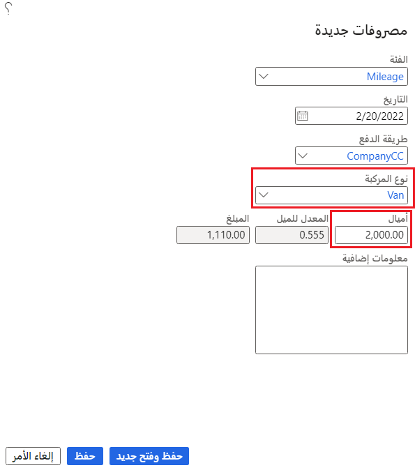

من بين الأنواع الشائعة من المصروفات المسجلة في تقارير المصروفات هو المسافة المقطوعة بالأميال. تتناول هذه الوحدة الخيارات المتاحة لإعداد حساب الأميال لتقارير المصروفات.

## إعداد المسافة المقطوعة بالأميال كمصروفات مسموح بها
يبدأ إعداد المسافة المقطوعة بالأميال في وحدة "إدارة المصروفات" أو وحدة "المشروع" أو وحدة "التحكم في الإنتاج‬". تتم مشاركة الإعداد عبر جميع الوحدات النمطية الثلاثة في Supply Chain Management. 

### فئة المصروفات
تحتاج إلى تحديد فئة المصروفات المتعلقة بالمسافة المقطوعة بالأميال التي يُمكن تحديدها في تقارير المصروفات. يجب أولاً تحديد فئة مشتركة لتحديد فئة المصروفات. 

عند تحديد الفئات المشتركة من وحدة إدارة "المصروفات"، انتقل إلى **الإعداد > عام > الفئات المشتركة**. يُمكنك استخدام فئة مشتركة في أي مجموعة من الوحدات التالية. ستشير إلى الوحدات النمطية التي يُمكنها استخدام الفئة، عندما تقوم بإعداد الفئة:

- المشروعات
- الإنتاج
- المصروفات

قم بتعيين الحقل **يُمكن استخدامه في المصروفات** إلى **نعم** لاستخدام المسافة المقطوعة بالأميال كنوع مصروفات في تقرير المصروفات.

### نوع المصروفات
تتكون أنواع المصروفات من قائمة محددة مسبقًا من الأنواع. يجب أن يكون نوع المصروفات لهذا الإدخال بحسب **المسافة المقطوعة بالأميال**. يُمكنك إضافة فئة المصروفات عند إنشاء فئة مشتركة. يتم إعداد هذه الأنواع في أيٍّ من الوحدات النمطية الثلاث تمامًا مثل الفئات المشتركة.
 
انتقل إلى **الإعداد > عام > فئات المصروفات** لإنشاء فئة مصروفات من إدارة المصروفات. حدد **جديد** لإضافة فئة جديدة. في الحقل **معرّف الفئة**، حدد الفئة **المشتركة** التي أنشأتها. 

لتقارير المصروفات، أكمل علامة التبويب **المصروفات** وعلامة التبويب **طرق الدفع المسموح بها**. تشير علامة التبويب **المصروفات** إلى الحساب الرئيسي المراد ترحيله إلى هذه المصروفات. يتم تعيين **نوع المصروفات** من تعريف الفئة **المشتركة** وسيكون بحسب **المسافة المقطوعة بالأميال**. اذكر طرق الدفع المسموح بها وحدد طريقة افتراضية.

يُمكنك إضافة فئة المصروفات إلى مجموعة الإحصائيات التي سيتم استخدامها لإعداد تقارير المصروفات. يُمكنك تعيين **مجموعة ضريبة مبيعات الصنف** إذا كانت هذه المصروفات خاضعة للضريبة. 

يُمكنك تحديد **المعدل القياسي للمسافة بالميل** في صَفحة **معلمات إدارة المصروفات**.

> [!div class="mx-imgBorder"]
> 
 
## إنشاء مستويات المسافة المقطوعة بالأميال
قد ترغب في تعويض المسافة المقطوعة بالأميال بمعدلات مختلفة بناءً على نوع السيارة التي تمت قيادتها والمسافة المقطوعة خلال عام معين. سيتيح النظام أيضًا رصيدًا لكل راكب في السيارة لتشجيع مشاركات السيارات. 

لتحديد مستويات المسافة المقطوعة بالأميال، انتقل إلى **إعداد الفئة > معدل المسافة بالأميال** في صَفحة **فئة المصروفات**. في صَفحة **مستويات معدل المسافة المقطوعة بالأميال**، يُمكنك تحديد نطاقات زمنية لمستويات المسافة المقطوعة بالأميال. 

راجع المثال التالي. تقوم إحدى الحكومات بتغيير معدّلها القياسي للمسافة المقطوعة بالأميال في العام التالي وتريد وضع الأسعار في وقت مبكر وجعلها سارية في 1 يناير 2022. يُمكنك إدخال **تاريخ البدء** لجعل الأسعار سارية من ذلك التاريخ. تأكد من إدخال **تاريخ الانتهاء** في سجل العام السابق أولاً قبل إنشاء السجل الجديد. لا يُمكن أن يكون لديك تاريخ فارغ في سجلات **تاريخ البدء** أو عدة سجلات **تاريخ الانتهاء** متعددة.

> [!div class="mx-imgBorder"]
> 

لا توجد صَفحة متاحة لإدخال أنواع السيارات. يُمكنك إضافة نوع جديد على بند أو التحديد من القائمة المنسدلة التي ستحتوي على جميع الأنواع التي تم إدخالها بالفعل.

الكميات التي تظهر في صَفحة **معدلات المسافة المقطوعة بالأميال** هي المسافة المقطوعة التراكمية لسنة واحدة. يتم تعويض كل المسافة المتراكمة المقطوعة بالأميال خلال العام حتى الكمية المحددة بالسعر لتلك المسافة المقطوعة. ستستخدم الأميال التي يتم دفعها فوق هذه الكمية معدل النطاق التالي. إذا بدأت رحلة واحدة في نطاق كمية واحد وتجاوزت المسافة المقطوعة بالأميال إلى نطاق الكمية التالي، فسيتم استخدام كلا المعدّلين. يتم سداد المسافة المقطوعة بالأميال المخصصة لكل نطاق بمعدل هذا النطاق.

توفر الأقسام التالية بعض الأمثلة على المسافة المقطوعة بالميل في تقرير المصروفات لمساعدتك على فهم العمليات الحسابية التي تحدث مع مستويات الأسعار هذه بشكل أفضل. 

## استخدم معدل المسافة المقطوعة بالأميال في تقرير المصروفات
تستخدم Project Operations مستويات الأميال المحددة في سطر تقرير المصروفات الذي تم إدخاله لتحديد المصاريف المسموح بها لكل رحلة. 

تعتمد صَفحة **تقرير المصروفات** التي ستراها على ما إذا كانت الميزة **إعادة تصور تقارير المصروفات** تم تشغيلها في البيئة الخاصة بك أم لا. تُظهر لقطة الشاشة التالية صَفحة **تقرير المصروفات** القياسية بدون تمكين الميزة.

بعد إضافة بند المصروفات، حدد فئة مصروفات **المسافة المقطوعة بالأميال**.

> [!div class="mx-imgBorder"]
> 
 
عند تحديد فئة مصروفات **المسافة المقطوعة بالأميال**، سيتم عرض صَفحة جديدة. لإدخال مزيد من المعلومات حول الرحلة، استخدم هذه الصَفحة. تأكد من إدخال **تاريخ المعاملة** و **المسافة المقطوعة بالأميال** و **نوع السيارة** و **عدد الركاب**. سيتم تعيين نوع السيارة بشكل افتراضي من إدخالات بند المصروفات السابقة. سيحسب النظام بدل المسافة المقطوعة بالأميال نيابة عنك. 

### المثال 1
في هذا المثال الأول، تكون الرحلة 100 ميل، ونوع السيارة **شاحنة صغيرة**، وتحصل على رصيد لاصطحاب راكبين معنا. لن يتم استخدام المعدل الافتراضي نظرًا لأنه تم تحديد مستويات المسافة المقطوعة بالأميال لهذا النوع من السيارات. يبدأ المستوى الأول المحدد عند ميل واحد وينتهي عند 1500 ميل، لذا تتناسب هذه الرحلة مع ذلك المستوى الأول وتستخدم معدل سفر خفيفًا يبلغ **0.58** لكل ميل بالإضافة إلى **0.10** لكل ميل لكلا الراكبين. ويكون المعدل الفعلي **0.78** لكل ميل.

> [!div class="mx-imgBorder"]
> 

 
### المثال 2
في هذا المثال الثاني، ستفكر في رحلة طولها 2000 ميل. في هذا المثال، يتم عرض صَفحة **تقرير المصروفات** الجديدة التي تم تمكينها بواسطة الميزة **إعادة تصور تقارير المصروفات**. يُمكنك الانتقال إلى صَفحة **تقرير المصروفات** الجديدة عن طريق تحديد مساحة عمل **إدارة المصروفات** من لوحة المعلومات الافتراضية أو قائمة مساحة العمل.

لتحديث بنود المصروفات، حدد رقم تقرير المصروفات ثم حدد زر **مصروفات جديدة** لإضافة بند جديد.

> [!div class="mx-imgBorder"]
> 

تستخدم الرحلة التي يبلغ طولها 2000 ميل المستوى الأول بأكمله من السفر الخفيف. **معدل السفر الخفيف للشاحنة** هو **0.58** لكل ميل. تم حساب أول 1500 ميل على أساس معدل السفر **الخفيف للشاحنة** بمقدار **0.58** لكل ميل. يتم احتساب الأميال المتبقية البالغ عددها 500 على أساس معدل السفر **المعتدل للشاحنة** بمقدار **0.55** لكل ميل.
بعد تحديد **الأميال** كفئة، ستدخل نوع السيارة **Van** ثم عدد الأميال (**2000**).

> [!div class="mx-imgBorder"]
> 

ستتم إضافة البند إلى تقرير المصروفات.

> [!div class="mx-imgBorder"]
> 

### المثال 3 
يتعلق هذا المثال التالي برحلة بسيارة لم يتم تحديد مستويات لها. تمت إضافة إدخال واحد إلى جدول الأسعار بدون **كمية**. سيسمح لك هذا النهج بتحديد نوع السيارة، لكنه لا يتجاوز المعدل الافتراضي. 

يتم استخدام المعدّل الافتراضي وهو **0.555** لكل ميل وذلك نظرًا لعدم وجود مستويات محددة. هذا المثال هو صَفحة **تقرير المصروفات** القياسية من دون تمكين الميزة. 

> [!div class="mx-imgBorder"]
> 

## حالات الاستخدام لمستويات معدل المسافة المقطوعة بالأميال
مستويات معدل الأميال معقدة؛ ومع ذلك، فهي مفيدة. 

توضح الأمثلة السابقة طريقة عمل العمليات الحسابية. تستخدم معظم الشركات معدلاً ثابتًا وليست لديها أي مستويات. غالبًا ما يعتمد المعدّل الثابت في الولايات المتحدة (US) على السعر الحكومي المعلَن كل عام وهو أكبر معدل يُمكن للشركة أن تسدده للموظفين دون خصم الضرائب من السداد. يتم تحديد المعدل الثابت في معلمات إدارة "المصروفات" ويتم استخدامه في حالة عدم وجود مستويات معدّلات قابلة للتطبيق. 

قد يكون من المنطقي، بالنسبة للموظفين الذين يستخدمون سيارة شخصية لقيادة مكثفة متعلقة بالعمل، تحديد مبلغ التعويض الذي يُمكن تقديمه سنويًا. استخدم "المعدّل صفر دولار" في أعلى مستوى معدّل للمسافة المقطوعة بالأميال لهؤلاء الموظفين، وعندما يحققون الحد الأقصى من التعويض، سيكون مستوى المعدّل التالي عند "المعدّل صفر".

إذا أرادت إحدى الشركات تشجيع الرحلات الجوية بدلاً من القيادة لمسافات طويلة، يُمكن أن يوفر المعدّل الأقل للرحلات الطويلة هذه الحملة التشجيعية. 

يمثل تقديم تعويضات للركاب في السيارة حافزًا لمشاركة السيارات.

توفر إمكانية تحديد مستويات معدل المسافة المقطوعة بالأميال والحصول على مستويات مختلفة تنطبق على موظفين مختلفين مرونة كبيرة للشركة لكي تكون لديها قواعد تعمل من أجل أعمالها. 
