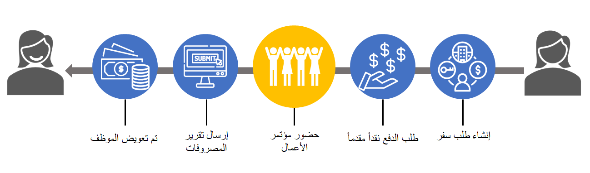

طلب السفر هو مستند مصدر يسرد المصروفات التي سيتم تكبدها بغرض السفر. يتم تقديم طلب السفر للمراجعة ويمكن استخدامه بعد ذلك لتخويل المصروفات.

لإدارة الموازنات وتوقعات السفر، تطلب بعض الشركات من الموظفين تقديم طلبات سفر توضح بالتفصيل المصروفات المتوقعة التي سيتم تكبدها في رحلة عمل. تقدم بعض الشركات لموظفيها سلفة نقدية للأغراض نفسها، دون التسبب في عبء مالي للموظف قبل الرحلة.

وقد تطلب مؤسستك تقديم طلب سفر قبل أن يتكبد الموظف المصروفات التي تتحملها المؤسسة. قد تنطبق هذه القاعدة سواء كان الموظف يشحن المصروفات على بطاقة ائتمان الشركة، أو ينفق النقد الذي تم استلامه من سلفة نقدية، أو يتكبد مصروفات خارج مصروفات الجيب سيتم تعويضها من قبل المؤسسة. وعادةً، عندما يتلقى أحد الموظفين سلفة نقدية، يُطلب منه أيضاً تقديم تقرير مصروفات للتحقق من المصروفات المتكبدة.

على سبيل المثال، إذا كانت مؤسستك تعمل على مشروع ثابت السعر يتطلب السفر، فيجب أن تتناسب مصروفات السفر الخاصة بأعضاء فريق المشروع مع موازنة المشروع. إن اشتراط الموافقة على مصروفات السفر قبل تكبدها يضمن بقاء المشروع في حدود الموازنة.
