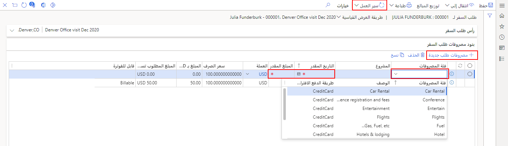

تشبه صفحة **طلب السفر** صفحة **‏‏تقرير المصروفات**. 

ضع في اعتبارك سيناريو تكون فيه مدير مشروع لمشروع إنشاء مبنى ثابت السعر، وتحتاج إلى السفر إلى المركز الرئيسي لشركة العميل لمناقشة التصميم الخاص بك مع شركائها. ونظراً لأن هذا المشروع مشروع ثابت السعر، تتطلب سياسة شركتك طلب سفر لأغراض إعداد الموازنة.

لإنشاء طلب سفر، اتبع الخطوات التالية:

1.  انتقل إلى **إدارة المصروفات > مصروفاتي > طلب السفر**.
2.  حدد **طلب السفر الجديد**.
3.  في حقل **غرض الأعمال**، أدخل غرض الأعمال. كن محدداً حتى يسهل العثور على الطلب في المستقبل.
4.  في حقل **‏‏الوجهة**، أدخل وجهة السفر المخطط له.
5.  في حقل **وصف السفر**، أدخل معلومات محددة حول رحلتك.
    
    يتم ملء الأبعاد المالية استناداً إلى معلومات التوظيف الخاصة بالطالب.
    
6.  إذا كان هذا الطلب مرتبطاً بمشروع، فحدد هذا المشروع في حقل **المشروع**.
    
8.  حدد **موافق**.
9.  في علامة التبويب السريعة **بنود مصروفات طلب السفر**، حدد **مصروفات طلب جديدة**.
10. في حقل **‏‏فئة المصروفات**، حدد المصروفات للبند.
11. في حقل **‬‏‫المشروع**، حدد مشروعاً للطلب، إن أمكن.
12. في حقل **التاريخ المُقدر**، حدد التاريخ المتوقع حدوث المصروفات فيه.
13. في حقل **المبلغ المقدر**، أدخل المبلغ المقدر للمصروفات.
14. استمر في إضافة ‏‫البنود حتى يكتمل الطلب.
15. حدد **سير العمل > ‏‏إرسال**. في حالة انتهاك سياسات الطلب، فأنت مطالب بإصلاحها قبل إرسال الطلب.
    
16. (اختياري) في المربع **تعليق**، أدخل المعلومات التي قد يحتاج ‏‫الموافق إلى معرفتها.
    
17. حدد **إرسال**.

عند إرسال طلب السفر، يتم توجيهه من خلال عملية سير العمل حتى يقوم جميع الموافقين بالموافقة عليه.

شاهد الفيديو التالي للحصول على عرض توضيحي لكيفية إنشاء طلب سفر.
 > [!VIDEO https://www.microsoft.com/videoplayer/embed/RE4IRyv]

