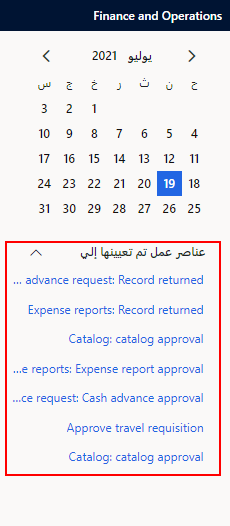
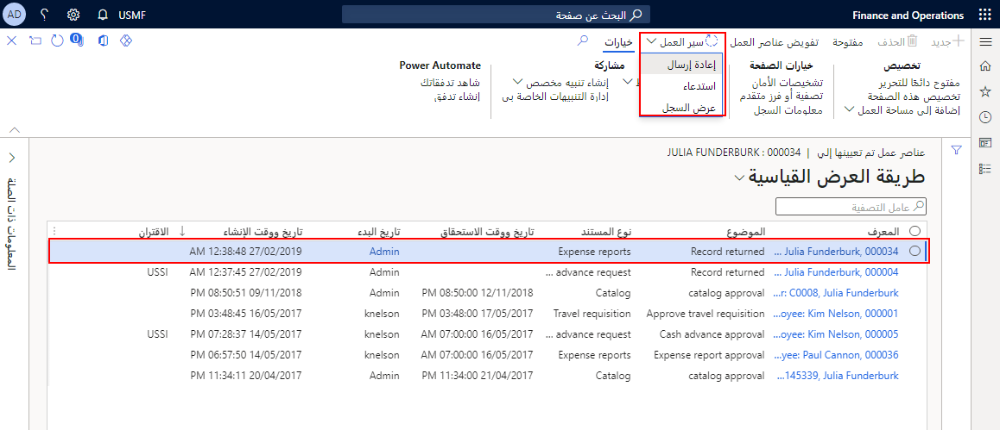

عند إرسال طلب سفر إلى سير العمل، فستتم إعادة توجيهه بشكل منهجي إلى المعتمِد المحدد استناداً إلى القواعد التي تم تحديدها عند إنشاء سير العمل.

إذا كنت معتمداً في سير عمل طلب السفر، فسيتم إعلامك عندما يتطلب الطلب انتباهك. قد تحتوي بعض مهام سير العمل على قرارات مشروطة تم إنشاؤها بناءً على تكوين سير العمل. قد يحتوي سير العمل أيضاً على مستويات متعددة من الاعتماد المطلوب. وفي هذه الحالات، عندما يقوم المعتمد الأول باعتماد سير العمل، يتم إرساله إلى المعتمد التالي، وهكذا. إذا قام أي معتمد بإرجاع طلب سفر، فستتم إعادة تشغيل التدفق، وسيحتاج منشئ سير العمل إلى إجراء تصحيحات وفقاً لما ينصح به المعتمِد الذي أبدى الرفض. 

يمكن عرض الإعلامات على لوحة المعلومات ضمن **عناصر عمل تم تعيينها إلي**. 

 
لاعتماد طلب سفر، اتبع الخطوات التالية:

1.  في لوحة المعلومات، حدد ارتباطاً تشعبياً في القسم **عناصر عمل تم تعيينها إلي**. سيتم فتح صفحة **عناصر عمل تم تعيينها إلي**.
2.  حدد طلب السفر القابل للتطبيق.
3.  عند إتمام المراجعة، حدد **سير العمل**، ثم حدد أحد الخيارات التالية:
    - **اعتماد** – يقوم باعتماد طلب السفر بالكامل. 
    - **إرجاع** – إرجاع طلب السفر إلى العامل الذي قدمه. يمكنك تحديد هذا الخيار إذا كانت المعلومات غير مكتملة أو إذا كانت لديك أسئلة حول التقرير.
    - **تفويض** – يقوم بتعيين طلب السفر إلى مستخدم آخر للاعتماد. 
    - **عرض السجل** – يفتح صفحة "تفاصيل محفوظات سير العمل"، حيث يمكنك عرض المحفوظات والتفاصيل الخاصة بالطلب في عملية الاعتماد.

 

