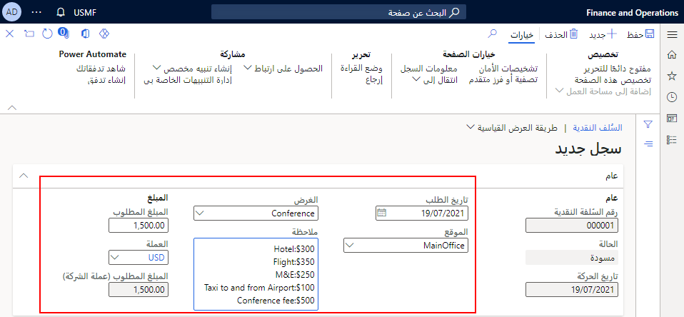

يتم تقديم السلفة النقدية للمصروفات المحتملة التي يتحملها الموظف قبل سفره لتغطية تكاليف السفر المقدَّرة. تسمح السُلف النقدية للشركات بالبقاء داخل حدود الموازنة وتقليل العبء المالي للعاملين ممن قد لا يمكنهم تحمُل مصروفات السداد في وقت لاحق.

على سبيل المثال، تمت الموافقة على حضور موظف المحاسبة إلى مؤتمر محاسبة في ميامي، فلوريدا. ولا يمكنهم دفع مقدمة قيمتها 1900 دولار أمريكي (USD) من التكلفة التقديرية للرحلة. يقوم موظف المحاسبة بتقديم طلب سلفة نقدية، بحيث يمكن للمشرف عليه الاطلاع على التكاليف التي يخططون لتحمُلها، ثم يحدد ما إذا كانت داخل حدود الموازنة الخاصة بمصروفات المؤتمرات.

لإنشاء سلفة نقدية، اتبع الخطوات الآتية:

1.  انتقل إلى **إدارة المصروفات > مصروفاتي > السُلف النقدية**.
2.  حدد **جديد‏‎**.

    سيتم ملء خانة **تاريخ الطلب** بالتاريخ الحالي.

3.  في الحقل **الموقع**، أدخِل الموقع الذي سيتم فيه تحمُل المصروفات.
4.  في الحقل **الغرض**، أدخِل الغرض من رحلة العمل.
5.  في الحقل **ملحوظة**، أدخِل الملحوظات الضرورية وفقاً لسياسات شركتك.
6.  في الحقل **المبلغ**، أدخِل مبلغ الأموال الذي تطلبه.
7.  حدد **حفظ**. قد تحتوي بعض الشركات على سير عمل للسُلف النقدية، ولكنها ليست مطلوبة بشكل منتظم.

