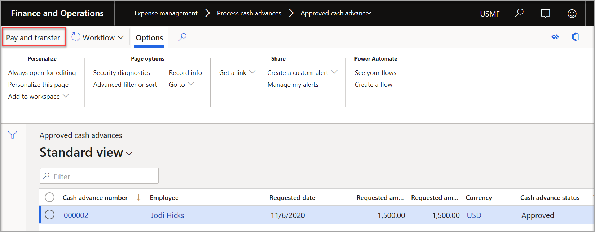
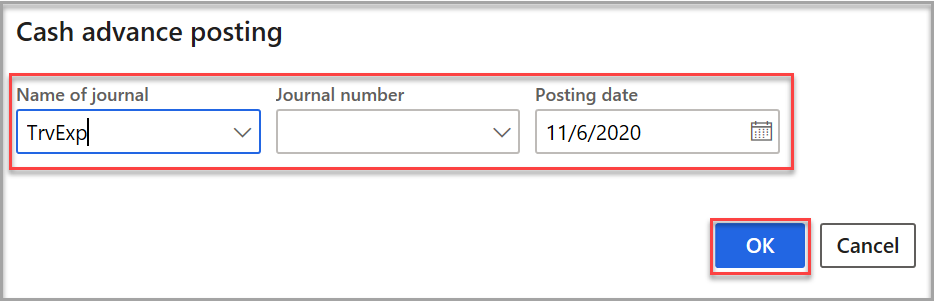

يمكنك تحديث طلب سلفة نقدية تمت الموافقة عليه مسبقاً. كما يمكنك تحديث طلب سلفة نقدية واحد أو طلبات متعددة في الوقت نفسه.

1.  حدد **إدارة المصروفات > معالجة السُلف النقدية > السُلف النقدية التي تمت الموافقة عليها**.
2.  حدد عامل تصفية إذا كنت ترغب في رؤية طلبات السلفة النقدية المحددة أو حدد "بدون عامل تصفية" إذا كنت ترغب في رؤية جميع طلبات السلفة النقدية.
3.  حدد طلب السلفة النقدية الذي ترغب في تحديثه.
4.  في الجزء "الإجراءات"، حدد **دفع وتحويل**. السلفة النقدية جاهزة الآن لدفعها وتحويلها إلى دفتر اليومية العام.
     
4.  في الحقل **اسم دفتر اليومية**، حدد **TrvExp**
5.  في الحقل **رقم دفتر اليومية**، حدد رقم دفتر اليومية.
6.  في الحقل **تاريخ الترحيل**، حدد التاريخ الذي سيتم فيه ترحيل دفتر اليومية (التاريخ المعين بشكل افتراضي هو تاريخ اليوم).
7.  حدد **موافق**.
    
 

عند ترحيل السلفة النقدية، تتم معالجة الدفع المقرر دفعه إلى الموظف.

