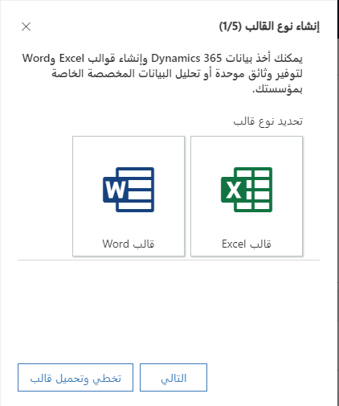

توفر قوالب Word للمستخدمين وسيلة لإنشاء مستندات موحدة بسهولة حول السجلات الغنية ببيانات Microsoft Dataverse وتطبيق قوة التنسيق الكاملة لبرنامج Microsoft Word. يمكن إنشاء قوالب تنظيمية للمستخدمين لدعم إنشاء مستند بسيط ويستطيع المستخدمون الذين لديهم أذونات مناسبة إنشاء قوالبهم الخاصة ومشاركة القوالب مع مستخدمين آخرين. السيناريو الشائع هو استخدام قالب مستند للتعامل مع حاجة تقارير خفيفة الوزن.

لمزيد من المعلومات، يرجى مراجعة [إدارة قوالب Word](/dynamics365/customer-engagement/sales-professional/manage-word-templates).

 
