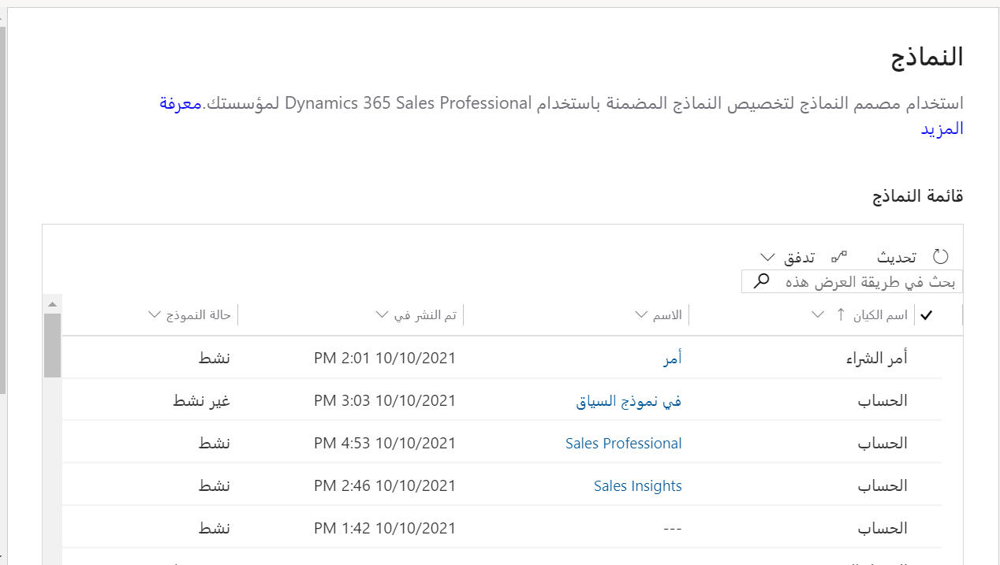

سنستعرض تخصيص النماذج وطرق العرض وسير إجراءات العمل وتطبيق Sales Professional.

### تخصيص النماذج

تزودك النماذج بواجهة مستخدم للتفاعل مع البيانات التي تحتاج إليها لتنفيذ عملك. من المهم تصميم النماذج التي يستخدمها الأشخاص بحيث تسمح لهم بسرعة العثور على المعلومات التي يحتاجون إليها وإدخالها. يمكنك استخدام مصمم النماذج لتخصيص النماذج المضمنة في Dynamics 365 Sales Professional لتلبية الاحتياجات المحددة لمؤسستك. 

لمزيد من المعلومات، يُرجى الاطلاع على [تخصيص النماذج (Sales Professional)](/dynamics365/customer-engagement/sales-professional/customize-forms). 
