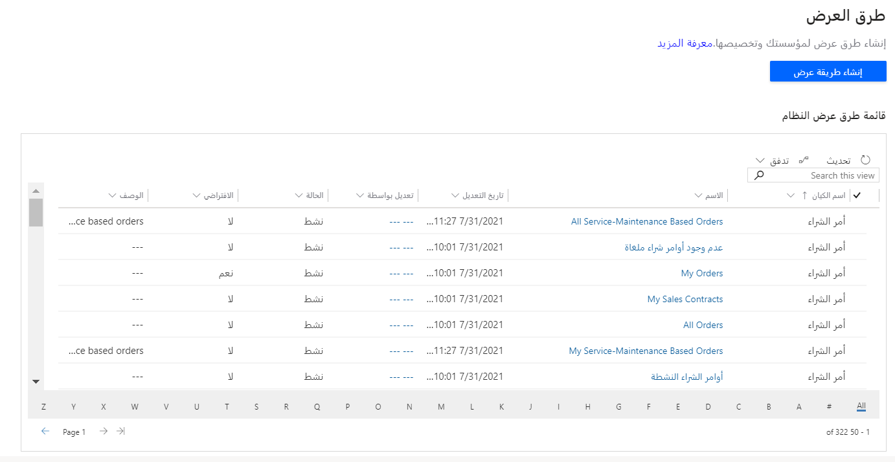

في Dynamics 365 Sales Professional، استخدم طرق العرض لتحديد كيفية عرض قائمة بالسجلات لجدول معيّن. تحدد طريقة العرض ما يلي:
 
- الأعمدة المطلوب عرضها.
- عرض الأعمدة المعروضة.
- كيفية فرز قائمة بالسجلات بشكل افتراضي. 
- عوامل التصفية الافتراضية التي يتم تطبيقها لحصر السجلات التي ستظهر في القائمة. 

يتم عرض السجلات المرئية في طرق العرض الفردية في قائمة، وفي بعض الأحيان يطلق عليها شبكة، والتي كثيراً ما توفر خيارات بحيث يمكن للأشخاص تغيير الإعدادات الافتراضية للفرز وعرض الأعمدة وعوامل التصفية لرؤية البيانات المهمة بالنسبة إليهم بمزيد من السهولة. تعرّف طرق العرض أيضاً مصدر بيانات المخططات المستخدمة في التطبيق. 

لمزيد من المعلومات عن تخصيص طرق العرض، اطلع على [تخصيص طرق العرض (Sales Professional)](/dynamics365/customer-engagement/sales-professional/customize-views). 
