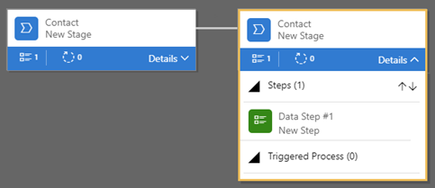

باستخدام Dynamics 365 Sales Professional، يمكنك المساعدة في ضمان قيام المستخدمين بإدخال البيانات بشكل متسق واتباع نفس الخطوات في كل مرة يعملون فيها مع أحد العملاء عن طريق إنشاء سير إجراءات العمل. على سبيل المثال، قد ترغب في إنشاء سير إجراءات العمل لتمكين الجميع من التعامل مع طلبات خدمة العملاء بنفس الطريقة أو لمطالبة المستخدمين بالحصول على الموافقة على فاتورة قبل إرسال الأمر.

تستخدم عمليات سير إجراءات العمل نفس التقنية الأساسية مثل العمليات الأخرى ولكن تختلف القدرات التي توفرها عن الميزات الأخرى التي تستخدم العمليات.

باستخدام عمليات سير إجراءات العمل، يمكنك تحديد مجموعة من المراحل والخطوات التي يتم عرضها في عنصر تحكم أعلى النموذج. تحتوي كل مرحلة على مجموعة من الخطوات. تمثل كل خطوة عمودًا حيث يمكن إدخال البيانات إليه. ينتقل المستخدمون إلى المرحلة التالية باستخدام زر "المرحلة التالية". يمكنك اتخاذ خطوة ضرورية حتى يتعين على المستخدمين إدخال البيانات للعمود المقابل قبل أن يتمكنوا من المتابعة إلى المرحلة التالية. هذا النوع من الخطوات يسمى "بوابة المرحلة".

تبدو عمليات سير إجراءات العمل بسيطة نسبيًا مقارنة بأنواع العمليات الأخرى. وذلك لأنها لا توفر أي منطق عمل مشروط أو تنفيذ تلقائي بعد توفير تجربة مبسطة لإدخال البيانات والتحكم في الإدخال إلى مراحل. ومع ذلك، عند دمجها مع عمليات وتخصيصات أخرى، يمكنها أن تلعب دورًا مهمًا في توفير وقت المستخدمين مما يقلل تكاليف التدريب وتعزيز اعتماد المستخدم.

لمزيد من المعلومات حول عمليات سير إجراءات العمل، راجع [تخصيص عمليات سير إجراءات العمل (Sales Professional)](/dynamics365/customer-engagement/sales-professional/customize-business-process-flows). 
