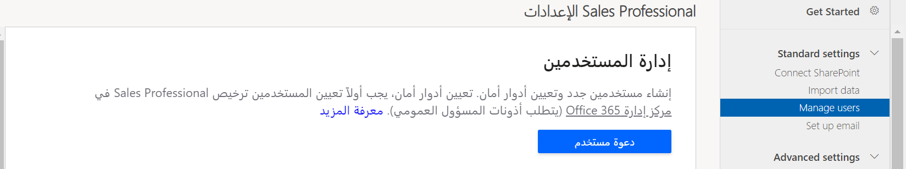

سيحتاج جميع مستخدمي Dynamics 365 Sales Professional إلى حساب مع تعيينه إلى دور أمان. ستحتاج إلى دور مسؤول عام في Microsoft 365 ودور مسؤول نظام في Dynamics 365 Sales Professional لإضافة المستخدمين وإدارتهم.

تتحكم أدوار الأمان في وصول المستخدم إلى البيانات من خلال مجموعة من مستويات الوصول والامتيازات. توفر Dynamics 365 Sales Professional مجموعة افتراضية من أدوار الأمان:

- Sales Professional

- مدير Sales Professional

- مسؤول النظام

- مخصص النظام
    
لمزيد من المعلومات، راجع [إضافة المستخدمين أو إدارتهم في Dynamics 365 Sales Professional](/dynamics365/customer-engagement/sales-professional/manage-users). 
