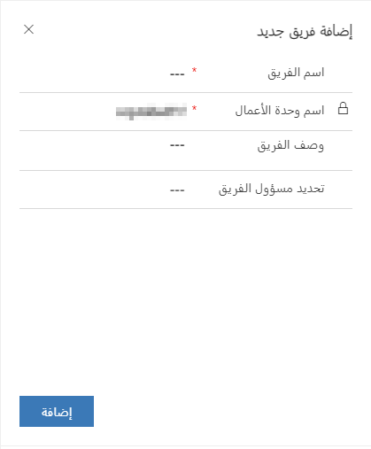

الفريق هو مجموعة من المستخدمين الذين يشاركون بعضهم بعضًا ويتعاونون فيما بينهم في سجلات العمل. يمكن إقران مستخدم بفرق متعددة. عندما يتم تعيين دور لفريق، يتم تعيين مجموعة الامتيازات المرتبطة بهذا الدور لأعضاء الفريق.

لمزيد من المعلومات، يرجى مراجعة [إضافة الفرق أو إدارتها في Dynamics 365 Sales Professional](/dynamics365/customer-engagement/sales-professional/manage-teams). 

