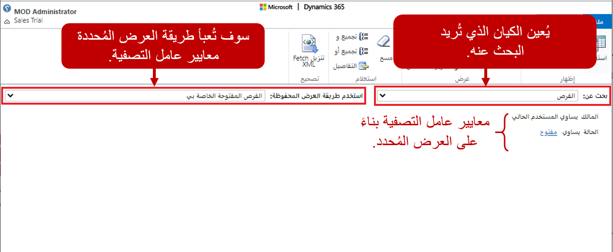
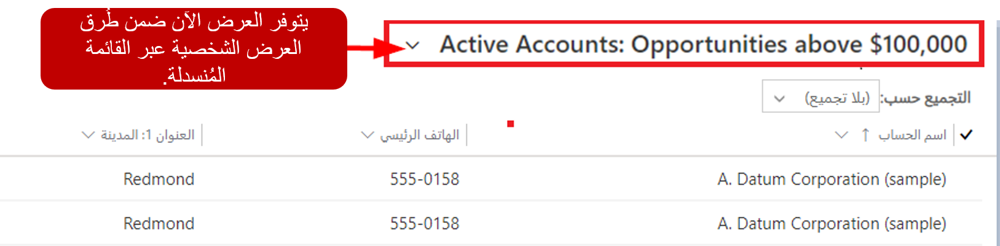
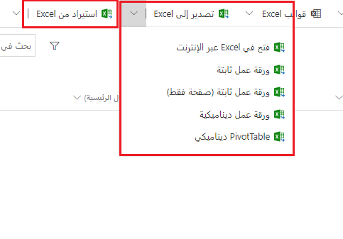
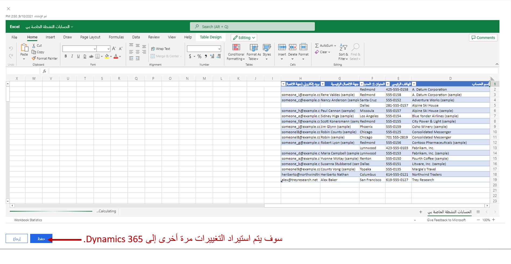
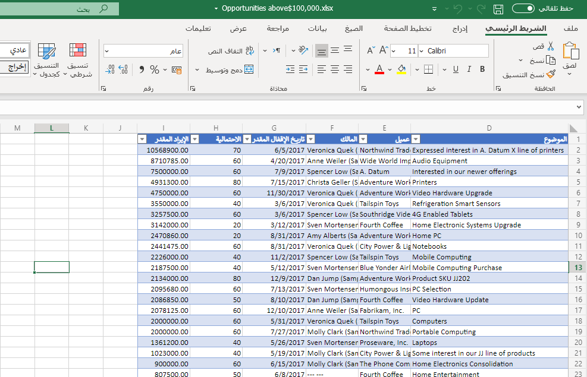

غالباً ما تكون الخطوة الأولى في الإبلاغ الفعال وتحليل البيانات هي العثور على البيانات. إذا لم يتم عرض البيانات الصحيحة، فإن المخططات والتقارير لا تقدم أي قيمة فعلاً. يتضمن، Microsoft Dynamics الجاهز طرق عرض متعددة يمكن استخدامها لتصفية البيانات وتحليلها بسرعة. يمكن للمؤسسات استخدام وجهات النظر هذه للحصول بسهولة على نظرة عامة على الصورة الكبيرة لما يحدث.

لنلقِ نظرة على بعض الأمثلة:

- يستخدم مدير المبيعات طريقة العرض **العملاء المتوقعون الذين تم فتحهم هذا الأسبوع** لمشاهدة جميع العملاء المتوقعين الجدد الذين تم تكوينهم خلال الأسبوع الحالي. من طريقة العرض، يمكن لمدير المبيعات تصفية العملاء المتوقعين حسب معايير مثل المنطقة. يمكن لمدير المبيعات تعيين العملاء المتوقعين في مناطق محددة لموظفي المبيعات المرتبطين بتلك المناطق.
- قوم مسؤول الحساب بتصدير السجلات التي تظهر في طريقة العرض **الفرص المغلقة في السنة المالية الحالية** إلى Microsoft Excel وإنشاء PivotTable للتعمق في الأرقام.

على الرغم من وجود العديد من طرق العرض الجاهزة التي تعرض البيانات بعدة طرق، فقد يتعين على المؤسسات العثور على بيانات محددة لا تظهر في أي طريقة عرض جاهزة. تتمثل إحدى طرق البحث عن هذه البيانات وتقديمها في استخدام ميزة "بحث متقدم" في Dynamics 365.

## بحث متقدم

يعد البحث المتقدم طريقة ممتازة لاستخراج البيانات من Microsoft Dynamics365 Sales. يستخدم عوامل التصفية المعرفة من قبل المستخدم لإظهار البيانات المطلوبة. على سبيل المثال، تريد مندوبة مبيعات الاطلاع على جميع حساباتها التي طلبت منتجاً معيناً خلال الأشهر الستة الماضية. باستخدام البحث المتقدم، يمكن لمندوب المبيعات التصفية على البيانات التي لا يتم تضمينها فقط في سجلات الحساب ولكن أيضاً في السجلات ذات الصلة، مثل البنود الموجودة في الطلبات التي وضعها الحساب. يمكن أن يساعد البحث المتقدم أيضاً في تحضير البيانات للتصدير إلى Excel لأغراض إعداد التقارير. للوصول إلى هذه الميزة، حدد الزر **بحث متقدم** على شريط التنقل. في نافذة **بحث متقدم**، يتم استخدام عمودين لتصفية السجلات مبدئياً:

- **ابحث عن:** حدد الجدول المراد البحث عنه، مثل الحسابات أو العملاء المتوقعين أو الفرص.
- **استخدام طريقة العرض المحفوظة:** حدد عرض الجدول الذي يجب أن يوفر معايير التصفية الأولية، مثل **الفرص المفتوحة الخاصة بي**.

عند تحميل "البحث المتقدم" لأول مرة، فإنه يستخدم عامل التصفية الذي يوفره طريقة العرض المعروضة حالياً. على سبيل المثال، إذا كنت تبحث في عرض **الفرص المفتوحة الخاصة بي** عند تحديد الزر **بحث متقدم**، فإن الزر **البحث عن**، والعمود *الفرص*، و **استخدام طريقة العرض المحفوظة** سيتم تعيينه على *الفرص المفتوحة الخاصة بي*. بالإضافة إلى ذلك، ستتم تصفية العرض بحيث يعرض فقط الفرص المفتوحة التي تملكها أنت، المستخدم الحالي.

توضح الصورة التالية كيف يبدو البحث المتقدم في هذا المثال.

يمكنك تغيير معايير التصفية عن طريق تحديد الزر **التفاصيل**. يمكنك إضافة أو تحرير أو حذف معايير التصفية الفردية كما تريد.

يمكن لـ "البحث المتقدم" إرجاع نوع سجل واحد فقط في قائمة النتائج. لا يمكنها إرجاع، على سبيل المثال، كل من الحسابات والفرص في قائمة واحدة. ولكن يمكنه استخدام البيانات الموجودة في جداول أخرى للتحكم في السجلات التي يتم عرضها لنوع سجل معين. على سبيل المثال، تُعيد معايير التصفية في الصورة التالية سجلات الحساب التي تحتوي على فرص مفتوحة ذات عائد تقديري يزيد عن \$100،000.00.

الانتهاء من تحديد معايير التصفية، يمكنك إظهار النتائج بتحديد الزر **النتائج**.

إذا كنت تريد حفظ مرشح بحث متقدم بحيث يمكن استخدامه كطريقة عرض في أي وقت، فحدد الزر **حفظ باسم**، وأدخل اسماً للعرض. بعد حفظ الفلتر كعرض، سيكون العرض متاحاً في قائمة **طرق العرض** للجدول الذي يعتمد عليه.

### قم بإنشاء طريقة عرض باستخدام البحث المتقدم

شاهد الفيديو التالي لترى كيف يمكنك إنشاء عرض باستخدام البحث المتقدم.

> [!VIDEO https://www.microsoft.com/videoplayer/embed/RE2NCXc]

## تكامل Excel

كثير من المستخدمين على دراية بأدوات تحليل البيانات المتوفرة في Excel ومرتاحين لها. لذلك، يفضل العديد من المستخدمين تصدير بيانات Dynamics 365 إلى Excel والقيام بتحليل البيانات من هناك.

يوفر Dynamics 365 العديد من الخيارات التي تتيح للمستخدمين إدارة بيانات Dynamics 365 وتحليلها باستخدام الأدوات الموجودة في Excel التي هم على دراية بها.

- صادرات بيانات Excel الثابتة:

  - يمكن للمستخدمين تصدير لقطة من العرض المحدد.
  - يمكن للمستخدمين تصدير جميع السجلات التي تظهر في طريقة عرض.

- المصنفات الديناميكية:

  - ينشئ التصدير المصنفات التي لها اتصال بقاعدة بيانات Dynamics 365 Sales.
  - يتم تحديث المصنفات ديناميكياً من داخل Excel.

- جداول PivotTable الديناميكية:
  - تشبه جداول PivotTables هذه المصنفات الديناميكية، ولكن يجب على المستخدمين تصميم أعمدة PivotTable والصفوف التي يريدون التفاعل معها.
- Microsoft Excel ‏Online:
  - يمكنك تحرير بيانات Dynamics 365 باستخدام Excel داخل Dynamics 365.
  - يمكن حفظ البيانات مرة أخرى في Dynamics 365.

### العمل مع Excel المضمنة

في بعض الأحيان، قد ترغب في إجراء عمليات تحرير مجمعة أو إجراء تحليل سريع لبيانات Dynamics 365 باستخدام الأدوات المتوفرة في Excel، ولكنك لست بحاجة إلى القيام بتصدير كامل للبيانات. يتيح لك Dynamics 365 إجراء تحليل مخصص سريع باستخدام Excel Online داخل Dynamics 365. على سبيل المثال، إذا كنت مدير مبيعات، فقد ترغب في تحليل الفرص التي يمتلكها فريقك ومراجعة مؤشرات الأداء الأساسية (KPIs) لمعرفة كيف يمكنك مساعدة أعضاء فريقك. إذا كنت مندوب مبيعات، يمكنك فتح فرصك في Excel وإجراء تحليل ماذا لو لسيناريوهات الحوافز المختلفة. أخيراً، قد ترغب في فتح البيانات بسرعة في Excel Online بحيث يمكنك نسخها في مكان آخر، مثل رسالة بريد إلكتروني.

يمكن فتح أي طريقة عرض معروضة حالياً في Dynamics 365 في Excel Online. ما عليك سوى تحديد الزر **> تصدير إلى Excel** في شريط الأوامر، ثم حدد **فتح في Excel Online** في القائمة التي تظهر.

بعد الانتهاء من تحرير بياناتك في Excel Online، يمكنك حفظ المعلومات المحدثة مرة أخرى في Dynamics 365 عن طريق تحديد الزر **حفظ**. تذكر الاحتفاظ بالتنسيق الحالي لخلايا Excel، لمنع حدوث مشكلات أثناء الاستيراد. لن يتم حفظ أي معلومات إضافية تضيفها إلى المصنف، مثل المخططات أو الألوان.

### تصدير معلومات Dynamics 365 إلى Excel

إذا كنت بحاجة إلى الاستفادة من أدوات التحليل الأكثر تقدماً المتوفرة في Excel، فيمكنك تصدير بيانات Dynamics 365 إما كمصنفات ثابتة أو كمصنفات ديناميكية. يمكنك استيراد كلا النوعين من المصنفات مرة أخرى إلى Dynamics 365. إذا كنت بحاجة إلى المزيد من الوظائف المتقدمة، يمكنك تصدير PivotTable ديناميكي. تجعل جداول Pivottable من السهل تنظيم البيانات وتلخيصها.

يتم تصدير بيانات Dynamics 365 إلى ملف Excel قياسي يمكنك استخدامه بعد ذلك على أي جهاز، مثل الهاتف أو الكمبيوتر اللوحي أو كمبيوتر سطح المكتب. تم تصديره بنفس التنسيق الذي تراه في Dynamics 365. لذلك، يظل النص نصاً، وتظل الأرقام أرقاماً، وتظل التواريخ تواريخ. ولكن قد تتغير بعض تنسيقات الخلايا.
