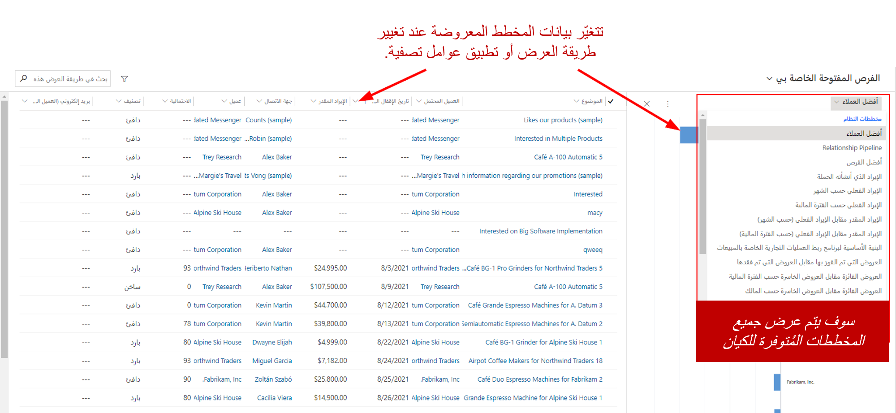
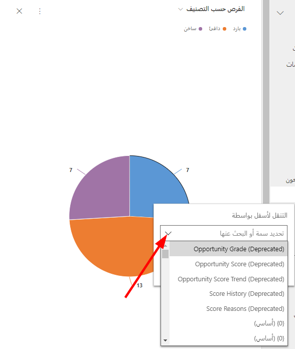
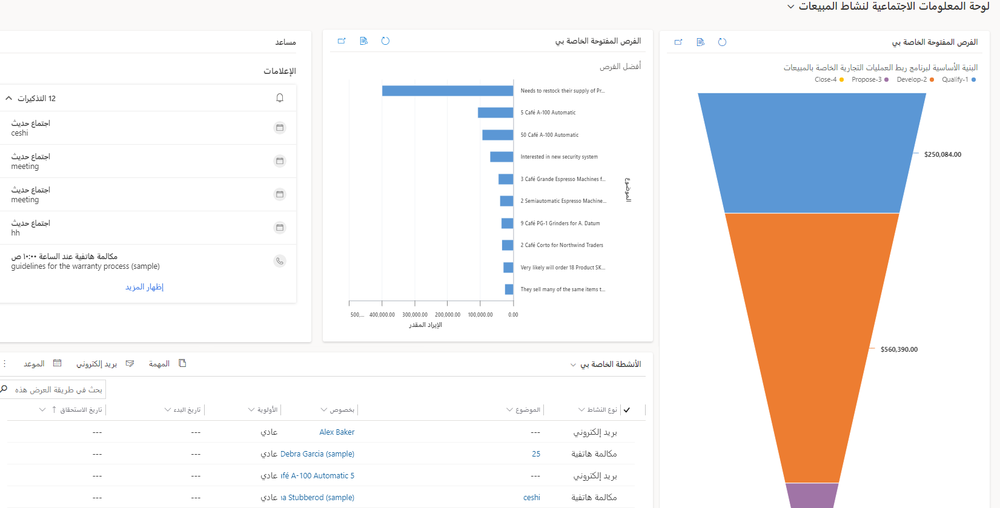
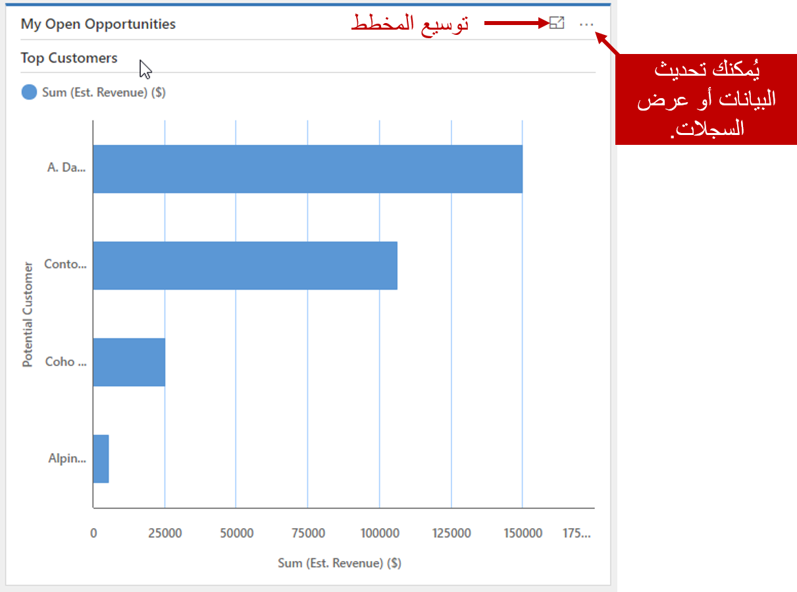
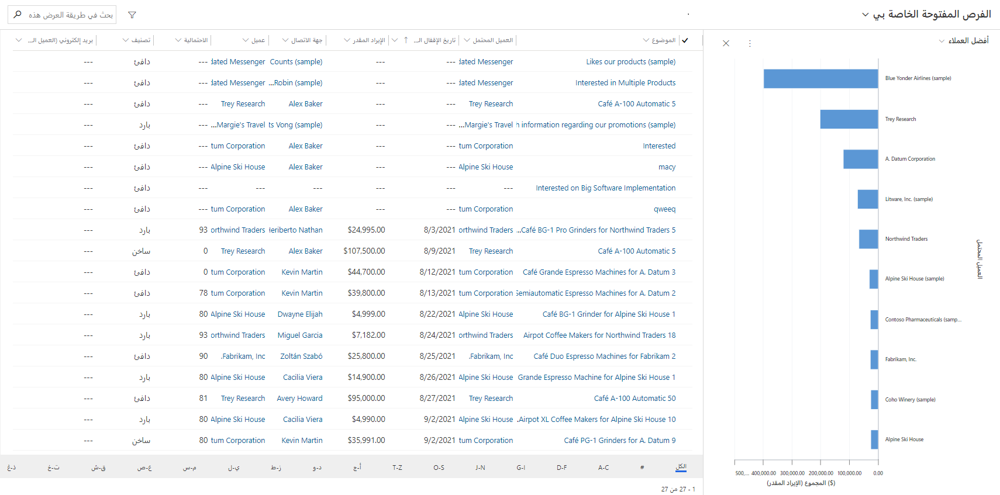
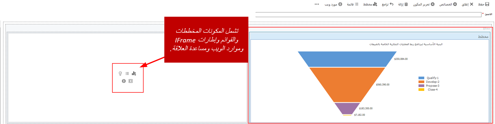

تُعد الأدوات مثل التقارير الجاهزة و‪Microsoft Excel PivotTables‬ والمصنفات مفيدة جداً في تجميع البيانات وتوفير منظور لها. لكن لا يحتاج معظم المستخدمين إلى هذا المستوى من تحليل البيانات. فهم يبحثون فقط عن طريقة سريعة للتنقل ومشاهدة البيانات عالية المستوى المهمة بالنسبة إليهم. على سبيل المثال، قد يرغبون في رؤية أهم الفرص المفتوحة لهم، أو أنشطة اليوم الحالي، أو البنية الأساسية لبرنامج ربط العمليات التجارية للمبيعات. يتضمن ‪Microsoft Dynamics 365‬ ميزتَين تُستخدمان كثيراً وتلبيان احتياجات هؤلاء المستخدمين:

- **المخططات:** توفر المخططات معلومات مرئية حول أهم بيانات ومعلومات المؤسسة أو المستخدم. يتضمن كل جدول عدداً من المخططات المعرّفة مسبقاً والتي يمكن استخدامها للاستفادة من بيانات الصورة العامة بشكل سريع.
- **لوحات المعلومات:** تسمح لوحات المعلومات للمستخدمين برؤية أهم المعلومات التي يحتاجون إليها لاتخاذ قرارات متعلقة بالأعمال في لمحة سريعة. يمكن أن تتألف لوحات المعلومات من مخططات وقوائم وموارد أخرى، مثل صفحات الويب الخارجية. يشمل Dynamics 365 العديد من لوحات المعلومات مسبقة التكوين التي تساعد في إلقاء الضوء على أهم المعلومات. يمكن تغيير لوحات المعلومات مسبقة التكوين، ويمكن إنشاء لوحات معلومات مخصصة.

إلى جانب كونها سهلة الاستخدام، تعرض المخططات ولوحات المعلومات بيانات في الوقت الحقيقي. عند إنشاء العملاء المتوقعين، وفتح الفرص وإغلاقها، وتحديث الأوامر، وما إلى ذلك، تعكس المخططات ولوحات المعلومات هذه التغييرات على الفور. بالإضافة إلى ذلك، يشاهد المستخدمون السجلات التي يتوفر لديهم الإذن لعرضها فقط في سياق المستخدم الذي يصل إليها.

## العمل باستخدام المخططات

تتوفر مخططات متعددة معرّفة مسبقاً لمعظم الجداول الجاهزة للاستخدام، مثل جداول الحسابات والعملاء المتوقعين والفرص. يمكنك فتح هذه المخططات من أي طريقة عرض مقترنة بالجداول. ما عليك سوى تحديد زر **إظهار المخطط** في شريط الأوامر. بعد أن يظهر جزء المخطط، يمكنك التبديل إلى أي مخطط تم تعريفه للجدول بتحديد السهم للأسفل بجانب اسم المخطط.

عند تصفية البيانات في طريقة العرض أو تغيير طريقة العرض التي تستخدمها، يتم تحديث المخطط في جزء المخطط بحيث يعكس البيانات التي يتم عرضها حالياً فقط. على سبيل المثال، في حالة تصفية طريقة العرض بحيث تعرض الفرص المهمة فقط، يتم تضمين الفرص المهمة فقط في المخطط المعروض.

إذا كنت ترغب في استعراض مجموعة معيّنة فقط من البيانات، مثل البيانات التي يتم تقديمها في مخطط شريطي، يمكنك التنقل لأسفل لعرض المزيد من التفاصيل. للتنقل لأسفل في البيانات، حدد عنصر في المخطط. يمكنك بعد ذلك إجراء عمليات تحديد البيانات. بينما تتنقل لأسفل خلال المخطط، يتم طرح أسئلة معيّنة عليك حول البيانات التي ستتنقل لأسفل للوصول إليها.

بعد الانتهاء من العمل باستخدام المخططات، يمكنك إغلاق جزء المخطط بتحديد زر **إخفاء المخطط** في شريط الأوامر.

## العمل باستخدام لوحات المعلومات

تعد لوحات المعلومات مجموعة من طرق العرض والمخططات وIFrames وموارد الويب وغير ذلك من التقارير الرسومية التي توفر نظرة عامة عالية المستوى على البيانات من موقع واحد. وبالتالي، يمكنك تحليل بيانات المبيعات المختلفة في الوقت نفسه. تعد لوحة المعلومات في الأساس لقطة للبيانات بتنسيقات مختلفة في صفحة واحدة. لا يتم عرض البيانات في موقع مركزي فقط، لكن يمكن التفاعل معها مباشرة من لوحة المعلومات نفسها. على سبيل المثال، يمكن لموظفي المبيعات مشاهدة مخطط البنية الأساسية لبرنامج ربط العمليات التجارية للمبيعات الخاصة بهم‬ ومعرفة عدد الفرص التي تم إغلاقها. في الوقت نفسه، يمكن أن تطالبهم مساعدة العلاقة باتخاذ إجراء بخصوص الفرص والمواعيد والمهام ذات الصلة بعملائهم.

تعرض الصورة التالية مثالاً للوحة المعلومات.

يُطلق على كل عنصر يتم تقديمه في لوحة المعلومات اسم *مكون*. يمكن أن تشمل كل لوحة معلومات ستة مكونات بحدٍ أقصى، ما لم تستخدم لوحات معلومات تفاعلية، أو ما لم تقم بزيادة الحد الافتراضي من خلال التخصيصات المتقدمة باستخدام ‪Microsoft Windows PowerShell‬.

لا يتم تحديث لوحات المعلومات تلقائياً، لكنها تعرض أحدث بيانات في كل مرة يتم تحميل الصفحة. إذا تركت لوحة المعلومات لإجراء تغييرات في سجل، فستعكس لوحة المعلومات هذه التغييرات في المرة التالية التي يتم تحميلها.

‪Microsoft Dynamics 365 Salesيشمل‫ ‬‬ عدة لوحات معلومات جاهزة للاستخدام تسمح للمستخدمين بقياس إنتاجيتهم ومقارنتها بالمستخدمين الآخرين في مؤسستهم. يُطلق على لوحات المعلومات الجاهزة للاستخدام هذه اسم *لوحات معلومات النظام*، ويمكن لجميع مستخدمي المؤسسة مشاهدتها. في ما يلي قائمة بلوحات معلومات النظام:

- لوحة معلومات المبيعات
- لوحة معلومات نشاط المبيعات
- لوحة المعلومات الاجتماعية لنشاط المبيعات

يمكنك توسيع المكونات أو التنقل لأسفل في السجلات المستخدمة لإنشاء المخططات عن طريق تحديد الزر المناسب.

إذا حددت الزر **‏‫عرض السجلات المستخدمة لإنشاء المخطط البياني‬**، يتم فتح نافذة تعرض المخطط وقائمة بالسجلات المقترنة به. يمكنك تحديد أحد عناصر المخطط لعرض السجلات المقترنة بهذه المنطقة. بعد الانتهاء من مراجعة البيانات، يمكنك إغلاق النافذة للعودة إلى لوحة المعلومات الأصلية.

إذا كنت تريد لوحات معلومات تتضمن عناصر معيّنة مناسبة لك، يمكنك إنشاء لوحات معلومات إضافية. يُطلق على لوحات المعلومات التي ينشئها المستخدمون الفرديون اسم *لوحات المعلومات الشخصية*. تكون لوحات المعلومات الشخصية ظاهرة فقط للمستخدمين الذين أنشأوها بشكل افتراضي، لكن يمكنهم مشاركتها مع مستخدمين آخرين إذا لزم الأمر. لإنشاء لوحة معلومات شخصية، حدد زر **‏‫لوحة معلومات Dynamics 365‬** في شريط الأوامر. الخطوة الأولى هي تحديد تنسيق لوحة المعلومات.

في مصمم لوحة المعلومات، يمكنك إضافة مكونات استناداً إلى احتياجاتك المحددة. يتضمن كل عنصر نائب لأحد المكونات مجموعة من الأزرار التي تقابل الأنواع المختلفة من المكونات التي يمكن إعدادها. عند إضافة مكونات إلى لوحة المعلومات، يمكنك تغيير حجمها أو نقلها أو حذفها كما يلزم.

في ما يلي بعض أنواع المكونات التي يمكن إضافتها إلى لوحة المعلومات:

- **المخطط:** يعرض هذا المكون مخطط Dynamics 365. إذا أضفت مخططاً إلى لوحة المعلومات، يجب تعريف الخصائص التالية:

    - الجدول المطلوب استخدامه
    - طريقة العرض التي تعرّف البيانات المعروضة في المخطط
    - المخطط المحدد المطلوب عرضه

- **القائمة:** يعرض هذا المكون طريقة عرض معيّنة في Dynamics 365. إذا أضفت قائمة إلى لوحة المعلومات، يجب تعريف الخصائص التالية:

    - الجدول المطلوب استخدامه
    - طريقة العرض المحددة المطلوب عرضها

- **IFrame:** يعرض هذا المكون معلومات لصفحة ويب.
- **مورد الويب:** يعرض هذا المكون معلومات لمورد ويب تمت إضافته.
- **‏‫مساعدة العلاقة‬:** يعرض هذا المكون ‏‫مساعدة العلاقة‬.

بعد أن تبدو لوحة المعلومات بالشكل الذي تريده، يمكنك حفظها وإغلاقها. في المرة التالية التي تحدد فيها خيار **لوحات المعلومات** في خريطة الموقع، ستتوفر لوحة المعلومات التي أنشأتها في قائمة لوحات المعلومات. دائماً ما تظهر لوحات المعلومات الشخصية في الجزء السفلي من القائمة، ضمن **‏‫لوحات المعلومات الخاصة بي‬**.

## إنشاء مخططات ولوحات معلومات شخصية

> [!VIDEO https://www.microsoft.com/videoplayer/embed/RE2NCXf]
