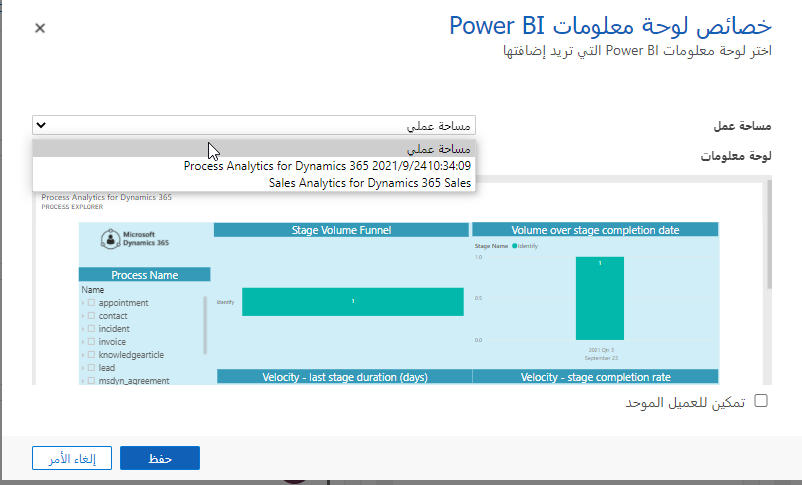

Microsoft Power BI عبارة عن مجموعة من أدوات تحليل الأعمال التي تقدم رؤى في جميع أنحاء مؤسستك. Power BI يساعد على الاتصال بمئات مصادر البيانات، ويبسط عملية إعداد البيانات، ويقود التحليل المخصص. باستخدام الأدوات التي توفرها Power BI، يمكنك إنتاج تقارير رائعة ثم نشرها حتى تتمكن مؤسستك من استهلاكها على الويب وعبر الأجهزة المحمولة.

يمكن للجميع إنشاء لوحات معلومات مخصصة تمنحهم عرضاً فريداً بزاوية 360 درجة لأعمالهم، والتي تتسع عبر المؤسسة، والتي تشتمل على الحوكمة والأمان. تتوفر جميع هذه الميزات والأدوات من خلال PowerBI.com. لا يمكن إنشاء لوحات معلومات مخصصة فحسب، بل توجد لوحات معلومات Power BI مسبقة التكوين تم إنشاؤها خصيصاً لمبيعات Microsoft Dynamics365 Sales وMicrosoft Dynamics 365 for Customer Service.

هناك العديد من الفوائد لاستخدام Power BI للمساعدة في تحليل بيانات Microsoft Dynamics 365. نظراً لأنه تطبيق تحليلات كامل للمؤسسات، فإن له نظاماً بيئياً خاصاً به. تتصل حزم المحتوى المتوفرة لـ Power BI بمئات من مصادر البيانات المختلفة، بما في ذلك Dynamics 365. لذلك، من السهل جداً الاتصال والحصول على بيانات مفيدة على الفور.

بالإضافة إلى ذلك، يمكن توسيع Power BI التقارير ولوحات المعلومات لتلائم مجموعة متنوعة من حالات الاستخدام.

يسمح لك Microsoft Dynamics 365 Online لـ Power BI بالوصول إلى بياناتك وتحليلها بسهولة. Power BI يستخدم موجز بروتوكول البيانات المفتوحة (OData) لإنشاء نموذج وصفي يتضمن جميع الجداول والمقاييس المطلوبة، مثل الحسابات والأنشطة والفرص والمنتج والعملاء المتوقعين والمستخدمين. بعد تثبيت التطبيق، يمكنك عرض لوحة التحكم والتقارير في [خدمة Power BI](https://powerbi.com/)، وفي Power BI ‏Mobile. تهدف لوحة القيادة والتقارير إلى تقديم تقارير تشغيلية حول البيانات على المدى القريب، حيث يكون التركيز على فريق أو مجموعة معينة. يمكن لكل استعلام استرداد 100,000 سجل كحد أقصى من Dynamics 365 Online.

## عرض لوحات معلومات Power BI في Dynamics 365

إذا كان لديك Power BI لوحات معلومات ومكونات تريد أن تظهر في Dynamics 365، يمكنك تشغيل تكامل Power BI. ستتمكن بعد ذلك من عرض هذه المرئيات القوية مباشرةً من داخل Dynamics 365.

فيما يلي المتطلبات الخاصة لتكامل Power BI مع Dynamics 365:

- يتم دعم Dynamics 365 Online فقط.
- يجب أن يكون لديك حساب Power BI مرتبط.
    - يتم استخدام نفس Microsoft Azure Active Directory لتسجيل الدخول الأحادي (SSO).

- يتطلب إنشاء لوحات معلومات Dynamics 365 لوحات معلومات وتجانب موجودة Power BI.

لتشغيل التكامل، انتقل إلى **الإعدادات \> الإدارة \> إعدادات النظام**. في إعدادات النظام، في علامة التبويب **إعداد التقارير**، حدد الخيار لتضمين Power BI مرئيات في Dynamics 365.

بعد تشغيل التكامل، سيتمكن المستخدمون من تنفيذ المهام التالية:

- أضف Power BI الإطارات المتجانبة إلى لوحة المعلومات.
- أضف لوحة معلومات كاملة Power BI.

> [!IMPORTANT]
> يمكن إضافة إطارات متجانبة ولوحات معلومات Power BI إلى لوحات المعلومات الشخصية فقط. لذلك، لا يمكن لمسؤولي النظام ومخصصي النظام إنشاء لوحات معلومات للنظام تتضمن مرئيات Power BI.

نظراً لأن Power BI يتصل بـ Dynamics 365 وجزء من التطبيق، فهناك بعض القيود التي يجب مراعاتها عندما تقرر استخدام Power BI:

- **Power BI لا يعمل في سياق السجلات أو المستخدمين:** > بخلاف المخططات ولوحات المعلومات، لا يعمل، Power BI في سياق سجل أو مستخدم. على الرغم من أنه يمكن توسيع الوظيفة بحيث تتضمن ارتباطات إلى السجلات الفردية، إلا أن هذه الإمكانية غير متوفرة في الأصل.

- **تحدث تحديثات البيانات كل ساعة أو يومياً:** Power BI لا يُظهر طريقة عرض في الوقت الفعلي لبيانات Dynamics 365. يتم تحديث البيانات على فترات زمنية محددة تعتمد على فئة التسعير الخاصة بك.
- **التطبيق والخدمة منفصلان:** Power BI هو تطبيق منفصل يتصل ببيانات Dynamics 365. قد يتطلب الأمر ترخيصاً آخر بالإضافة إلى ترخيص Dynamics 365 الخاص بك.
