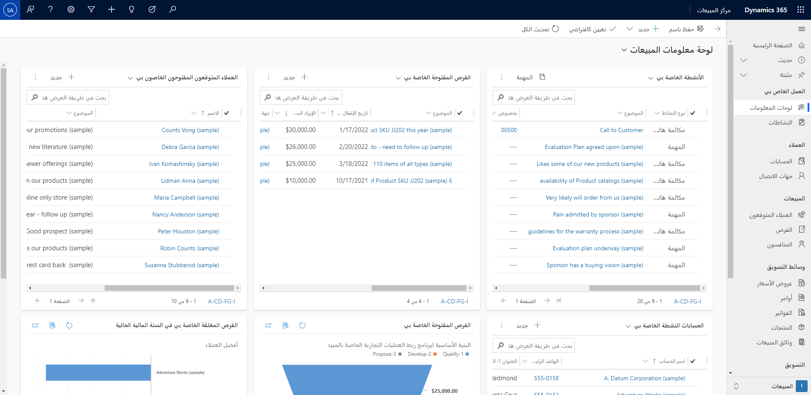
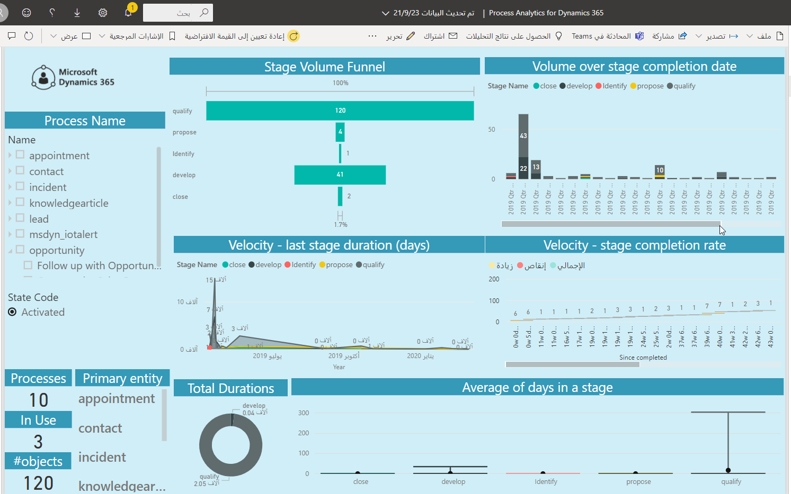

تطبيقات قوالب Power BI هي حزم متكاملة من لوحات معلومات وتقارير Power BI منشأة مسبقًا. يوفر استخدام تطبيقات قوالب Power BI مع Dynamics 365 Sales طريقة ملائمة وفعالة وسريعة للوصول إلى بيانات مبيعاتك وتحليلها.

تتوفر تطبيقات قوالب Power BI التالية لتحليل بيانات مبيعاتك في Dynamics 365 Sales:

- Sales Analytics for Dynamics 365 Sales

- تحليلات العمليات لـ Dynamics 365

يمكنك الاتصال ببيانات Dynamics 365 Sales وتحليلها باستخدام تطبيقات قوالب Power BI هذه. ويمكنك جدولة تحديثات البيانات التلقائية لضمان أنه يمكنك دائمًا اتخاذ القرارات الأكثر إفادة في الوقت المناسب. يمكنك أيضًا إنشاء لوحات معلومات Power BI مخصصة خاصة بك تستند إلى التقارير الموجودة في تطبيقات القوالب هذه وإدراجها مباشرة في Dynamics 365 Sales. 

## Sales Analytics for Dynamics 365 Sales

يعد مديرو المبيعات مسؤولين عن إدارة مندوبي المبيعات الذين يعملون مع العملاء لإقفال الصفقات كل يوم. يحتاج مديرو المبيعات إلى الاطلاع على المقاييس التشغيلية ومقاييس البنية الأساسية لبرنامج ربط العمليات التجارية الرئيسية للارتقاء بأداء الفريق.

يمكن للمديرين رؤية الاتجاهات في هذه المقاييس على مدار فترة زمنية لفهم كيفية أداء البائعين، حتى يتمكنوا من اتخاذ تدابير تصحيحية وتقديم التوجيه المناسب للبائعين وتحسين تجربة شراء العملاء.

وبصفتك مدير مبيعات، استخدم لوحة المعلومات هذه لتنفيذ المهام الآتية:

- يمكنك مراقبة تدفق المبيعات و‏‫لوحة المتسابقين الخاصة بالمبيعات‬ وأفضل الصفقات.

- قم بتحليل أداء التدفق والصفقات الرابحة/الخاسرة وإقفال العميل المتوقع.

> [!div class="mx-imgBorder"]
> 

## تحليلات العمليات لـ Dynamics 365

يهدف تصميم تطبيق قوالب Power BIProcess Analytics for Dynamics 365 إلى مساعدة مديري sales enablement على الحصول على رؤى حول حالات سير إجراءات العمل.  

ويمكن لمديري Sales enablement تعقب مؤشرات الأداء الأساسية، بما في ذلك سرعة السجلات خلال مراحل المعالجة لفهم مدى كفاءة العمليات المؤسسية وتعريفات العمليات الدقيقة لتحقيق أقصى فعالية.

بصفتك مدير sales enablement، استخدم تطبيق القوالب هذا لتنفيذ المهام الآتية:

- تعقب أداء إجراءات العمل.

- إنشاء لوحات معلومات مخصصة تركز على إجراء عمل واحد فقط.

> [!div class="mx-imgBorder"]
> 

للحصول على مزيد من المعلومات، تفضل بزيارة [تكوين Power BI تطبيقات القوالب للتعامل مع Dynamics 365 Sales](/dynamics365/sales-enterprise/configure-sales-template-apps?azure-portal=true) أو [تخصيص تطبيقات قوالب Power BI لـ Dynamics 365 Sales](/dynamics365/sales-enterprise/customize-template-apps?azure-portal=true).
