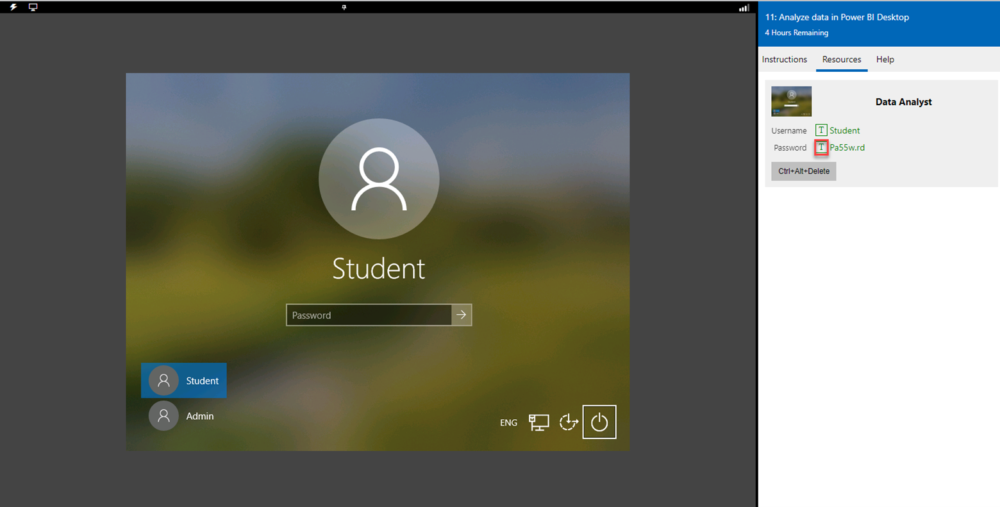

تشتمل هذه الوحدة النمطية على تمرين عملي يجب إكماله.

استخدم الموارد المجانية المتوفرة في التمرين العملي لإكمال التمارين في هذه الوحدة النمطية. لن تفرض عليك أي رسوم.

[تسجيل الدخول لتشغيل التمرين العملي](/training/modules/analyze-dynamics-365-sales-data/5-analyze-data?launch-lab=true)

## الوصول إلى بيئتك

قبل أن تبدأ هذا التمرين العملي، حدد **تشغيل التمرين العملي** أعلاه.

لتسجيل الدخول إلى بيئة التمرين العملي:

1. انقر فوق أي مكان على سطح مكتب Windows في نافذة المعمل.

1. في علامة تبويب **الموارد** الموجودة على الشريط الجانبي للمعمل، حدد الرمز **T** الموجود بجوار **كلمة المرور**. يتم إدخال كلمة مرور الجهاز تلقائياً نيابة عنك. يمكنك تسجيل الدخول باستخدام ملف تعريف الطالب.

1. اضغط على **إدخال**.

   > [!div class="mx-imgBorder"]
   > 

يمكنك الآن أن تبدأ عملك على هذا التمرين العملي.

يقدم Microsoft Dynamics 365 Sales خيارات متعددة للبحث عن البيانات وعرضها وتحليلها.

## الأهداف التعليمية

في نهاية هذه التمارين، ستتمكن من أداء المهام التالية:

- استخدم "البحث المتقدم" لإنشاء طرق عرض Microsoft Dynamics 365.

- تصدير بيانات Dynamics 365 وتحليلها باستخدام Microsoft Excel.

- إنشاء لوحة معلومات شخصية.

- تأهيل عميل متوقع وإلغاء تأهيله.

## الوصول إلى بيئة التمرين العملي المستضاف

قبل بدء هذا التمرين العملي، ستحتاج إلى فتح ارتباط بيئة التمرين العملي أعلاه، وتسجيل الدخول إلى بيئة التمرين العملي. لا يلزم توفير بيئة Dynamics خاصة بك، حيث تم إعداد بيئة وحساب لهذا التمرين العملي.

> [!Note]
> إذا كنت قد سجلت دخولك حالياً إلى Dynamics 365، فقد يتم تسجيل خروجك من حسابك قبل بدء هذا التمرين العملي.

لتسجيل الدخول إلى حساب التمرين العملي:

1. عندما تفتح بيئة التمرين العملي، ستشاهد صفحة تسجيل الدخول إلى Microsoft في الجانب الأيمن. إذا تمت مطالبتك بانتقاء حساب، فاختر **استخدام حساب آخر**.

1. في نافذة التمرين العملي اليسرى، حدد علامة تبويب **الموارد**، ثم حدد قيمة **اسم المستخدم** لنسخها. ألصق هذه القيمة في مربع النص في الجانب الأيمن من الشاشة أسفل **تسجيل الدخول**، ثم حدد **التالي**.

1. ستتم مطالبتك الآن بإدخال كلمة مرور. ضمن **الموارد** في النافذة اليسرى، حدد قيمة **كلمه مرور** لنسخها. الصقها في النافذة اليمنى في مربع النص أسفل **إدخال كلمة مرور**. بعد ذلك، حدد **التالي**.

1. في نافذة **هل تريد تخزين كلمه مرورك لـ microsoftonline.com**، حدد **ليس لهذا الموقع**.

لقد قمت الآن بتسجيل دخولك إلى Dynamics 365، ويمكنك بدء التمرين العملي.

## استخدام Dynamics 365 مع Microsoft 365

يمتلك عدد كبير من الأشخاص في فريق المبيعات لديك خبرات واسعة في استخدام Excel. وهم يحبون أن يكونوا قادرين على التعامل مع بيانات Dynamics 365 في Excel. وقد علق العديد منهم بأنه قد يكون من الصعب بعض الشيء تصدير البيانات إلى Excel وتحريرها ثم استيرادها مرة أخرى إلى Dynamics 365. وهم يبحثون عن طريقة أسهل للتعامل مع بيانات Dynamics 365 في Excel.

في معظم الأوقات، عندما تقوم بإجراء تعديلات مجمعة، تقوم بتغيير فرص تزيد الإيرادات المقدرة فيها عن 20000 دولار أمريكي وتصنيفها "ساخن"، وبالتالي تريد البدء من هناك. وتريد أن تجعل تحرير هذه السجلات في Excel أمراً سهلاً قدر الإمكان وإعادة تنفيذ التغييرات في Dynamics 365.

1. باستخدام منطقة التنقل إلى اليمين، حدد **الفرص** أسفل مجموعة **المبيعات**.

1. في الزاوية العلوية اليسرى من التطبيق، يظهر الزر **بحث متقدم** (أيقونة عامل التصفية).

1. على شريط الأوامر الذي يظهر في النافذة، حدد **التفاصيل** في قسم الاستعلام لفتح الاستعلام لتحريره.

1. حدد السهم إلى جانب عامل التصفية **المالك**، ومن القائمة التي تظهر، حدد **حذف**.

1. تأكد من استمرار ظهور **الحالة – تساوي – مفتوح**. **لا تقم بإزالتها**.

1. تحت عامل تصفية الحالة، حدد النص **تحديد**.  من القائمة التي تظهر، حدد **تصنيف**.

1. عيّن عامل التصفية **تصنيف** على النحو التالي:

    - **التصنيف-يساوي-ساخن**

1. تحت عامل التصفية **تصنيف**، حدد النص **تحديد‏‎**.  من القائمة التي تظهر، حدد **الإيرادات المقدرة**.

1. عيّن عامل تصفية الإيرادات المقدرة على الشكل التالي:

    - **الإيرادات المقدرة – أكبر من – 20،000**

1. حدد أيقونة **النتائج** لعرض النتائج.

1. حدد علامة التبويب **بحث متقدم** للرجوع إلى محرر الاستعلام.

1. حدد **حفظ كـ**.

1. في مربع الحوار **حفظ كطريقة عرض جديدة**، عيِّن القيم الآتية:

    - **الاسم**: فرص ساخنة تزيد عن 20 ألف – الأحرف الأولى من اسمك.

    - **الوصف**: *اترك هذا الحقل فارغاً.*

1. حدد **حفظ**.

1. أغلق نافذة **بحث متقدم**.

1. اضغط على **F5** لتحديث نافذة المستعرض.

1. عد إلى **الفرص**، إذا لزم الأمر.

1. حدد السهم السفلي إلى جانب اسم طريقة العرض الحالية، ثم في القائمة التي تظهر، ابحث عن القسم **طرق العرض الخاصة بي**، ثم حدد طريقة العرض **فرص ساخنة تزيد عن 20 ألف – الأحرف الأولى من اسمك**.

1. على شريط الأوامر، حدد **تصدير إلى Excel‎**، ثم من القائمة التي تظهر، حدد **فتح في Excel Online**.

    يفتح Microsoft Excel Online داخل Dynamics 365. (إذا لم يظهر الخيار "تصدير إلى Excel، فحدد علامة القطع العمودية.)

1. ابحث عن فرصة حيث الحقل **احتمال** فارغ. عيّن الحقل **احتمال** إلى **65**.

1. حدد الزر **حفظ**.

1. حدد **إغلاق**. قد يحتاج Dynamics 365 إلى دقائق قليلة لإظهار التغييرات.

## إنشاء قالب Excel يمكن للمستخدمين الآخرين استخدامه من داخل Dynamics 365

1. في تطبيق مركز مبيعات Dynamics 365، استخدم منطقة التنقل إلى اليمين لتحديد **الفرص**.

1. على شريط الأوامر، حدد **قوالب Excel**.  من القائمة التي تظهر، حدد **تنزيل القالب**.

1. في مربع الحوار، قم بتعيين القيم التالية:

    - **تصفية حسب الكيان**: فرصة.

    - **استخدام طريقه العرض المحفوظة**: فتح الفرص.

1. حدد الزر **تنزيل**.

1. افتح قالب **الفرص المفتوحة** الذي قمت بتنزيله.

1. حدد **تمكين التحرير**.

1. اسحب لتحديد الجدول بأكمله.

1. في علامة التبويب **إدراج**، حدد **جدول محوري**.

1. في مربع الحوار إنشاء جدول محوري، عيِّن القيم الآتية:

    - **الجدول/النطاق**: أدخل *الجدول 1*.

    - **ورقة عمل جديدة**: تأكد من تحديد هذا الخيار.

1. حدد **موافق**.

1. في الجزء **حقول PivotTable**، عيِّن القيم الآتية:

    - **القيم**: أضف حقل **مجموع الإيرادات المقدرة**.

    - **الصفوف**: أضف حقل **التصنيف‏‎**.

1. في Excel، حدد **ملف** > **حفظ باسم**.

1. احفظ الملف إلى سطح مكتبك باسم **فتح Opps بواسطة PivotTable – *الأحرف الأولى من اسمك***.

1. أغلق Excel.

1. عد إلى مركز مبيعات Dynamics 365.

1. على شريط الأوامر، حدد **قوالب Excel‎**، ثم من القائمة التي تظهر، حدد **تحميل قالب**.

1. حدد الملف الذي قمت بتغييره الآن في Excel، وحدد **تحميل**.

1. استخدم منطقة التنقل إلى اليمين للانتقال إلى **الفرص**، إذا لزم الأمر.

1. على شريط الأوامر، حدد **قوالب Excel**. على القائمة التي تظهر، حدد قالب **فتح Opps بواسطة PivotTable – DB** ثم حدد **فتح في Excel Online**.

1. حدد **الرجوع إلى Dynamics 365** لإغلاق القالب.

## إنشاء لوحة معلومات ومشاركتها

### السيناريو

تريد مديرة المبيعات الخاصة بـ Contoso إنشاء لوحة معلومات مبيعات عمومية ليستخدمها فريقها. ينبغي أن تشتمل لوحة المعلومات هذه على طريقة عرض مخصصة للفرص والمخطط الذي يظهر فرص المبيعات في تنسيق رسومي.

### الخطوات عالية المستوى

- إنشاء لوحة معلومات تتضمن استعلام "بحث متقدم" ومخطط.

### الخطوات التفصيلية

إنشاء لوحة معلومات تتضمن استعلام "بحث متقدم" ومخطط.

1. في مركز مبيعات Dynamics 365، استخدم منطقة التنقل اليمنى لتحديد **لوحات المعلومات**.

1. على شريط الأوامر، حدد **+ جديد** و **لوحة معلومات Dynamics 365**.

1. في مربع الحوار اختيار تخطيط، حدد **لوحة معلومات مركزة مكونة من 3 أعمدة**، ثم حدد **إنشاء**.

1. في نافذة "لوحة معلومات جديدة" التي تظهر، في حقل **الاسم**، أدخل **لوحة معلومات إدارة المبيعات**، ثم حدد **حفظ**.

1. في مصمم لوحة المعلومات، حدد القسم الأيمن، ثم حدد الزر **إدراج مخطط**.

1. في مربع الحوار إضافة مكون قم بتعيين القيم التالية لمكون التخطيط الجديد:

    - **نوع السجل**: فرصة.

    - **طريقة العرض**: فرصي المفتوحة.

    - **المخطط**: الفرص حسب التصنيف.

1. حدد **إضافة**.

1. في مصمم لوحة المعلومات، حدد القسم العلوي الأوسط، ثم حدد الزر **إدراج قائمة**.

1. في مربع الحوار إضافة مكون قم بتعيين القيم التالية لمكون التخطيط الجديد:

    - **نوع السجل**: فرص.

    - **طريقة العرض**: فرصي المفتوحة.

1. حدد **إضافة**.

1. في مصمم لوحة المعلومات، حدد القسم السفلي الأوسط، ثم حدد الزر **إدراج مخطط**.

1. في مربع الحوار إضافة مكون قم بتعيين القيم التالية لمكون التخطيط الجديد:

    - **نوع السجل**: فرص.

    - **طريقة العرض**: فرصي المفتوحة.

    - **المخطط**: تدفقات المبيعات.

1. حدد **إضافة**.

1. في مصمم لوحة المعلومات، حدد القسم العلوي الأيمن، ثم حدد الزر **إدراج Iframe‎**.

1. في مربع الحوار إضافةIframe‎، عيِّن القيم الآتية:

    - **URL**: أدخل [https://www.bing.com](https://www.bing.com/?azure-portal=true).

    - **التسمية**: تغيير القيمة إلى موقع Bing.

    - **عرض التسمية على لوحة المعلومات**: حدد خانة الاختيار.

1. حدد **موافق** لإغلاق مربع الحوار.

1. في مصمم لوحة المعلومات، حدد المقطع الأيمن السفلي، ثم اضغط على مفتاح **حذف** في لوحة المفاتيح.

1. حدد مكون **موقع Bing** iFrame الذي أضفته في وقت سابق.

1. على شريط الأوامر، حدد زر علامة القطع (**...**)، ثم حدد **زيادة الارتفاع**. كرر هذه الخطوة حتى يقوم مكون iFrame بملء المساحة الفارغة المتبقية على الجانب الأيسر من لوحة المعلومات.

1. على شريط الأوامر، حدد **حفظ** ثم **إغلاق** لعرض النتائج.

## إنهاء التمرين العملي

لإنهاء هذا التمرين العملي، انقر فوق أيقونة القائمة الموجودة في أعلى الزاوية اليسرى من نافذة التعليمات هذه، وحدد **إنهاء التمرين العملي**.
