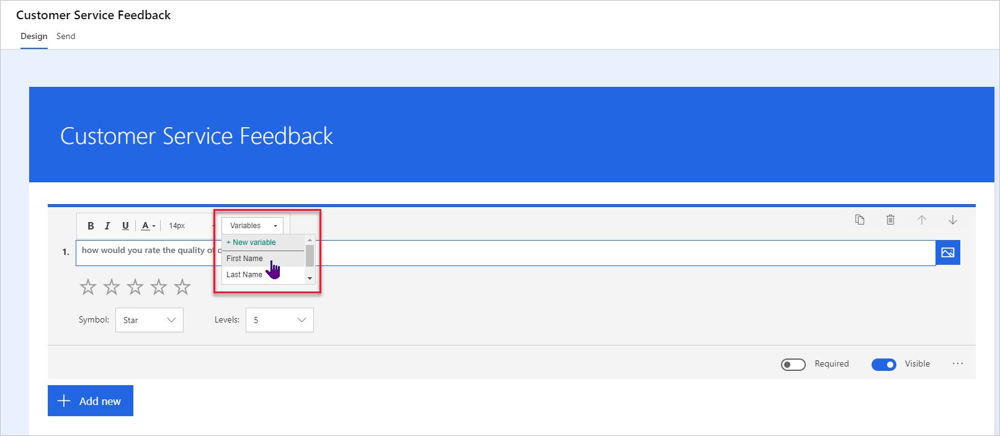
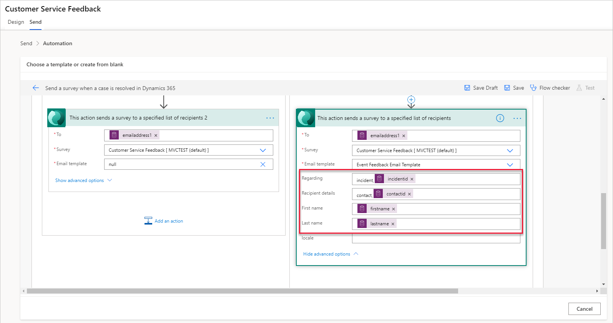

تشمل الطرق المختلفة لإرسال استطلاع Dynamics 365 Customer Voice إرسال رسائل بريد إلكتروني مباشرة من Dynamics 365 Customer Voice، ومشاركة الاستطلاع من خلال رابط أو رمز الاستجابة السريعة، وتضمين الاستطلاع مباشرة داخل موقع الويب. يستعرض هذا القسم كيفية إرسال الاستطلاعات باستخدام Microsoft Power Automate.

يوفر إنشاء تدفق لصانع الاستطلاع القدرة على إرسال استطلاع أو إنشاء دعوة باستخدام Dynamics 365 Customer Voice موصل في Power Automate. يساعد استخدام هذه الطريقة بدلاً من إرسال بريد إلكتروني في جعل إنشاء المتغيرات واستخدامها أداة قوية لأي مؤسسة. يمكن ملء المتغيرات بقيم فعلية مرتبطة بالمستجيب، مما يخلق تجربة ملاحظات شخصية وفريدة من نوعها للعملاء لكل شخص. 

ضع في اعتبارك سيناريو تم فيه إنشاء استطلاع آراء خدمة العملاء بواسطة مؤسسة Contoso. بالإضافة إلى طلب التعليقات حول عملية الدعم وكيفية التعامل مع الحالة، تريد الشركة تضمين بعض التخصيص بحيث يرى العميل اسمه كجزء من الاستطلاع. بشكل افتراضي، يتم تضمين ثلاثة متغيرات في كل استطلاع: الاسم الأول واسم العائلة والإعدادات المحلية. (سيتم تغطية المتغيرات لاحقاً في هذه الوحدة.) إضافة متغير إلى عنصر الاستطلاع أمر بسيط، ويمكنك الوصول إلى المتغيرات من القائمة المنسدلة **المتغيرات**، كما هو موضح في ما يلي صورة. يمكن إضافتها إلى وصف الاستطلاع وفي نص السؤال والعنوان الفرعي للسؤال. 

بعد إضافة متغير **الاسم الأول** إلى الاستطلاع، حان الوقت الآن لإعداد التدفق في Power Automate. سيؤدي تحديد علامة التبويب **إرسال** في الجزء العلوي من الاستطلاع إلى إظهار جميع الطرق التي يمكنك استخدامها لتوزيع الاستطلاع، بما في ذلك خيار تكوين التدفق باستخدام Power Automate. يمكن إنشاء التدفق مباشرة من Power Automate بدلاً من الطريقة التي ينشئ فيها المستخدم كل خطوة من التدفق بنفسه. يمكن أن يساعدك استخدام قوالب التدفق المتوفرة داخل Dynamics 365 Customer Voice في عرض الخطوات المختلفة المضمنة والبدء في فهم كيفية عمل إجراءات الموصل. 

بالنسبة لمتطلبات Contosoيقوم **بإرسال استطلاع عندما يتم حل الحالة في** هو الخيار الأفضل. بعد تكوين التدفق، يمكنك الوصول إليه من خلال العودة إلى منطقة **الصفحة الرئيسية** ثم تحديد الرقم الذي يوضح التدفق الذي تم تكوينه. بالإضافة إلى ذلك، يمكنك مراجعة جميع التدفقات المرتبطة باستطلاع ورؤية اسم التدفق، ونموذج البريد الإلكتروني الذي تم استخدامه، وعدد مرات تشغيل التدفق، وعدد مرات فشله، وما إذا كان التدفق قد تم تشغيله حالياً تشغيل أو إيقاف. لإجراء تعديلات على التدفق، حدد رمز تحرير القلم الرصاص بجوار التدفق. 

ستظهر مراجعة التدفق في قسم الأتمتة أن القالب قد استخدم الإجراء Dynamics 365 Customer Voice **إرسال استطلاع** من Power Automate. كجزء من إنشاء التدفق، تمت تعبئة العديد من القيم في خطوة الإجراء هذه. دعوة الاستطلاع التي تم إنشاؤها هي نشاط في Microsoft Dataverse. النشاط له عمود **بخصوص**، والذي يشير إلى سجل معين مرتبط به. يمكن ربط دعوة الاستطلاع بأي نوع سجل تم تمكين الأنشطة فيه. في هذا المثال، يتم استخدام العمود **بخصوص** لربط الدعوة بالحالة التي تم حلها. نتيجة لذلك، عندما تنتقل إلى الحالة في Dynamics 365، سيتم عرض دعوة الاستطلاع في المخطط الزمني. 

استخدم العمود **تفاصيل المستلم** لربط النشاط (وأي استجابة استطلاع ذات صلة) بسجل جهة الاتصال المناسب الذي سيتم إرسال دعوة الاستطلاع إليه. سيتم عرض النشاط في الجدول الزمني لسجل المستلمين في بيئة Dataverse.

استخدام النموذج يعني أن متغيري **الاسم الأول** و **اسم العائلة** يتم ملؤها تلقائياً في **إرسال استطلاع** خطوة الإجراء في التدفق. ومع ذلك، يمكنك إضافة هذه المتغيرات إذا كنت تقوم بإنشاء تدفق جديد أو تعديل التدفق. يمكنك إكمال هذا الإجراء عن طريق إضافة القيمة الديناميكية للاسم الأول من جهة الاتصال ذات الصلة والمرتبطة بالحالة (أو سجل آخر، كما هو مطلوب). على الرغم من ملء الاسم العائلة، إلا إذا تم استخدامه في مكان ما في الاستطلاع أو في قالب البريد الإلكتروني، فلا حاجة إليه ومع ذلك، لن يتسبب الاحتفاظ بالمتغير في التدفق في حدوث مشكلة. 

سيتم تشغيل قالب Power Automate بأكمله المستخدم للمؤسسة عندما يتم حل الحالة في Dynamics 365. سيحدد التدفق ما إذا كان العميل جهة اتصال أم حساباً. بعد ذلك، سيستخدم التدفق الموصل Dynamics 365 Customer Voice لإرسال بريد إلكتروني باستخدام نموذج الاستطلاع والبريد الإلكتروني الذي تم تحديده في التدفق، ثم يمر عبر متغيرات **الاسم الأول** و **اسم العائلة**. سيتلقى العميل بريداً إلكترونياً يحتوي على رابط لإجراء الاستطلاع. سيحتوي الاستطلاع على القيمة الديناميكية للاسم الأول التي يتم عرضها بدلاً من اسم المتغير.

ستتمكن من عرض أي تدفقات تم تكوينها لاستطلاع ما في علامة التبويب **إرسال** ضمن Power Automate. ستعرض هذه الشاشة آخر مرة تم فيها تشغيل التدفق وعدد مرات تشغيله وعدد حالات الفشل التي حدثت. يمكنك أيضاً الوصول إلى التدفق عن طريق تحديد علامة القطع (**...**)في الزاوية العلوية اليمنى من لوحة تفاصيل التدفق، حيث يمكنك إجراء التغييرات، إذا لزم الأمر. 

> [!VIDEO https://www.microsoft.com/videoplayer/embed/RE4AD9l]
