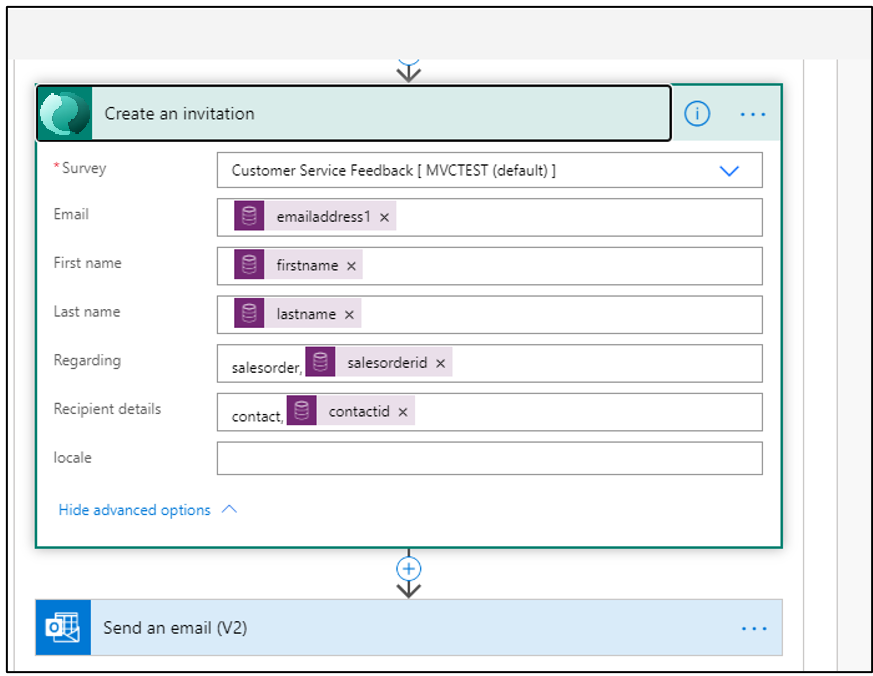
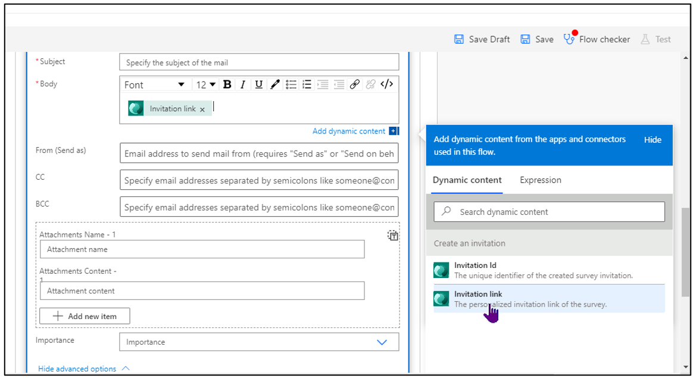

يُعتبر استخدام موصل Dynamics 365 Customer Voice في Power Automate هو الحل المناسب عندما تحتاج إلى إرسال استطلاع باستخدام خدمة بريد Dynamics 365 Customer Voice. بالإضافة إلى ذلك، فهو الحل المناسب عندما تستخدم قالب البريد الإلكتروني الذي تم إنشاؤه وحفظه ضمن Dynamics 365 Customer Voice. 

يتوفّر لك أيضاً استخدام إجراء موصل آخر في Dynamics 365 Customer Voice: إجراء **إنشاء دعوة**. يؤدي إنشاء دعوة إلى إنشاء سجل لنشاط دعوة الاستطلاع، بشكل مشابه للعملية باستخدام إجراء **إرسال استطلاع**. لكن استخدام إجراء **إنشاء دعوة** يؤدي إلى إنشاء ارتباط مخصص يمكن الوصول إليه على مدار الجزء المتبقي من التدفق. فكّر في الأمثلة التالية كأسباب لاستخدام إجراء **إنشاء دعوة**:

- إرسال طلب تعليقات إلى عميل من خلال الأنظمة الأساسية للبريد الإلكتروني مثل Outlook أو Gmail بدلاً من إرساله من داخل Dynamics 365 Customer Voice
- استخدام خدمة SMS (الرسائل النصية) واستخدام الارتباط كجزء من الرسالة، ما يوفر طريقة مختلفة لإبقاء العملاء على علم بآخر المستجدات وطريقة للتواصل معهم
- إنشاء دعوة واستخدام ارتباط الدعوة لإضافة عمود مخصص في سجل لجهة اتصال في بيئة Microsoft Dataverse، ثم استخدام العمود كجزء من رحلة العميل في Dynamics 365 Marketing
- إنشاء ارتباط فريد لدعوة الاستطلاع، والتي يمكن استخدامها لإجراء استطلاع على الهاتف مع أحد العملاء الذين لا يستطيعون الوصول لإكمال الاستطلاع بمفردهم

يجب أن تساعدك هذه الأسباب في تحديد ما إذا كان إجراء **إرسال استطلاع** أو إجراء **إنشاء دعوة** هو الأفضل لتنفيذ متطلب الاستطلاع للمؤسسة. لإنشاء تدفق جديد، انتقل إلى **إرسال > تشغيل تلقائي** ثم حدد واحداً من القوالب المتوفرة. لمستخدمي Power Automate الخبراء، أو إذا لم يكن أي قالب يلبي احتياجات المؤسسة التي سترسل الاستطلاع، يمكن إنشاء تدفق جديد من قالب فارغ. 

في هذا المثال، يتم تحديد القالب **‏‫إرسال استطلاع عند تنفيذ أمر في Dynamics 365‬**. يمكنك حذف الخطوة **إرسال استطلاع** والبحث عن إجراء **إنشاء دعوة** وإضافته بدلاً من ذلك. بشكل مشابه للخطوة **إرسال استطلاع**، يمكنك استخدام قيم ديناميكية لملء متغيرات البريد الإلكتروني والاسم الأول واسم العائلة. يتم ربط العمود **بخصوص** بأمر المبيعات، والعمود **‏‫تفاصيل المستلم** بجهة الاتصال التي ستتسلم دعوة الاستطلاع.



ستكون الخطوة التالية هي إضافة إجراء لازم لإرسال الدعوة. يمكنك إنجاز هذه المهمة بطرق عديدة؛ مع ذلك، يستخدم المثال التالي موصل Outlook. Outlook ليس أداة تسويق، لذا لا ننصح بإرسال المئات من رسائل البريد الإلكتروني لدعوة الاستطلاع بهذه الطريقة. على أي منشئ استطلاعات أو تدفقات استشارة إدارة تكنولوجيا المعلومات في الشركة قبل استخدام هذا الخيار على أساس رسائل البريد الإلكتروني الجماعية. يجب ملء الأعمدة مثل **الموضوع** و **إلى** و **من** بصفتها مطلوبة. في النص الأساسي للبريد الإلكتروني، يمكنك إضافة محتوى ديناميكي من خطوة **إنشاء دعوة**. يجب إضافة ارتباط الدعوة كذلك. سيؤدي استخدام الارتباط المباشر إلى ظهور سلسلة طويلة في البريد الإلكتروني. بدلاً من ذلك، يمكنك إنشاء ارتباط مختصر باستخدام علامات HTML بسيطة. حدد زر HTML **</>** لإظهار طريقة عرض HTML، ثم إضافة المنطق التالي: 

```html
<a href="[InvitationLink]">Complete Our Survey</a>
```

عند إنشاء البريد الإلكتروني وإرساله، سيشاهد المستجيب عبارة **إكمال الاستطلاع** بخط أسفلها كارتباط تشعبي. سيؤدي تحديد هذا الارتباط إلى نقل المستجيب إلى الاستطلاع لإكماله. بعد إكمال الاستطلاع، سيتم ربط الرد على الاستطلاع بالسجلات التي تمت إضافتها إلى العمودَين **بخصوص** و **تفاصيل المستلم** اللذين تم تعيينهما في التدفق في Power Automate. 


