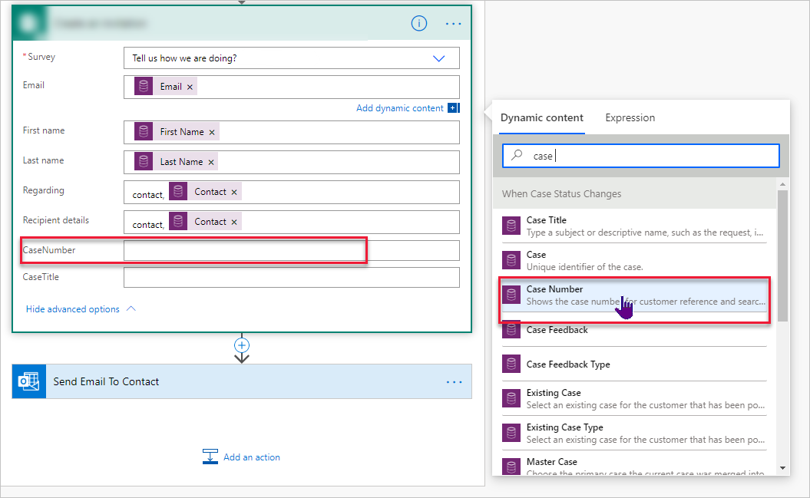

**الاسم الأول** و **الاسم الأخير** هما متغيران افتراضيان يتم تطبيقها عل كل استبيان (ولا يمكن حذفهما). المتغير هو عنصر يتغير استنادًا إلى المستلم. تجب مراعاة مشروع Contoso، حيث تقوم الشركة بإرسال استبيان تعليقات خدمة العملاء في كل مرة يتم فيها حل إحدى الحالات. ويعرف مدير خدمة العملاء أنه يمكن إقفال العديد من حالات الدعم لنفس جهة الاتصال في فترة زمنية قصيرة. لذلك، يحتاج المدير إلى مؤشر واضح لتمييز الحالة التي تم طلب التعليقات الخاصة بها.

لتحقيق هذه المهمة، يمكنك إنشاء متغيرات جديدة وإضافتها إلى استبيان تعليقات خدمة العملاء. حدد قائمة **تخصيص** من الجانب الأيمن من الاستبيان، ثم حدد **متغيرات**. يمكنك إضافة 15 متغيرًا كحدٍ أقصى، بما في ذلك **الاسم الأول** و **الاسم الأخير** و **الإعدادات المحلية**. في هذا المثال، ستتم إضافة المتغيرين الجديدين وهما **رقم الحالة** و **عنوان الحالة**. يمكن أن يتضمن اسم المتغير أحرفًا وأرقامًا فقط دون وجود مسافات بينهما. ويتم استبدال القيمة الافتراضية بالقيمة الفعلية عند إرسال الاستبيان. على سبيل المثال، إذا تمت إضافة متغير، وكان من الممكن أن يكون العمود الذي تم تمريره من خلال هذا المتغير فارغًا، فسيتم عرض النص الذي تمت إضافته في القيمة الافتراضية بدلاً من ذلك. ضع في اعتبارك هذه الطريقة كآلية مُواجَهة للبيانات المفقودة في السجلات داخل بيئة Microsoft Dataverse ذات الصلة.

> [!div class="mx-imgBorder"]
> 

عند إضافة متغير جديد، ستتوفر لك إمكانية إضافة متغير إلى الاستبيان على الفور. يمكن إضافة المتغيرات إلى وصف الاستبيان وأسئلة الاستبيان وترجماتها وقوالب البريد الإلكتروني. في المثال التالي، تمت إضافة متغير **الاسم الأول** إلى السؤال الأول، مع مخاطبة جهة الاتصال حسب الاسم. في السؤال الثاني، يمكنك تقديم توضيح بشأن الحالة التي تتطلب تعليقات عن طريق إضافة المتغيران **رقم الحالة** و **عنوان الحالة**.

> [!div class="mx-imgBorder"]
> 

وحتى يتم تحديد المتغيرات في Power Automate، إذا تمت مشاركة رابط الاستبيان بإحدى الطرق، فسيعرض الاستبيان {{CaseNumber}} و{{CaseTitle}} بدلاً من القيم الفعلية من الحالة التي تم إقفالها. حتى يصبح كل شيء متوافق، أنت بحاجة إلى تحديد المتغيرات الجديدة لأي تدفق يتم استخدامه لإرسال استبيان أو إنشاء دعوة. يمكن سحب المحتوي الديناميكي لهذين المتغيرين من المشغل الأصلي الذي يتم تشغيله عند إقفال الحالة. يؤدي البحث عن طريق إدخال كلمة **حالة** إلى عرض جميع الأعمدة التي تتضمن كلمة "حالة" في اسم العمود. عند العثور على العمود الصحيح، يمكنك تحديده لإضافته إلى المتغير في خطوة الإجراء Dynamics 365 Customer Voice في التدفق. بعد ذلك، يمكنك إضافة متغير **عنوان الحالة**. والآن، عند تشغيل التدفق ، سيتم ملء المتغيرين **رقم الحالة** و **عنوان الحالة** بالقيم الصحيحة من الحالة التي تم إقفالها.

> [!div class="mx-imgBorder"]
> 
